**Role yang sesuai**

- *Member User* (Pekerja)

User dapat menyimpan memorandum sebagai *template*. *Template* ini digunakan jika sewaktu-waktu *user* akan melanjutkan memorandum yang sudah dibuat dan diubah kembali kemudian dikirimkan kepejabat tujuan tanpa harus mengisi *form* memorandum. Langkah - langkah untuk menyimpan memorandum sebagai *template* adalah sebagai berikut

## **E-Corr Versi Web**

Langkah-langkah untuk save as template memorandum via Web adalah sebagai berikut :

1. Isi *form* memorandum dan Klik **Save as Template**

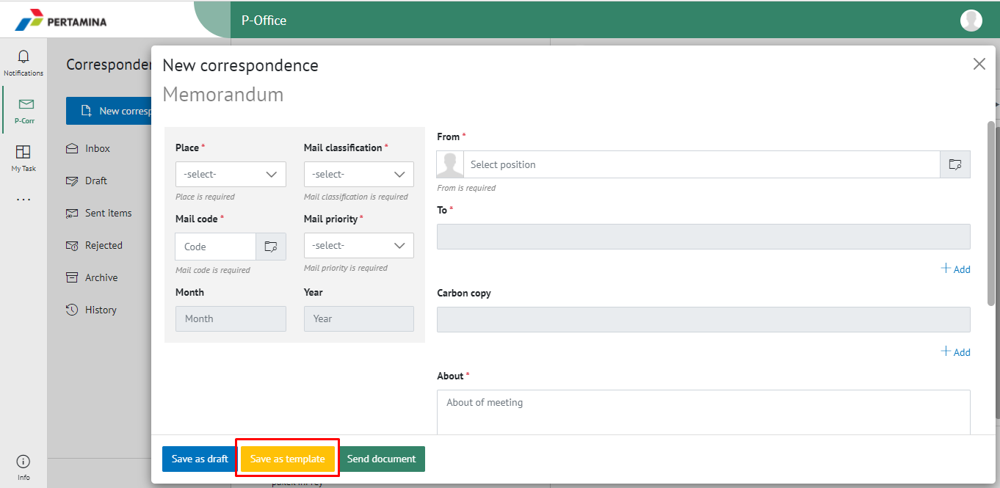

2. Memorandum yang disimpan menjadi *template* akan tersimpan di menu **"Draft - Direct"**. Untuk melanjutkan *template* yang sudah dibuat *user* dapat memilih menu **"Draft - Direct"** kemudian pilih *template* yang akan digunakan

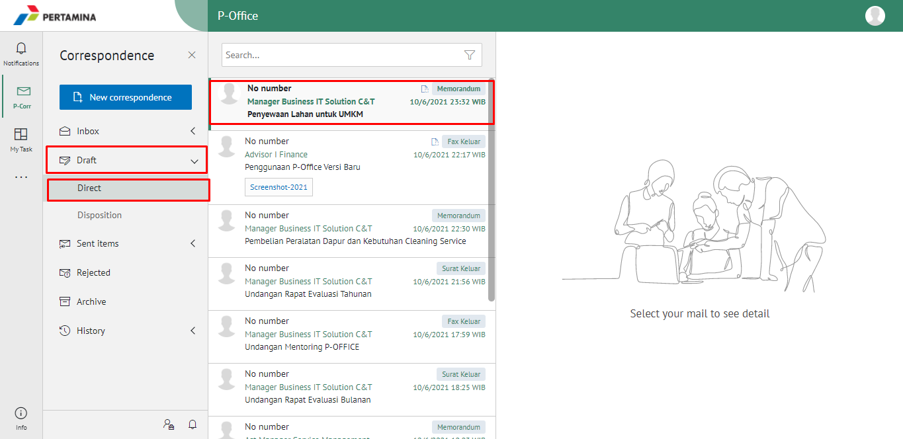

3. Pilih tombol **Use Template** untuk melanjutkan edit memorandum

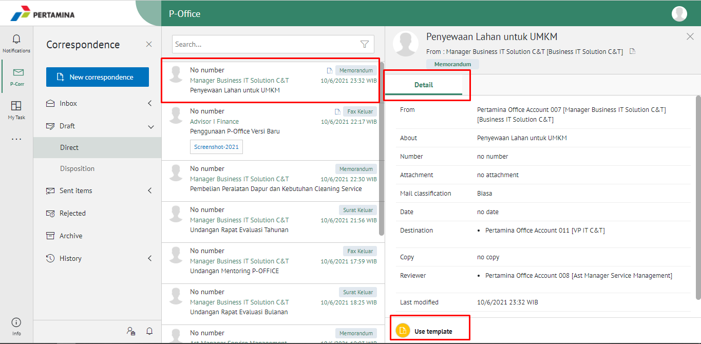

4. Sistem akan menampilkan form **Edit Correspondence**, klik Simpan untuk menyimpan perubahan

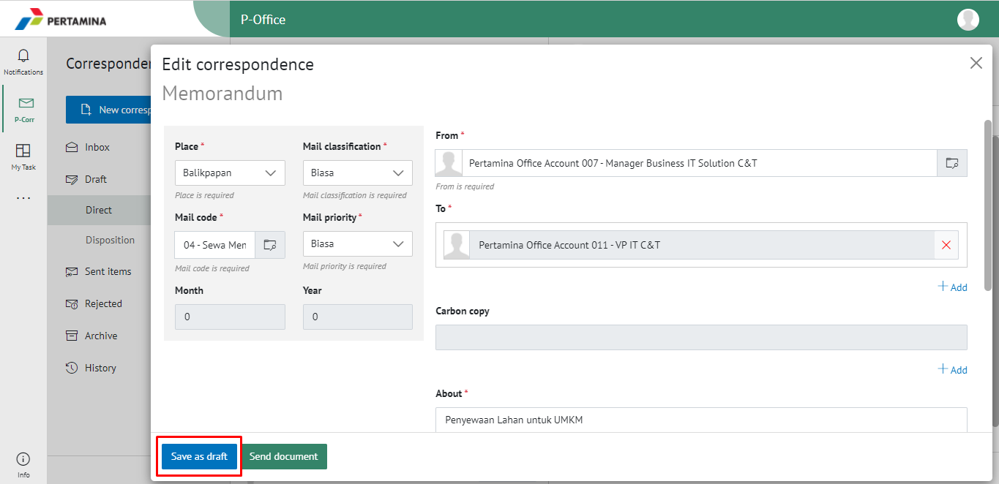

5. Lakukan perubahan pada surat, klik **Save as Draft** untuk menyimpan perubahan dan memorandum akan tersimpan di menu **"Draft - Direct"** sebagai draft atau klik **Modify Document** lalu pilih **Send Documnet** untuk mengirimkan ke pejabat tujuan dan tersimpan di menu **"Sent Item - Direct"**.

## **E-Corr Versi Teams**

Langkah-langkah untuk save as template memorandum via Teams adalah sebagai berikut :

1. Isi *form* memorandum dan Klik **Save as Template**

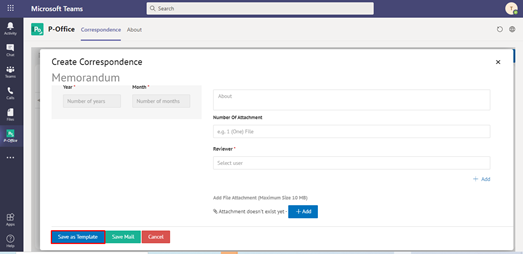

2. Memorandum yang disimpan menjadi *template* akan tersimpan di menu **"Draft - Memorandum"**. Untuk melanjutkan *template* yang sudah dibuat *user* dapat memilih menu **"Draft - Memorandum"** kemudian pilih *template* yang akan digunakan

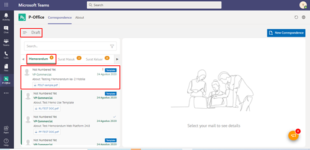

3. Pilih tombol **Use Template** untuk melanjutkan edit memorandum

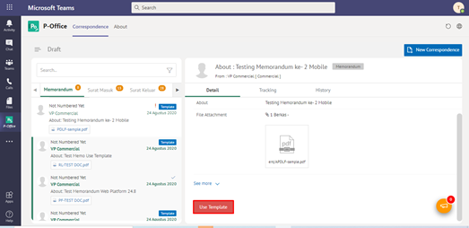

4. Sistem akan menampilkan form **Edit Correspondence**

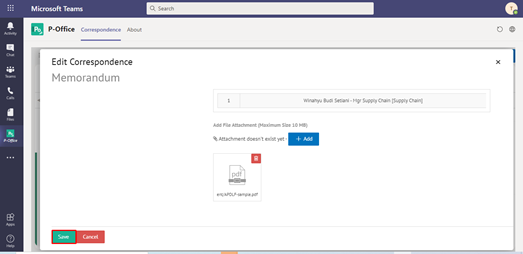

5. Lakukan perubahan pada surat, klik **Save** untuk menyimpan perubahan dan memorandum akan tersimpan di menu **"Draft - Memorandum"** sebagai draft atau klik **Send** untuk mengirimkan ke pejabat tujuan dan tersimpan di menu **"Sent Item - Memorandum"**.

## **E-Corr Versi Android & IOS**

Langkah-langkah untuk menyimpan memorandum sebagai template via Android adalah sebagai berikut:

1. Isi _form_ memorandum dan klik **Save as Template**

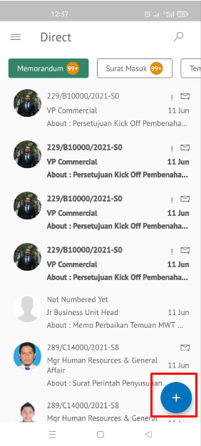 
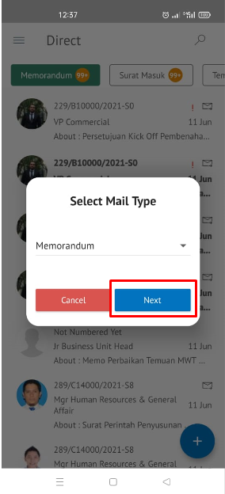 
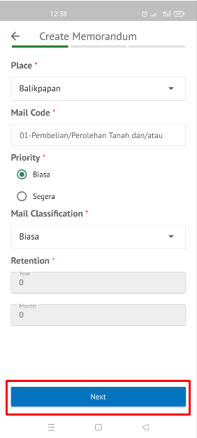 
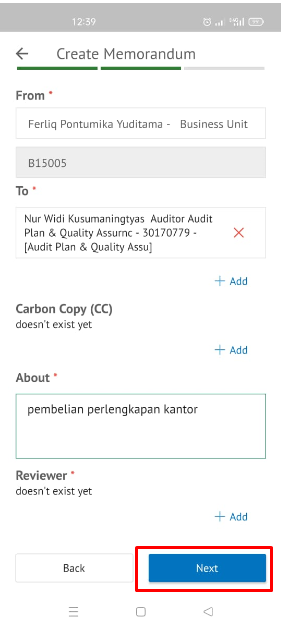
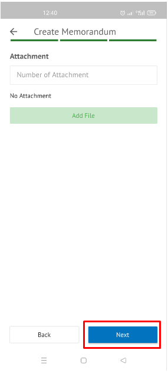
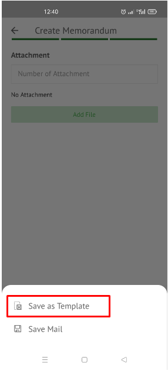

2. Memorandum yang disimpan menjadi template akan tersimpan di menu “**Draft – Memorandum”. Untuk melanjutkan _template_ yang sudah dibuat _user_ dapat memilih menu “**Draft – Memorandum**” kemudian pilih _template_ yang akan digunakan

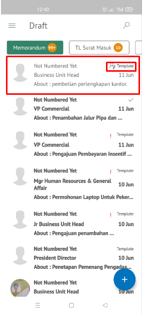 

3. Pilih tombol **Use Template** untuk melanjutkan edit memorandum

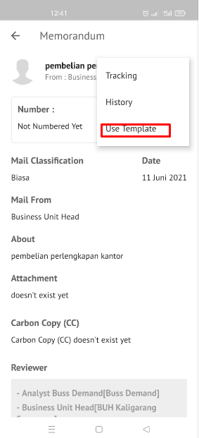

4. Sistem akan menampilkan form **Edit Correspondence** klik **Save Mail** untuk menyimpan perubahan

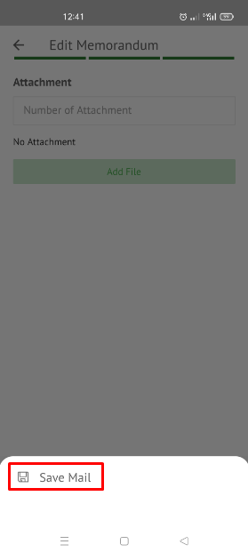

5. Lakukan perubahan pada surat, klik **Save Mail** untuk menyimpan perubahan dan memorandum akan tersimpan di menu **“Draft – Memorandum”** sebagai draft atau klik **Send** untuk mengirimkan ke pejabat tujuan dan tersimpan di menu **“Sent Item – Memorandum”.**