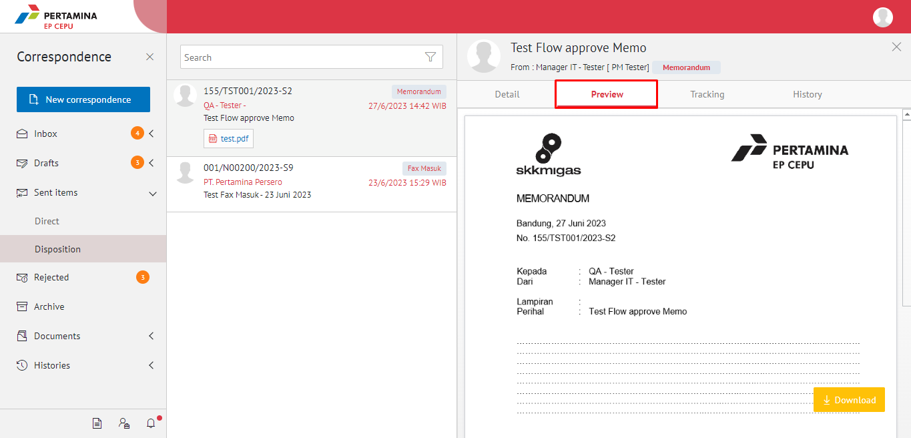
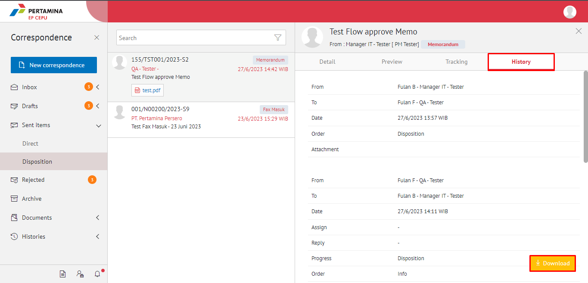
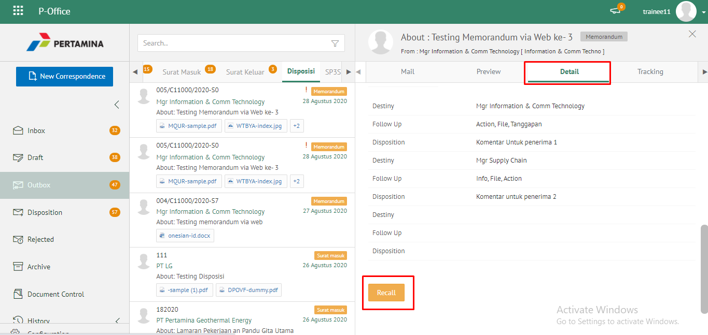
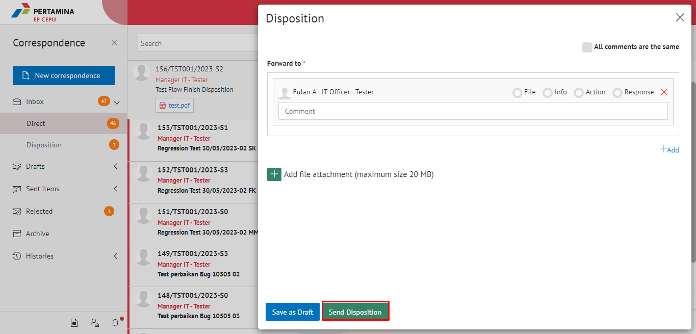

**Role yang sesuai**

- *Approver User*
- *Reviewer User*
- *Member User* (Pekerja)
- Sekretaris

*User* dapat menyelesaikan disposisi memorandum jika *user* tidak akan melanjutkan untuk mendisposisikan memorandum ke pejabat lain atau memorandum selesai pada *user* tersebut. Langkah-langkah untuk menyelesaikan memorandum adalah sebagai berikut

## **E-Corr Versi Web**

Langkah-langkah untuk menyelesaikan disposisi memorandum via Web adalah sebagai berikut :

1. Klik menu **Inbox** dan pilih tab **Direct**

2. Pilih memorandum yang akan diselesaikan kemudian pilih tab **Detail** Lalu pilih button **Disposition**

3. Pilih Button **+Add** kemudian pilih pejabat yang akan di disposisikan

4. Sistem menampilkan pop up konfirmasi user yang akan menerima disposisi kemudian klik **Send Disposition**.

5. Sistem menyimpan perubahan dan informasi selesai disposisi akan tersimpan di detail disposisi.

