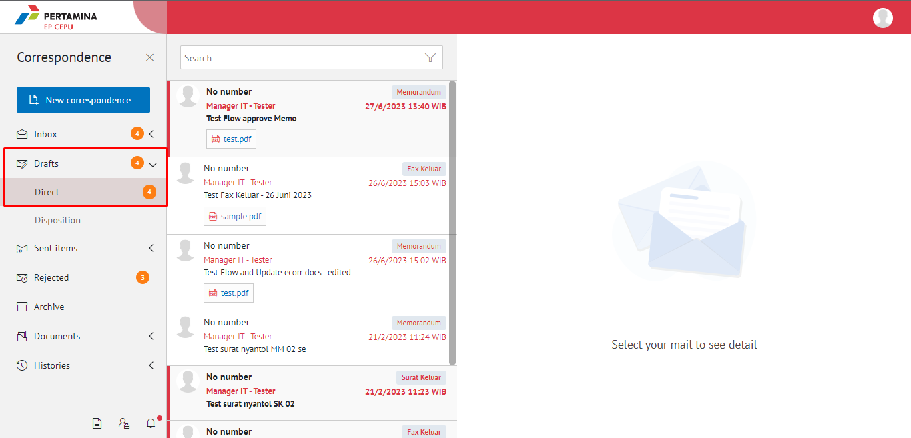
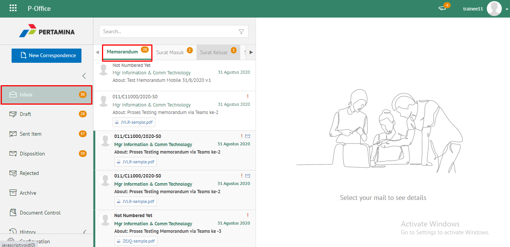
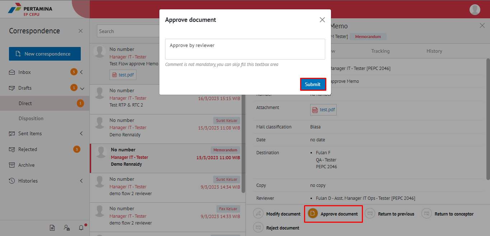
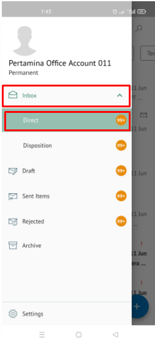
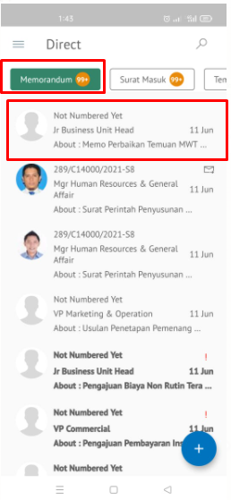
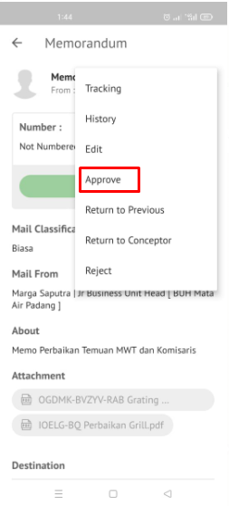
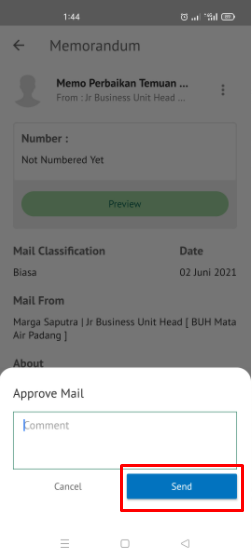

Role yang sesuai

- *Approver User*
- *Reviewer User*

*User* dapat menyetujui memorandum yang sudah dilakukan review dan memorandum akan dikirimkan ke *reviewer* selanjutnya atau *approver*. 

## **E-Corr Versi Web**

Berikut ini terdapat Tangkapan Layar yang menjelaskan langkah - langkah untuk menyetujui memorandum **via Web**. Memorandum yang sudah di edit dan disetujui oleh reviewer akan terkirim ke approver untuk dilakukan tindak lanjut

1. Klik menu **Draft** dan pilih tab **Direct**

2. Pilih memorandum yang akan ditindak lanjuti kemudian pilih tab **Detail**

3. Klik tombol **Approve** dan Isikan komentar jika diperlukan dan pilih Button **Submit**

4. Sistem berhasil menyimpan perubahan. Memorandum yang sudah di kirim akan tersimpan di menu **Sent Item - Memorandum**

## **E-Corr Versi Android**

Berikut ini terdapat langkah - langkah untuk menyetujui memorandum **via Mobile**. Memorandum yang sudah di edit dan disetujui oleh reviewer akan terkirim ke approver untuk dilakukan tindak lanjut

1. Klik menu **Inbox** dan pilih tab **Direct**

 

2. Pilih memorandum yang akan ditindak lanjuti kemudian pilih ikon **titik tiga**
   

3. Pilih **Approve** dan pilih **Send**. Isikan komentar jika diperlukan

 

4. Sistem berhasil menyimpan perubahan. Memorandum yang sudah di kirim akan tersimpan di menu **Sent Item- Memorandum**