**Role yang sesuai**

- *Member User* (Pekerja)

Konseptor dapat menambah memorandum pada aplikasi E-Corr. 

## **E-Corr Versi Web**

langkah untuk menambah memorandum via Web adalah sebagai berikut

1. Klik menu **New Correspondence**

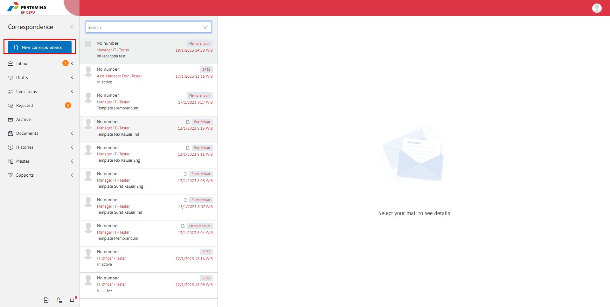

2. Pilih jenis surat **"Memorandum"**

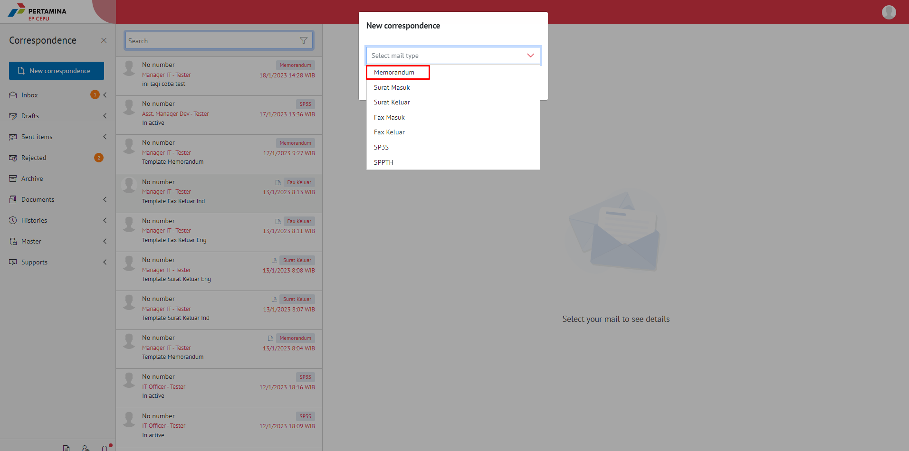

3. Isi *form* tambah memorandum. Terdapat bebarapa aksi untuk menindaklanjuti memorandum yang sudah diisi *form*nya yaitu **Simpan Memorandum**,  dan **Save as Template Memorandum**.

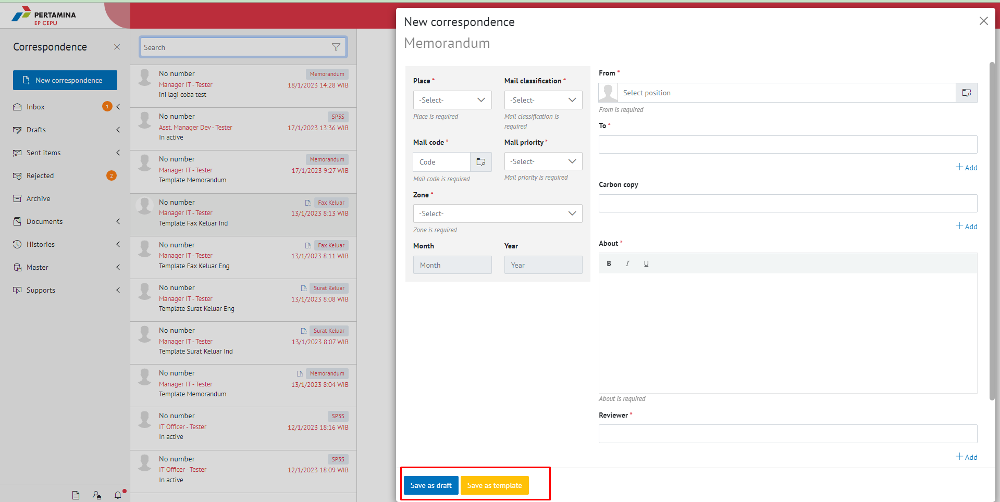

##### [Edit] Memorandum

Langkah - langkah untuk mengubah isi memorandum melalui Word Desktop adalah sebagai berikut

1. Pilih Menu **Draft** lalu pilih **Direct**

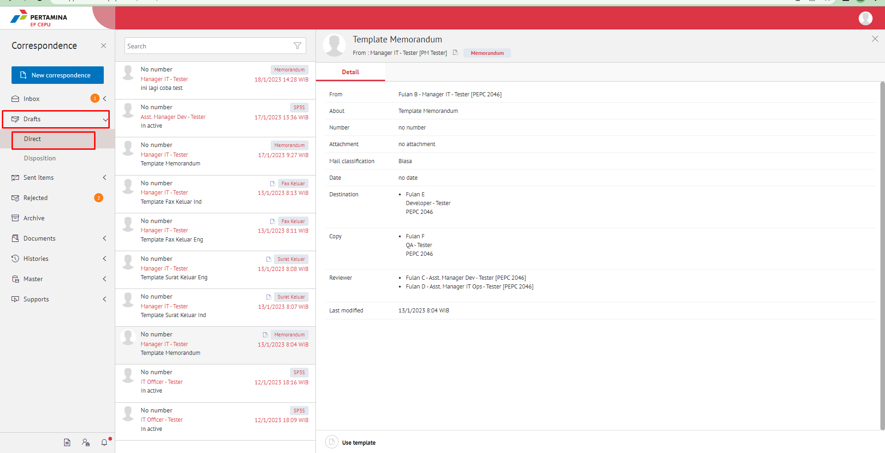

2. Pilih **Memorandum** yang akan di **edit** Lalu pilih **Detil** dan pilih Button **Modify Document**
   
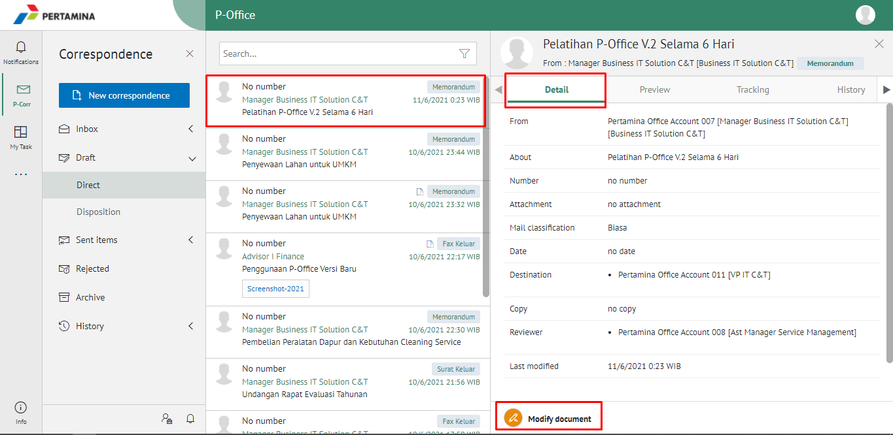

3. Pilih **Edit Document** dan PIlih **Edit In Word App** atau **Edit Online**
   
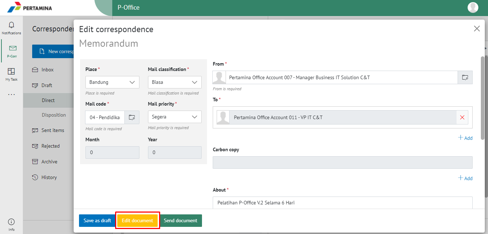
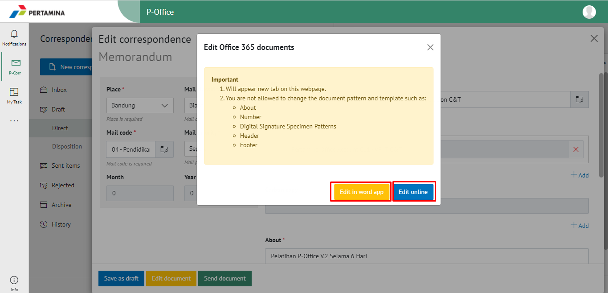

4. Surat yang sudah selesai diubah maka akan tersimpan di menu **"Draft - Direct"**

#### Kirim Memorandum

Langkah - langkah untuk mengirim memorandum adalah sebagai berikut

1. Pilih **Draft** lalu pilih **Direct** ,Pilih surat yang berlabel **Memorandum** lalu pilih **Detile - Modify - dan pilih Button Send Document** untuk mengirim surat ke pejabat tujuan

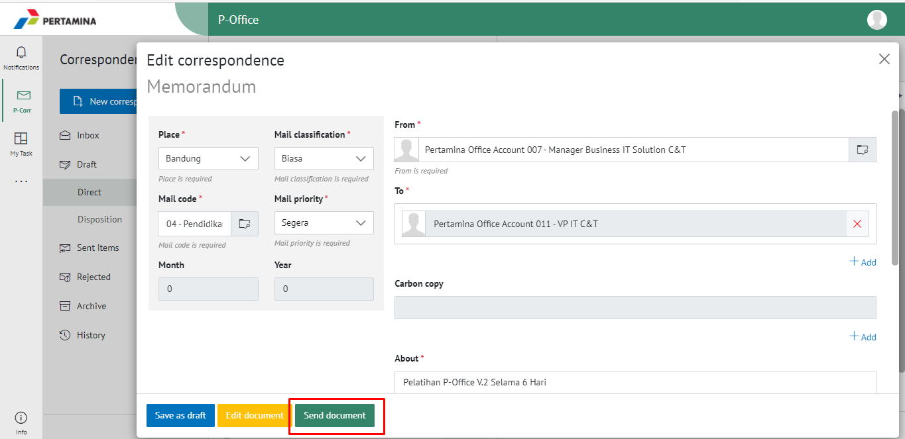

1. Sistem menyimpan perubahan dan memorandum akan tersimpan di menu **"Sent Item - Direct"**

## **E-Corr Versi Android**

Langkah-langkah untuk menambah Memorandum adalah sebagai berikut :

1. 	Klik icon **(+)** untuk membuat memorandum

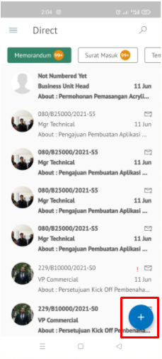

2. Pilih jenis surat “**Memorandum**”
   
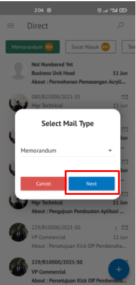

3. Isi _form_ tambah memorandum. Terdapat bebarapa aksi untuk menindaklanjuti memorandum yang sudah diisi _form_nya yaitu **Save memorandum**, **Send Memorandum**dan **Save as Template Memorandum.**

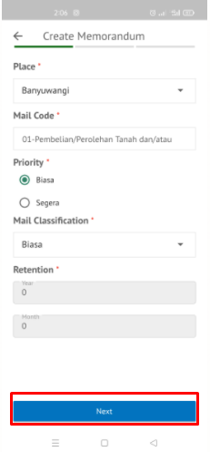 
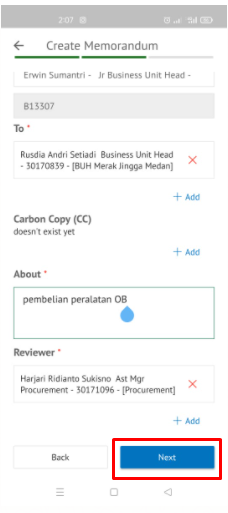 

### Simpan Memorandum

Langkah – langkah untuk menyimpan memorandum adalah sebagai berikut.

1. Isi _form_ memorandum kemudian klik **Save Mail**

 
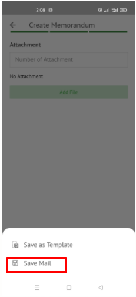

2. Sistem akan menyimpan perubahaan dan memorandum akan tersimpan di menu **Draft-Memorandum**

