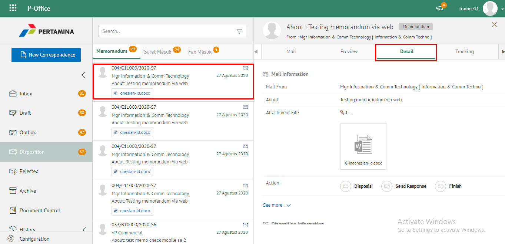
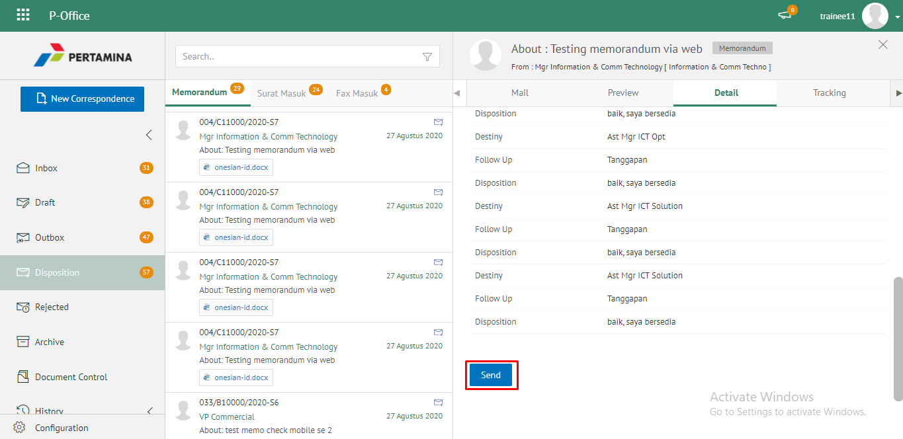

**Role yang sesuai**

- *Approver User*
- *Reviewer User*

Langkah - langkah untuk menolak memorandum adalah sebagai berikut

1. Klik menu **Inbox** dan pilih tab **Memorandum**

2. Pilih memorandum yang akan ditolak kemudian pilih tab **Detail**

3. Klik tombol **Reject** dan pilih **Send**. Isikan komentar jika diperlukan

4. Sistem menampilkan pop up konfirmasi dan user harus mengisi keterangan tolak disposisi memorandum kemudian klik **Save**.

5.	Sistem menyimpan perubahan dan disposisi memorandum yang sudah ditolak akan otomatis terhapus akan tersimpan di menu **“Rejected – Memorandum”** user penolak dengan label **Rejected**.

## **E-Corr Versi Android**

Langkah-langkah untuk menolak disposisi Memorandum adalah sebagai berikut :

1. Klik menu **Inbox** dan pilih tab **Memorandum**

 

2. Pilih memorandum yang akan ditolak kemudian **Detail** pilih ikon **tombol button**

 

3. Klik tombol **Reject** dan Isikan komentar jika diperlukan

 

4. Sistem menampilkan pop up konfirmasi dan _user_ harus mengisi keterangan tolak disposisi memorandum kemudian klik send.
Sistem Memorandum yang sudah di tolak akan tersimpan dimenu “**Rejected- Memorandum**” user penolak pada label “**Rejected**

## **E-Corr Versi IOS**

**Menolak Memorandum**

Langkah-langkah untuk menolak memorandum adalah sebagai berikut
1.	Klik menu **Inbox **dan pilih tab **Memorandum**

2.	Pilih memorandum yang akan ditindak lanjuti kemudian pilih icon **Option **dan pilih **Reject**

3.	Isikan komentar jika diperlukan kemudian klik **Send **untuk menyimpan perubahan

4.	Memorandum yang sudah di tolak akan tersimpan di menu “**Rejected - Memorandum**” user penolak dengan label **Rejected**