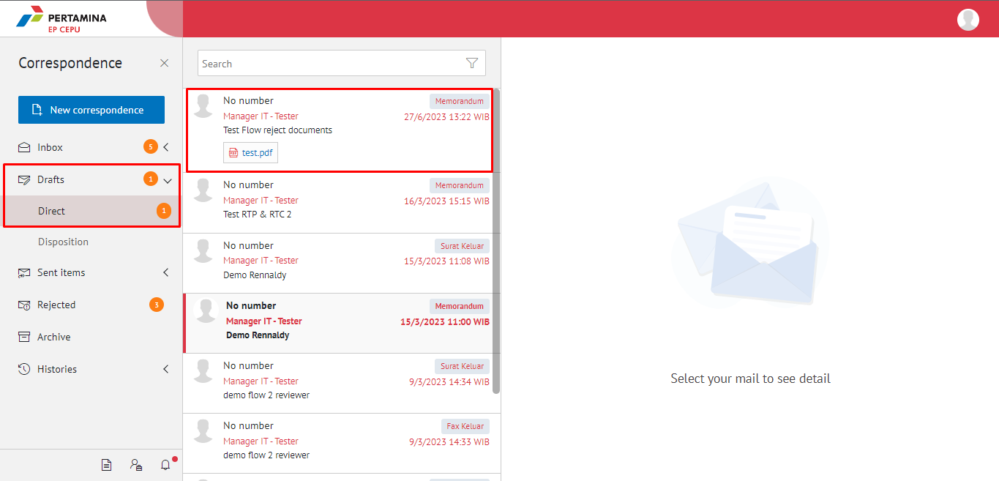
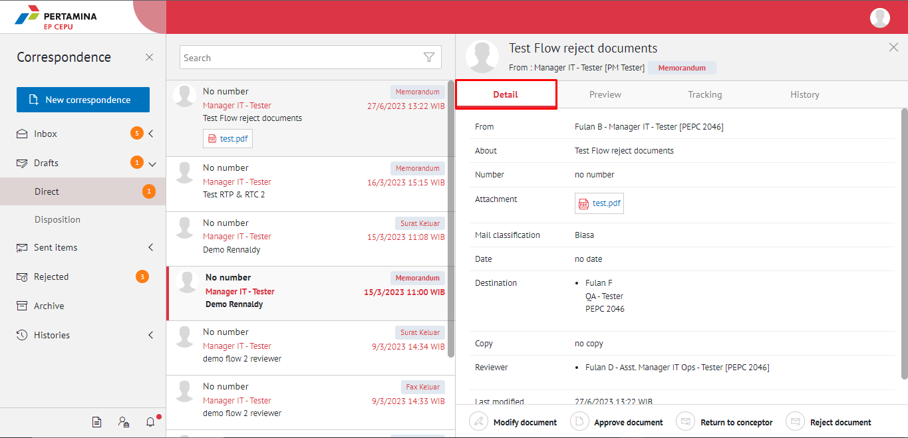
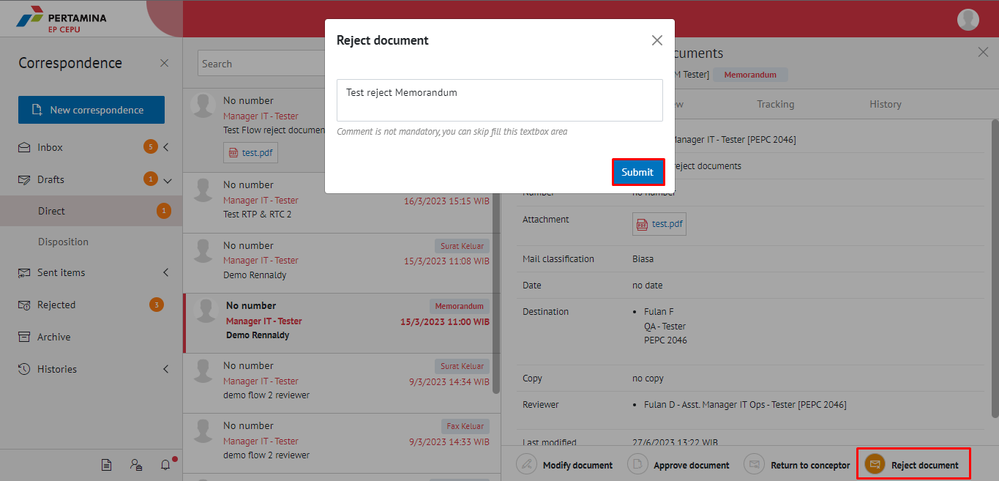
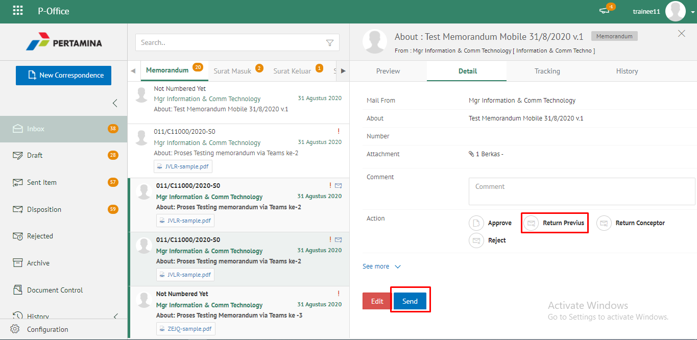
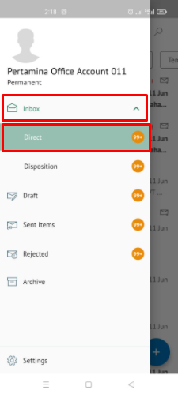
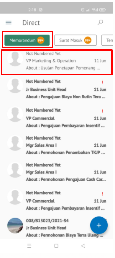
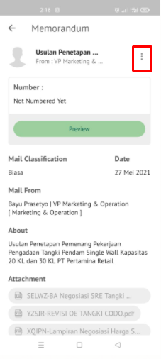
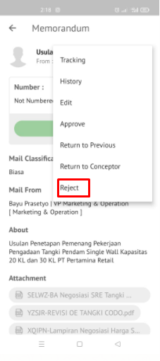
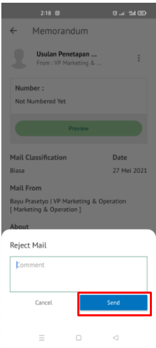

### Menolak Memorandum

**Role yang sesuai**

- *Reviewer User*
- *Approver User*

*User* dapat menolak memorandum yang akan dikembalikan ke konseptor jika hasil review memorandum belum / tidak sesuai.

## **E-Corr Versi Web**

Langkah - langkah untuk menolak memorandum via Web adalah sebagai berikut

1. Klik menu **Draft** dan pilih tab **Direct**

2. Pilih memorandum yang akan ditindak lanjuti kemudian pilih tab **Detail**

3. Klik tombol **Reject Document** dan pilih **Sumbit**. Isikan komentar jika diperlukan

4.	Sistem berhasil menyimpan perubahan. Memorandum yang sudah di tolak akan terhapus dari aplikasi akan tersimpan di menu **“Rejected – dan pilih yang berlabel Memorandum”** 

## **E-Corr Versi Android & IOS**

Langkah-langkah untuk menolak Memorandum via Android dalah sebagaia berikut :

1. Klik menu **Inbox** dan pilih tab **Direct**

 

1. Pilih **memorandum** yang akan ditindak lanjuti kemudian pilih icon **titik tiga**

 

3. Lalu pilih **Reject** dan pilih **Send**.Isikan komentar jika diperlukan
   

4. Sistem berhasil menyimpan perubahan. Memorandum yang sudah di tolak akan tersimpan dimenu “**Rejected- Memorandum**” user penolak pada label “**Rejected**”