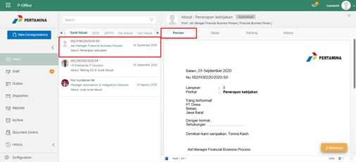
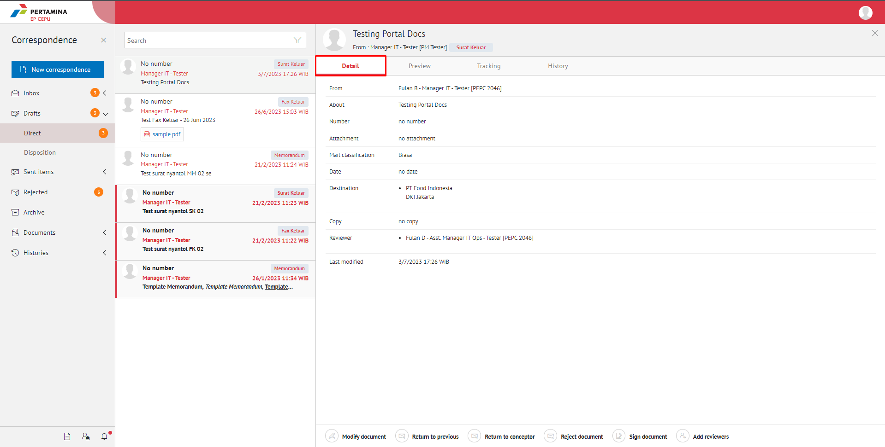
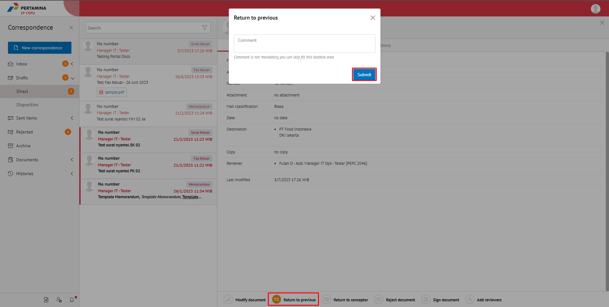
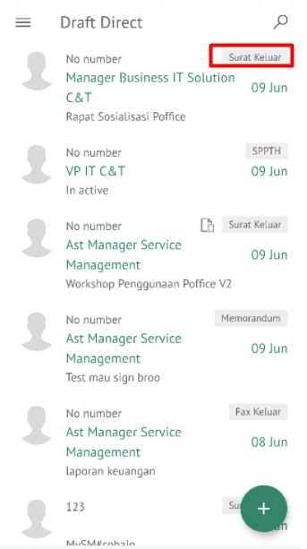
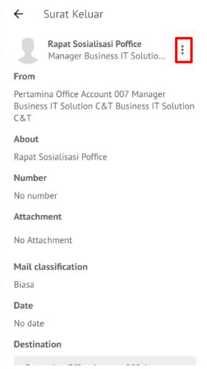
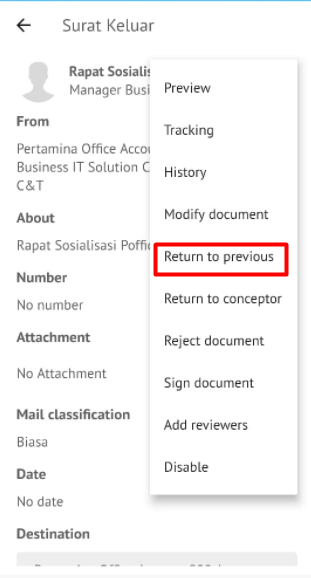
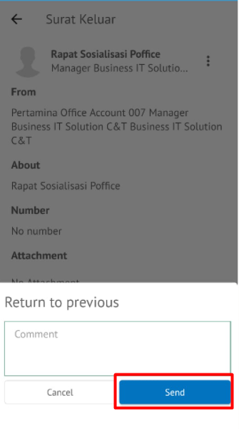

**Role yang sesuai**

- *Approver User*
- *Reviewer User*

*User* dapat mengembalikan surat keluar ke sebelumnya jika hasil review belum / tidak sesuai. Surat akan dikembalikan ke satu level *reviewer* sebelumnya atau ke konseptor (apabila hanya ada satu *reviewer*).

## **E-Corr Versi Web**

Langkah - langkah untuk mengembalikan surat keluar ke sebelumnya via Web adalah sebagai berikut

1. Klik menu **Draft** dan Klik menu **Direct** kemudian pilih surat yang berlabel **Surat Keluar**

2. Pilih surat keluar yang akan ditindak lanjuti kemudian pilih tab **Detail**

3. Klik tombol **Return to Previous** dan pilih **Submit**. Isikan komentar jika diperlukan

4. Sistem berhasil menyimpan perubahan. Surat keluar yang sudah di kirim akan tersimpan di menu **Sent Item - Surat keluar** dan penerima pengembalian surat keluar akan menerima surat keluar di menu **Draft - Surat keluar**

## **E-Corr Versi Mobile (Android & iOS)**

Langkah-langkah untuk mengembalikan surat keluar ke sebelumnya via Mobile (Android & iOS) adalah sebagai berikut :

1. Klik menu **Draft - Direct** dan pilih label **Surat Keluar**

 

2. Pilih surat keluar yang akan ditindak lanjuti kemudian pilih tombol **button**

 

3. Klik tombol **Return to Previous** dan pilih **Send** Isikan komentar jika diperlukan

 

4. Sistem berhasil menyimpan perubahan. Surat keluar yang sudah di kirim akan tersimpan di menu **Sent Item - Surat keluar** dan penerima pengembalian surat keluar akan menerima surat keluar di menu **Draft - Surat keluar**
