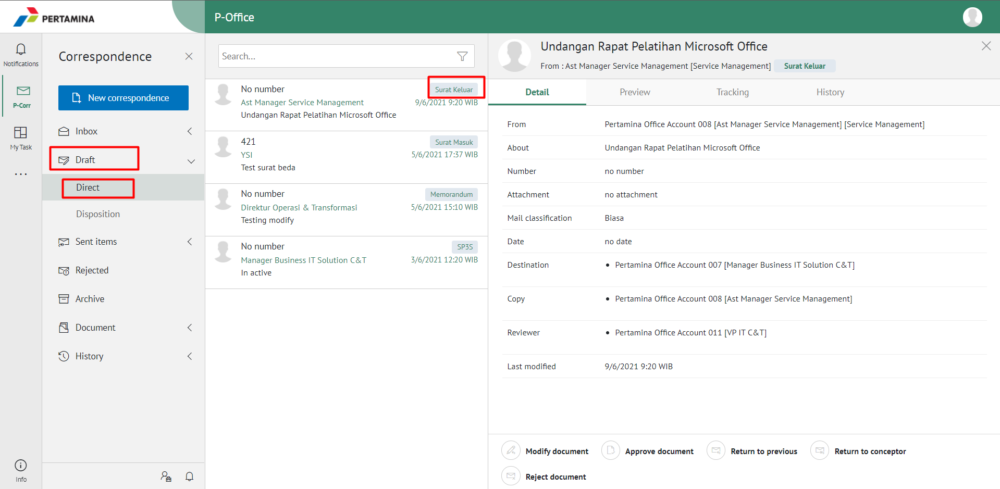
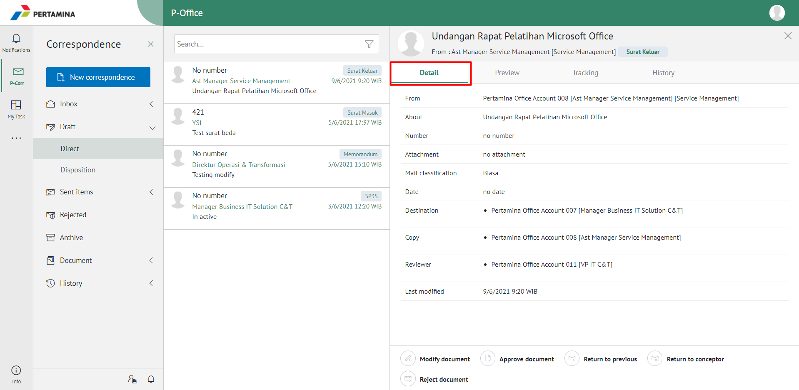
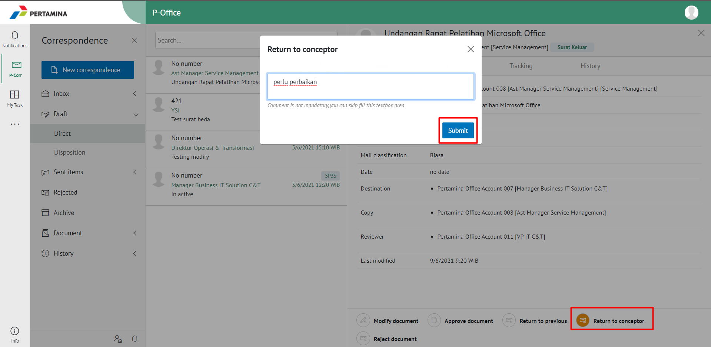
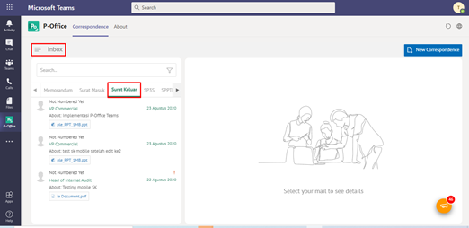
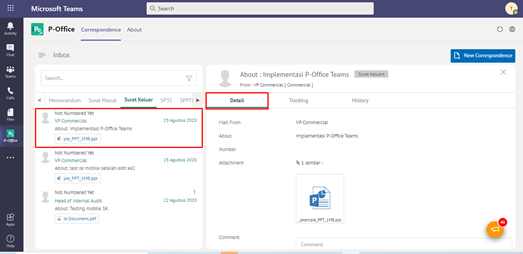
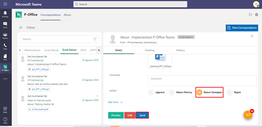

Role yang sesuai

- *Approver User*
- *Reviewer User*

*User* dapat mengembalikan surat keluar ke konseptor jika hasil review belum / tidak sesuai. 

## **P-Office Versi Web**

Langkah - langkah untuk mengembalikan surat keluar ke konseptor via Web adalah sebagai berikut

1. Klik menu **Draft** dan Klik menu **Direct** kemudian pilih label **Surat Keluar**

2. Pilih surat keluar yang akan ditindak lanjuti kemudian pilih tab **Detail**

3. Klik tombol **Return Conceptor** dan pilih **Submit**. Isikan komentar jika diperlukan

4. Sistem berhasil menyimpan perubahan. Surat keluar yang sudah di kirim akan tersimpan di menu **Sent Item- Surat Keluar** dan konseptor akan menerima surat keluar di menu **Draft - Surat Keluar**

## **P-Office Versi Teams**

Langkah - langkah untuk kembalikan konseptor via Teams adalah sebagai berikut :

1. Klik menu **Inbox** dan pilih tab **Surat Keluar**

2. Pilih surat keluar yang akan ditindak lanjuti kemudian pilih tab **Detail**

3. Klik tombol **Return Conceptor** dan pilih **Send**. Isikan komentar jika diperlukan
 

4. Sistem berhasil menyimpan perubahan. Surat keluar yang sudah di kirim akan tersimpan di menu **Sent Item - Surat keluar** dan penerima pengembalian surat keluar akan menerima surat keluar di menu **Draft - Surat keluar**

## **P-Office Versi Mobile (Android & iOS)**

Langkah-langkah untuk melihat informasi surat keluar via Mobile (Android & iOS) adalah sebagai berikut :

1. Klik menu **Draft - Direct** lalu pilih label **Surat keluar**

 

2. Pilih surat keluar yang akan ditindak lanjuti kemudian pilih icon **Option**

 

3. Klik tombol **Return to Conceptor** dan pilih **Send** Isikan komentar jika diperlukan

4. Sistem berhasil menyimpan perubahan. Surat keluar yang sudah di kirim akan tersimpan di menu **Sent Item- Surat Keluar**dan konseptor akan menerima surat keluar di menu **Draft – Direct** label surat **Surat Keluar**

