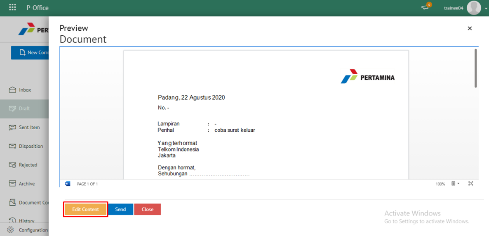
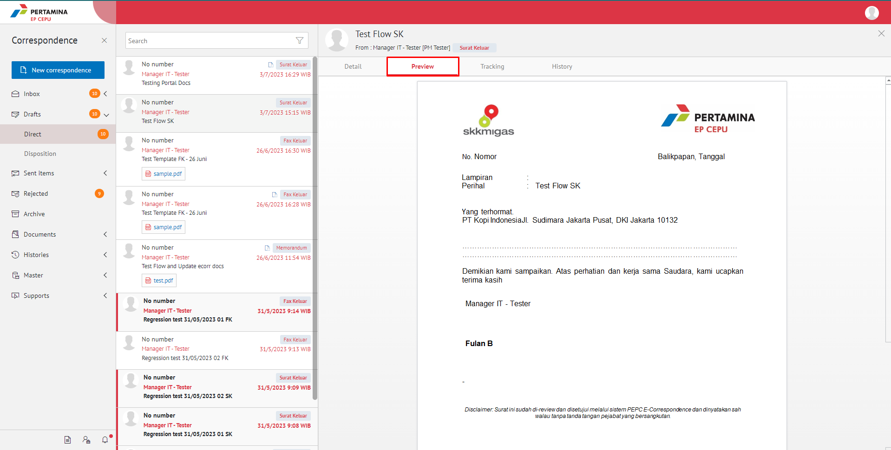
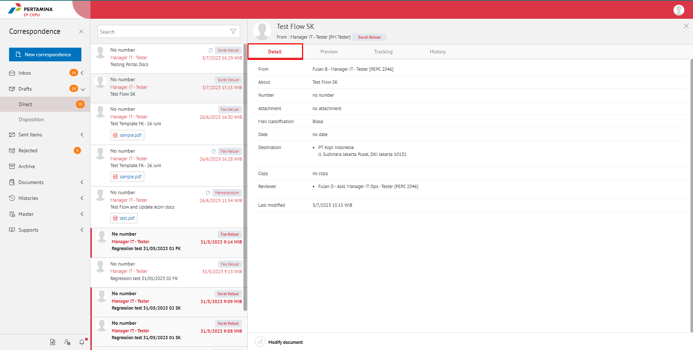
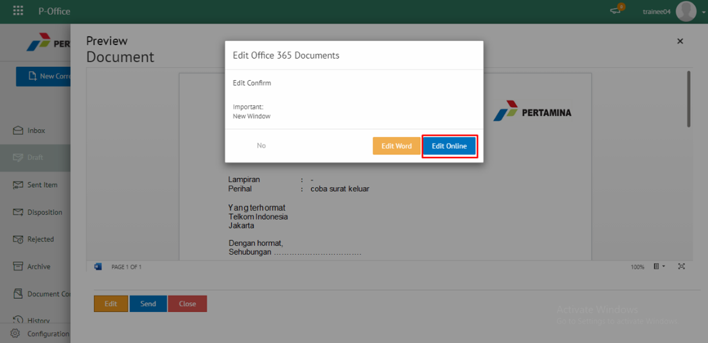
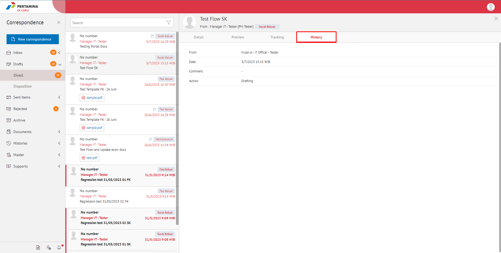

**Role yang sesuai**

- *Approver User*
- *Reviewer User*
- *Member User* (Pekerja)
- Sekretaris

*User* dapat melihat informasi lengkap surat keluar termasuk *preview* surat keluar, detail surat keluar, *tracking* surat keluar dan *history* surat keluar.

## **E-Corr Versi Web**

Langkah - langkah untuk melihat informasi surat keluar via Web adalah sebagai berikut :

1. Klik menu **Inbox/Draft/Sent Item** dan pilih label **Surat Keluar**. Pilih salah satu surat keluar yang akan dilihat informasinya

#### Preview Surat Keluar

Pada tab informasi **Preview**, ditampilkan *preview* surat keluar yang sudah dibuat. *Preview* surat keluar disesuaikan dengan template berdasarkan jenis surat

#### Detail Surat Keluar

Pada tab Detail, terdapat informasi asal surat, perihal, file lampiran, nomor surat, klasifikasi surat, tanggal surat, tujuan surat dan *reviewer*

#### Tracking Surat Keluar

Pada tab **Tracking**, ditampilkan informasi *tracking* surat keluar dalam bentuk *chart*

#### History Surat Keluar

Pada tab **History**, ditampilkan riwayat surat keluar yang terdapat informasi jabatan, tanggal, tindakan dan komentar

