**Role yang sesuai**

- *Approver User*
- *Reviewer User*
- *Member User* (Pekerja)
- Sekretaris

*User* dapat melihat informasi lengkap surat keluar termasuk *preview* surat keluar, detail surat keluar, *tracking* surat keluar dan *history* surat keluar.

## **P-Office Versi Web**

Langkah - langkah untuk melihat informasi surat keluar via Web adalah sebagai berikut :

1. Klik menu **Inbox/Draft/Sent Item** dan pilih label **Surat Keluar**. Pilih salah satu surat keluar yang akan dilihat informasinya

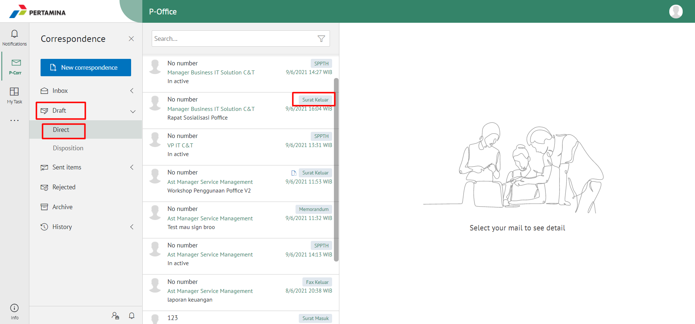

#### Preview Surat Keluar

Pada tab informasi **Preview**, ditampilkan *preview* surat keluar yang sudah dibuat. *Preview* surat keluar disesuaikan dengan template berdasarkan jenis surat

#### Detail Surat Keluar

Pada tab Detail, terdapat informasi asal surat, perihal, file lampiran, nomor surat, klasifikasi surat, tanggal surat, tujuan surat dan *reviewer*

#### Tracking Surat Keluar

Pada tab **Tracking**, ditampilkan informasi *tracking* surat keluar dalam bentuk *chart*

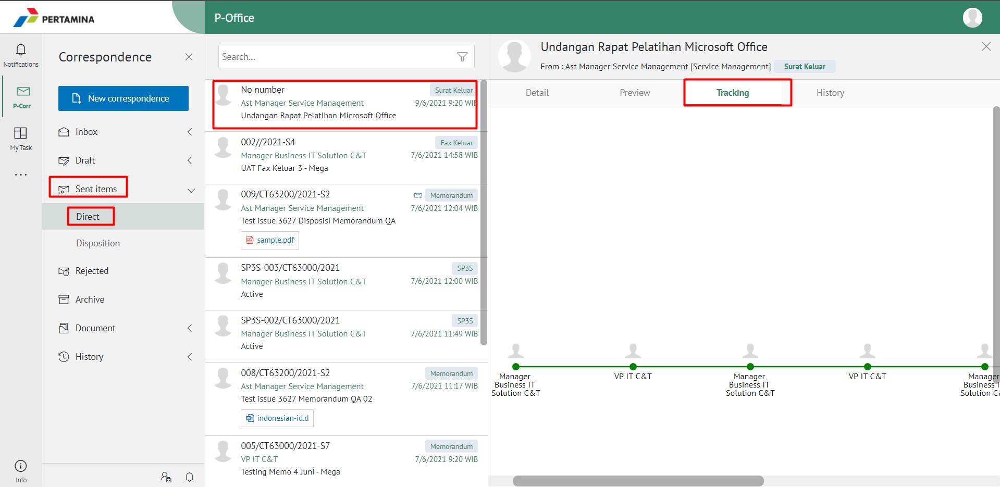

#### History Surat Keluar

Pada tab **History**, ditampilkan riwayat surat keluar yang terdapat informasi jabatan, tanggal, tindakan dan komentar

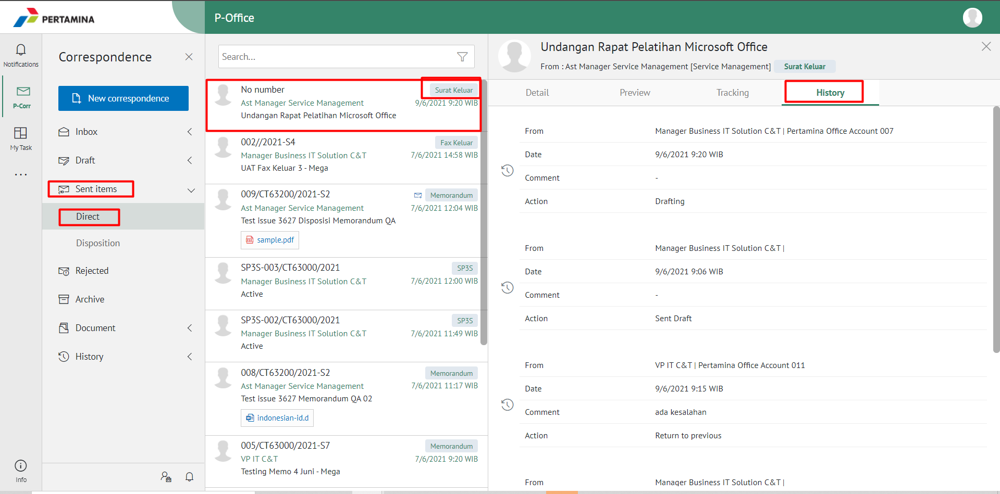

## **P-Office Versi Teams**

Langkah - langkah untuk melihat informasi surat keluar via Teams adalah sebagai berikut :

1. Klik menu **Inbox/Draft/Sent Item** dan pilih tab Surat Keluar. Pilih salah satu surat keluar yang akan dilihat informasinya

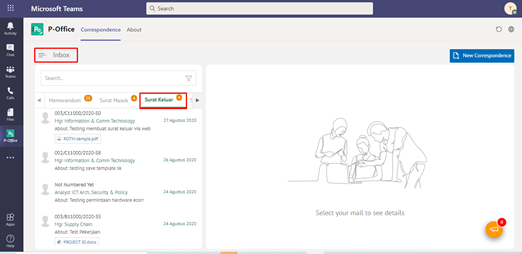

#### **Preview Surat Keluar**

Pada button **Preview**, ditampilkan preview surat keluar yang sudah dibuat. Preview surat keluar disesuaikan dengan template berdasarkan jenis surat.
  

  
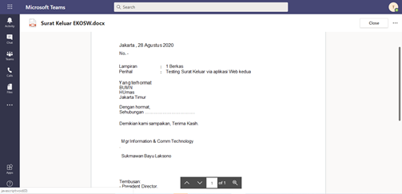

#### **Detail Surat Keluar**

Pada tab Detail surat keluar, terdapat informasi asal surat, perihal, file lampiran, nomor surat, klasifikasi surat, tanggal surat, tujuan surat dan reviewer
  
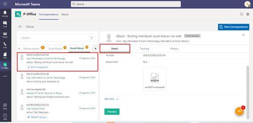
  
#### **Tracking Surat Keluar**

Pada tab **Tracking**, ditampilkan informasi tracking surat keluar dalam bentuk chart
  
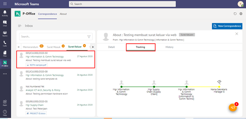

#### **History Surat Keluar**

Pada tab **History**, ditampilkan riwayat surat keluar yang terdapat informasi jabatan, tanggal, tindakan dan komentar
  
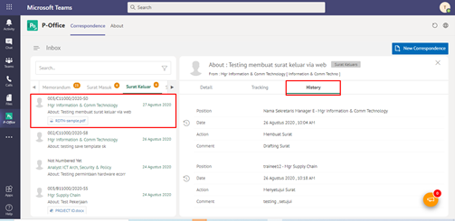

## **P-Office Versi Mobile (Android & iOS)**

Langkah-langkah untuk melihat informasi surat keluar via Mobile (Android & iOS) adalah sebagai berikut :

1. 	Klik menu **Inbox/Draft/Sent Item** dan pilih  label **Surat Keluar.**
   
 

**Detail Surat Keluar**

Klik pada salah satu surat untuk melihat Detail surat keluar, terdapat informasi asal surat, perihal, file lampiran, nomor surat, klasifikasi surat, tanggal surat, tujuan surat dan _reviewer_

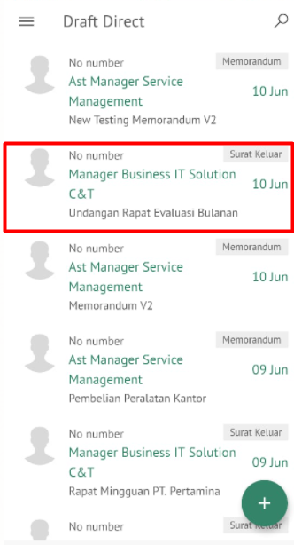 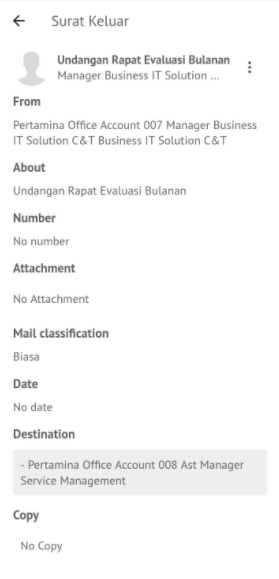

**Preview Surat Keluar**

Pada tombol **Preview**, ditampilkan _preview_ surat keluar yang sudah dibuat. _Preview_ surat keluar disesuaikan dengan template berdasarkan jenis surat.

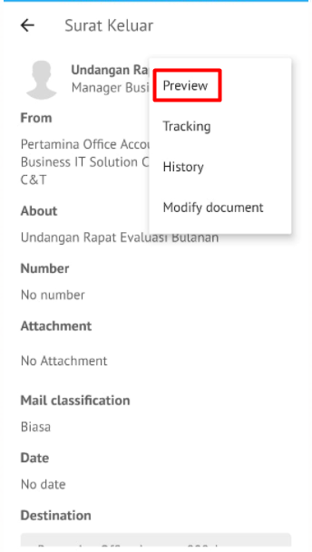 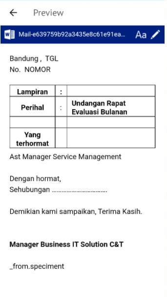

**History Surat Keluar**

Pada pilihan **History**, ditampilkan riwayat surat keluar yang terdapat informasi jabatan, tanggal, tindakan dan komentar

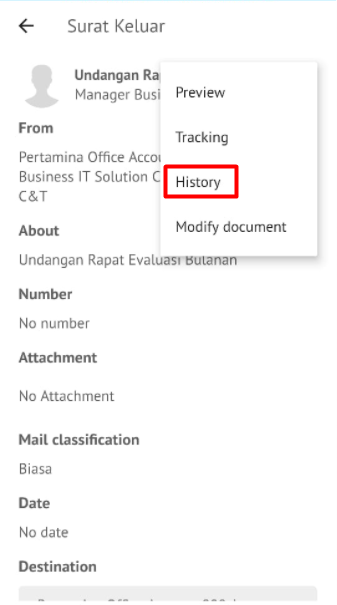 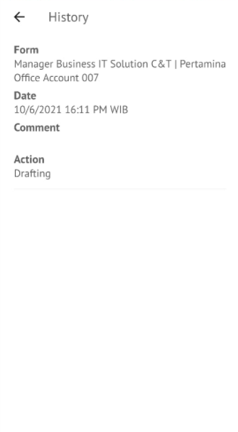

**Tracking Surat Keluar**

Pada pilihan **Tracking**, ditampilkan tracking surat keluar yang terdapat informasi user, Jabatan dan tindakan.

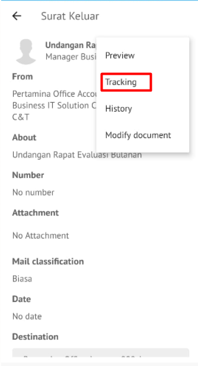 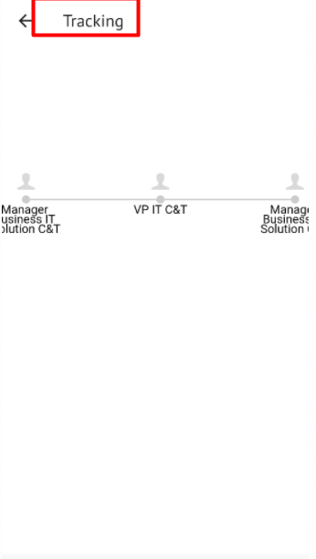

