**Role yang sesuai**

- *Approver User*

*User* dapat mengesahkan surat keluar yang sudah dikirim dan direview oleh reviewer. Keluaran untuk tindak lanjut ini adalah untuk men-*generate* nomor surat keluar kemudian surat keluar dapat dikirimkan ke pejabat tujuan. 

## **E-Corr Versi Web**

Berikut ini video tutorial yang menjelaskan langkah-langkah untuk mengesahkan surat keluar oleh approver **via Web**. Penandatangan surat keluar dapat menggunakan Digital Sign Peruri/BSSN/tanpa digital sign. Jika pengguna memilih menggunakan Peruri maka akan diarahkan untuk memasukan kode OTP yang dikirimkan ke email dan nomor handphone terdaftar. Jika penggunaa memilih menggunakan BSSN maka akan diarahkan untuk memasukan NIK dan Passphrase sesuai yang terdaftar pada sistem.

 

1. Klik menu **Draft**, Klik menu **Direct** dan pilih label **Surat Keluar**

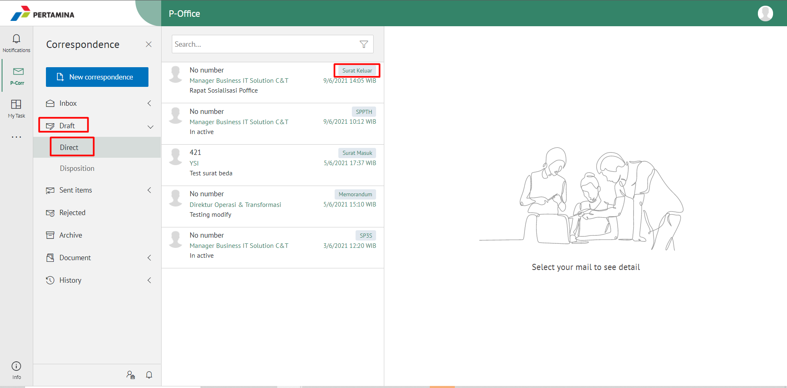

2. Pilih surat keluar yang akan ditindak lanjuti kemudian pilih tab **Detail**

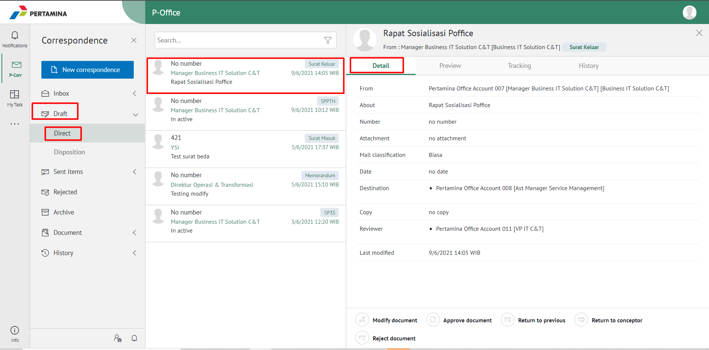

3. Klik **Approve Document** kemudian pilih **Submit**

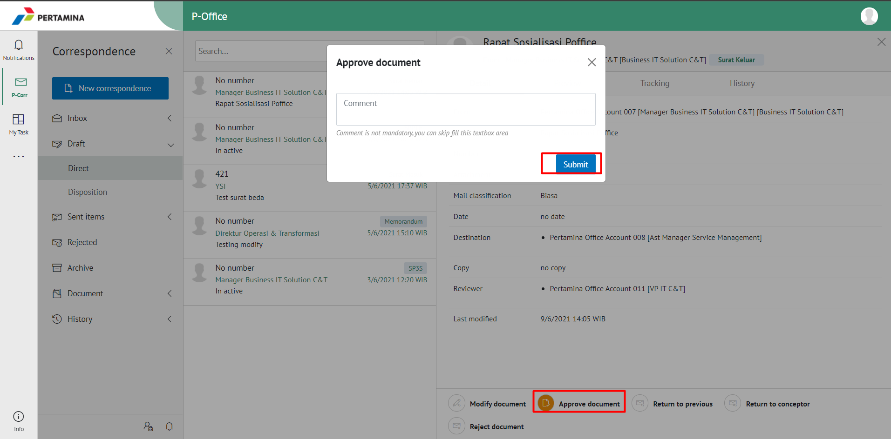

4. Pilih **Sign Document** menggunakan Peruri/BSSN/tanpa Digital Sign

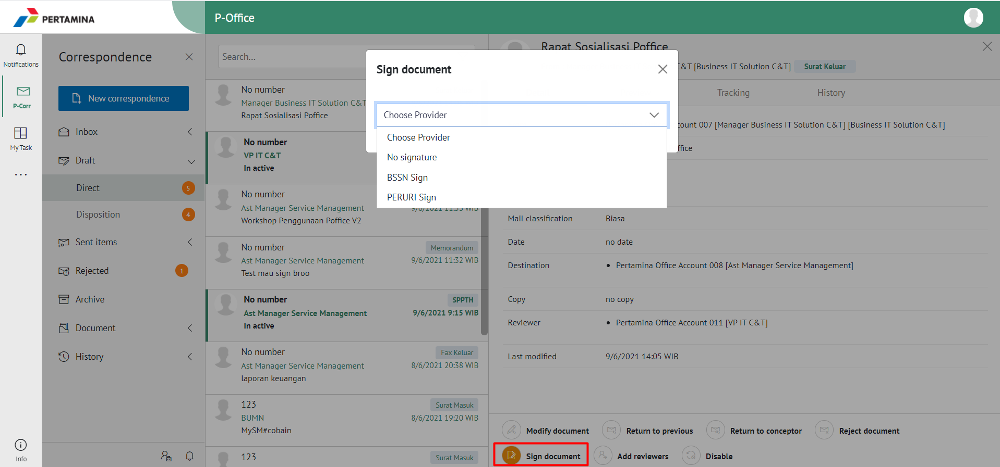

5. Sistem menampilkan *form* Validation of Digital Signature kemudian masukan kode OTP jika menggunakan Peruri atau masukan NIK dan Passphrase untuk BSSN

6. Klik button **Sign**
 
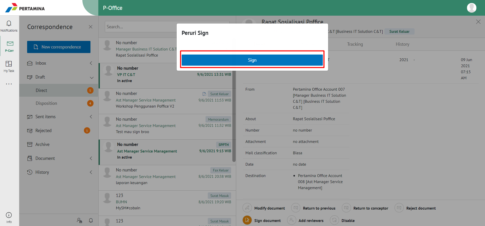

7. Surat keluar yang sudah disetujui akan tersimpan di menu **"Sent Item - Surat Keluar"** pengirim

## **E-Corr Versi Mobile (Android & iOS)**

Langkah-langkah untuk mengesahkan surat keluar via Mobile (Android & iOS) adalah sebagai berikut:

1. Klik menu **Draft - Direct** dan pilih label **Surat Keluar**

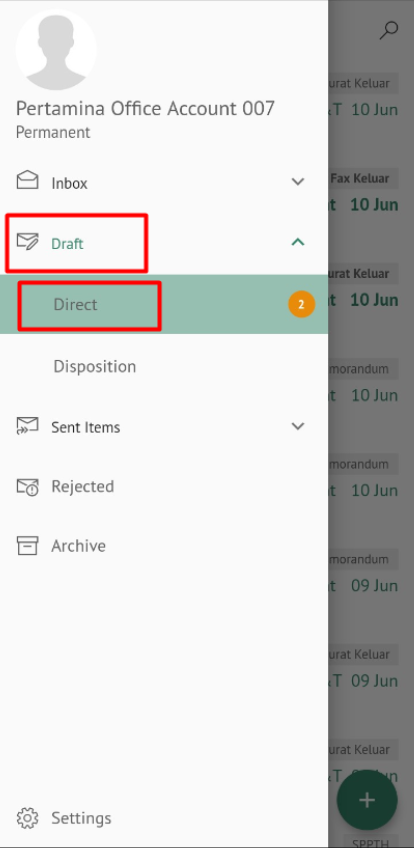 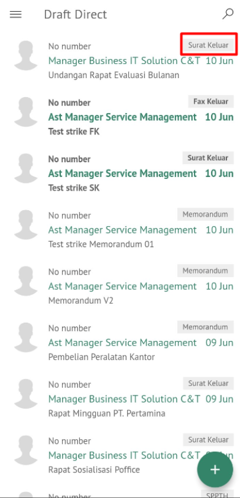

2. Pilih surat keluar yang akan ditindak lanjuti kemudian pilih tab **Detail**

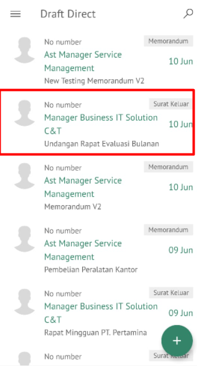 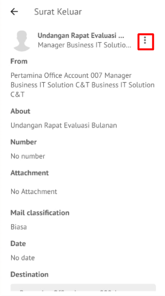

3. Pilih tombol **Sign document**

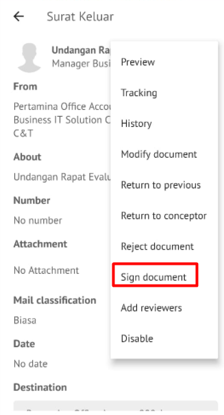

4. Sistem akan menampilkan form Signing Documents kemudian klik **Next**
   
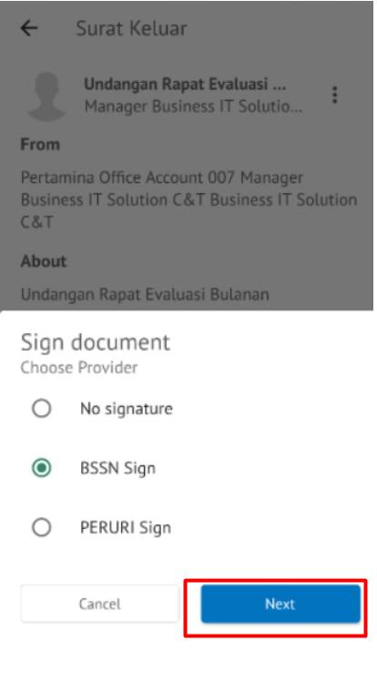

5. Kemudian isikan **NIK** dan **PassPhrase** pada form E-Corr kemudian klik **Next**
   
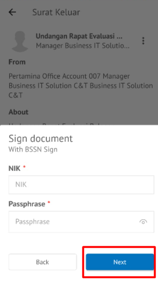

Surat keluar yang sudah disetujui akan tersimpan di menu “**Sent Item - Surat Keluar**” pengirim sedangkan surat keluar akan tersimpan di menu “**Inbox - Surat Keluar**” penerima.

