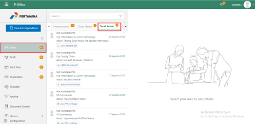
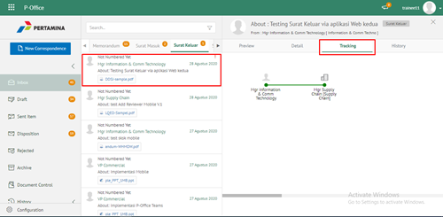

**Role yang sesuai**

- *Approver User*

*User* dapat mengesahkan surat keluar yang sudah dikirim dan direview oleh reviewer. Keluaran untuk tindak lanjut ini adalah untuk men-*generate* nomor surat keluar kemudian surat keluar dapat dikirimkan ke pejabat tujuan. 

## **E-Corr Versi Web**

Berikut ini tutorial yang menjelaskan langkah-langkah untuk mengesahkan surat keluar oleh approver **via Web**. Penandatangan surat keluar dapat menggunakan Digital Sign atau tanpa digital sign.

1. Klik menu **Draft**, Klik menu **Direct** dan pilih sulat yang berlabel **Surat Keluar**

2. Pilih surat keluar yang akan ditindak lanjuti kemudian pilih tab **Detail**

3. Klik **Approve Document** kemudian pilih **Submit**

4. Pilih **Sign Document** menggunakan Peruri/BSSN/tanpa Digital Sign

5. Sistem menampilkan *form* Validation of Digital Signature kemudian masukan kode OTP jika menggunakan Peruri atau masukan NIK dan Passphrase untuk BSSN

6. Klik button **Submit**
 

7. Surat keluar yang sudah disetujui akan tersimpan di menu **"Sent Item - Surat Keluar"** pengirim

