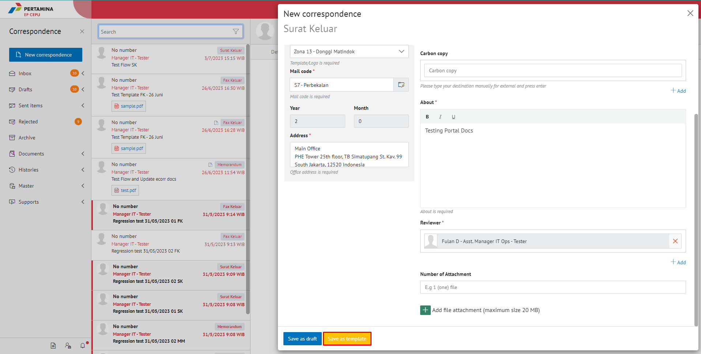
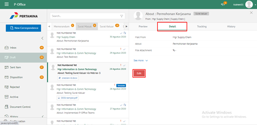
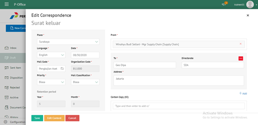
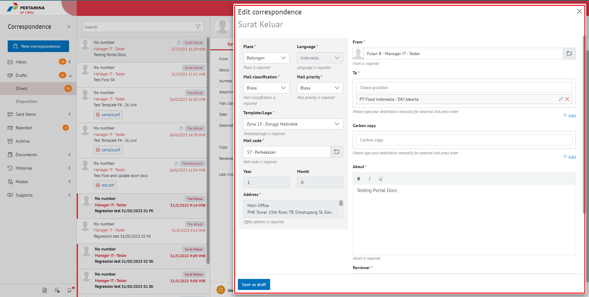

**Role yang sesuai**

- *Member User* (Pekerja)

*User* dapat menyimpan surat sebagai *template*. *Template* ini digunakan jika sewaktu - waktu *user* akan melanjutkan surat keluar yang sudah dibuat dan diubah kembali kemudian dikirimkan ke pejabat tujuan tanpa harus mengisi *form* surat keluar. 

## **E-Corr Versi Web**

Langkah - langkah untuk Save as template via Web adalah sebagai berikut :

1. Isi *form* surat keluar dan klik **Save as Template**

2. Surat keluar yang disimpan menjadi *template* akan tersimpan di menu **"Draft - Direct"**. Untuk melanjutkan *template* yang sudah dibuat *user* dapat memilih menu **"Draft - Direct"** kemudian pilih *template* yang akan digunakan

3. Pilih tombol **Use Template** untuk melanjutkan edit surat

4. Sistem akan menampilkan form **Edit Correspondence**, klik **Save as Draft** untuk menyimpan perubahan

5. Lakukan perubahan pada surat, klik **Save** untuk menyimpan perubahan dan surat akan tersimpan di menu **"Draft - Surat Keluar"** sebagai draft atau klik **Send document** untuk mengirimkan ke pejabat tujuan dan tersimpan di menu **"Sent Item - Surat Keluar"**.

