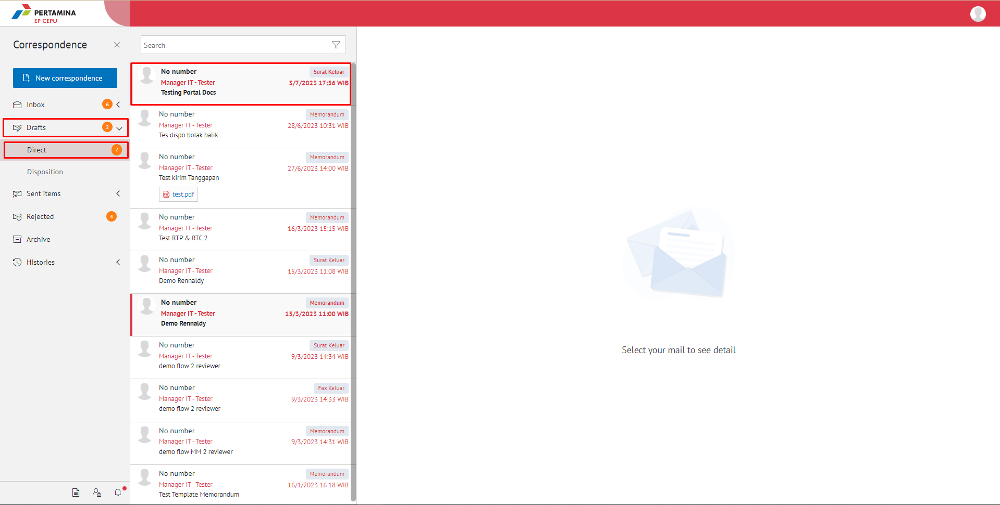
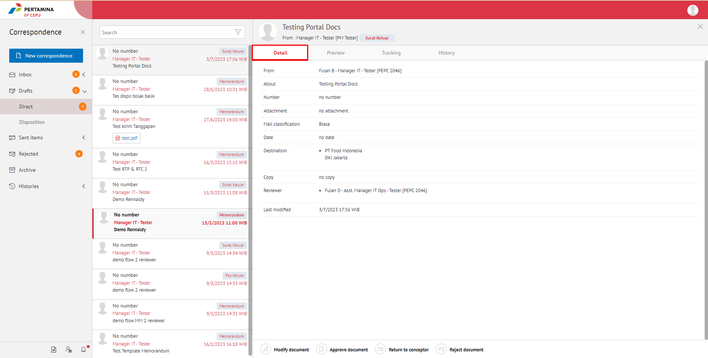
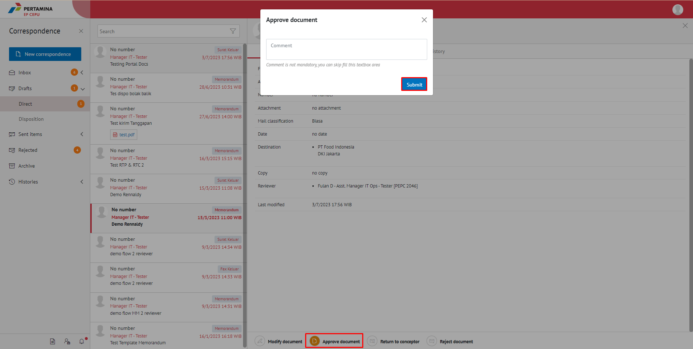
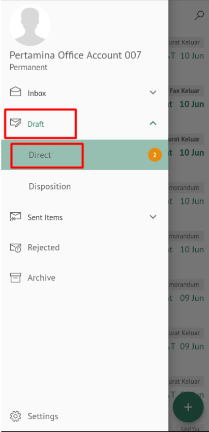
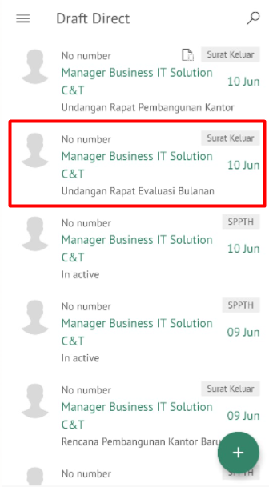
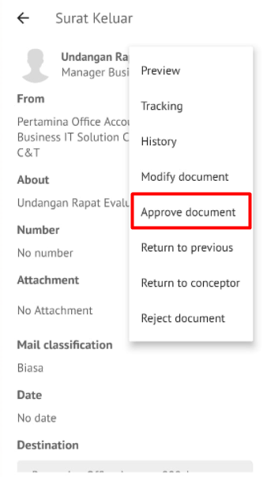
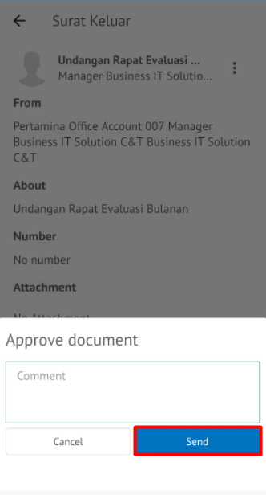

**Role yang sesuai**

- *Approver User*
- *Reviewer User*

*User* dapat menyetujui surat keluar yang sudah dilakukan review dan surat keluar akan dikirimkan ke *reviewer* selanjutnya atau *approver*. 

## **E-Corr Versi Web**

Langkah - langkah untuk menyetujui surat keluar via Web adalah sebagai berikut

1. Klik menu **Draft - Direct** dan pilih surat yang berlabel **Surat Keluar**

2. Pilih surat keluar yang akan ditindak lanjuti kemudian pilih tab **Detail**

3. Klik tombol **Approve document** dan pilih **Submit**. Isikan komentar jika diperlukan

4. Sistem berhasil menyimpan perubahan. Surat keluar yang sudah dikirim akan tersimpan di menu **Sent Item - Surat Keluar**

## **E-Corr Versi Mobile (Android & iOS)**

Langkah-langkah untuk melihat informasi surat keluar via Mobile (Android & iOS) adalah sebagai berikut :

1. Klik menu **Draft - Direct** dan pilih label **Surat Keluar**

 

2. Pilih surat keluar yang akan ditindak lanjuti kemudian pilih icon **Option**

 

3. Klik tombol **Approve document** dan pilih **Send** Isikan komentar jika diperlukan

 

4. Sistem berhasil menyimpan perubahan. Surat keluar yang sudah di kirim akan tersimpan di menu **Sent Item- Surat Keluar**

