**Role yang sesuai**

- *Approver User*

*User* dapat menambahkan reviewer kemudian surat keluar akan diteruskan ke reviewer baru.

## **E-Corr Versi Web**

Langkah - langkah untuk menambah reviewer surat keluar via Web adalah sebagai berikut :

1. Klik menu **Draft** dan Klik menu **Direct** kemudian pilih label **Surat Keluar**

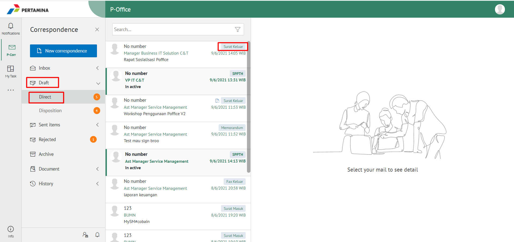

2. Pilih surat keluar yang akan ditindak lanjuti kemudian pilih tab **Detail**

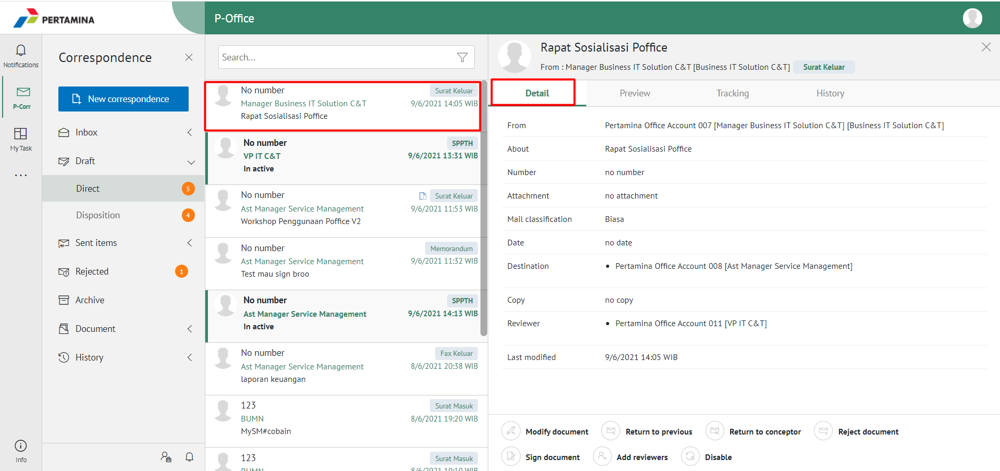

3. Klik tombol **Add Reviewer** dan pilih pejabat yang akan melakukan review dengan meng-klik tombol "+" pada field **Add Reviewer**

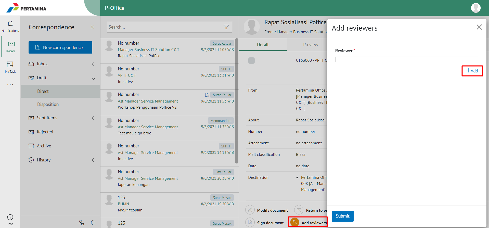

4. Sistem akan menampilkan pejabat untuk dijadikan reviewer baru

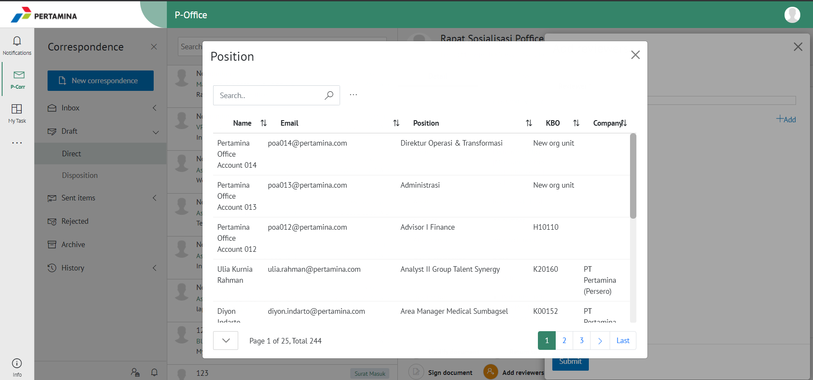

5. Pilih **Submit** untuk mengirimkan kepada pejabat/reviewer yang dituju dan surat keluar akan tersimpan di menu **"Sent Item - Surat Keluar"**. Untuk pejabat/reviewer baru akan menerima surat keluar di menu **"Draft - Surat Keluar"**

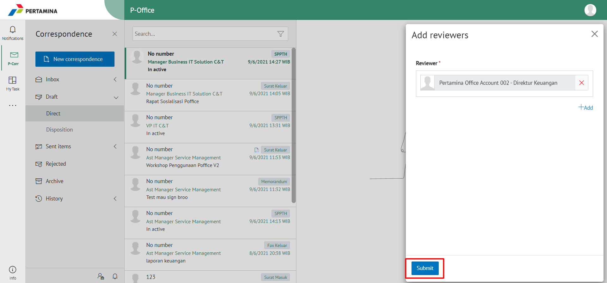

## **E-Corr Versi Teams**

Langkah - langkah untuk tambah reviwer baru via Teams adalah sebagai berikut :

1. Klik menu **Inbox** dan pilih tab **Surat Keluar**
 

2. Pilih surat keluar yang akan ditindak lanjuti kemudian pilih tab **Detail**
 

1. Klik tombol **Add Reviewer** dan pilih pejabat yang akan melakukan review dengan meng-klik tombol “+” pada field **Add Reviewer**
 
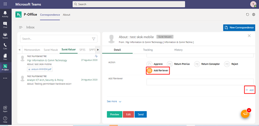

4. Sistem akan menampilkan pejabat untuk dijadikan reviewer baru
 
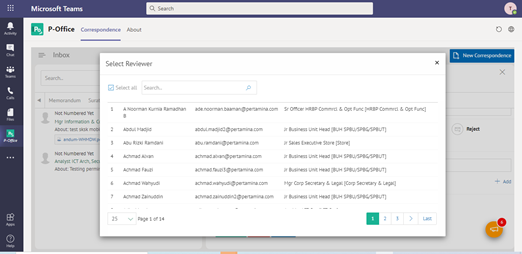

1. Pilih **Send** untuk mengirimkan kepada pejabat/reviewer yang dituju dan surat keluar akan tersimpan di menu **“Sent Item - Surat Keluar”**. Untuk pejabat/reviewer baru akan menerima surat keluar di menu **“Inbox – Surat Keluar”**
 
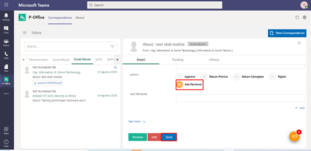

## **E-Corr Versi Mobile (Android & iOS)**

Langkah-langkah untuk menambahkan Reviewer baru surat keluar via Mobile (Android & iOS) adalah sebagai berikut :

1. Klik menu **Draft - Direct** dan pilih label **Surat Keluar**

 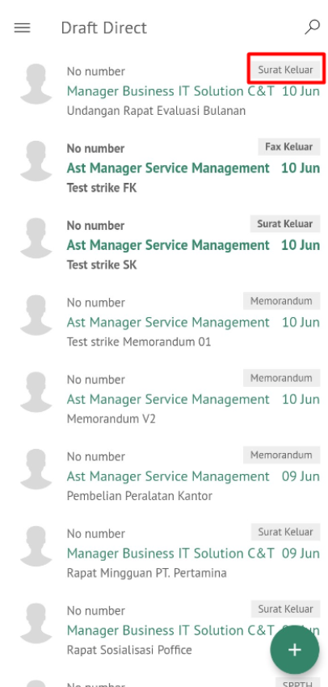

2. Pilih surat keluar yang akan ditindak lanjuti kemudian icon **Option**
   
 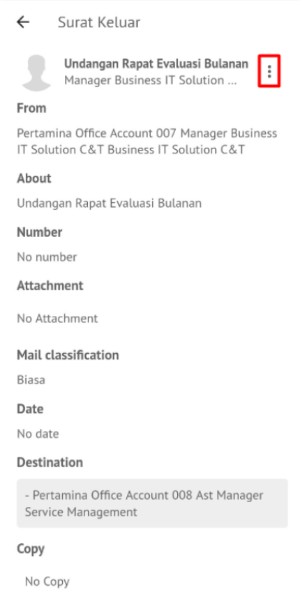

3. Klik tombol **Add Reviewers** dan pilih pejabat yang akan melakukan review dengan meng-klik tombol **+Add**
   
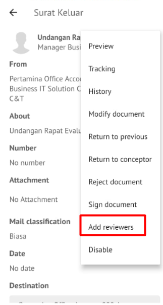 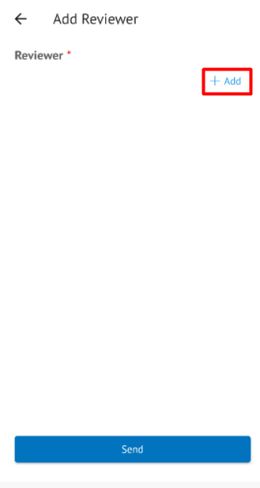

4. Sistem akan menampilkan pejabat untuk dijadikan reviewer baru

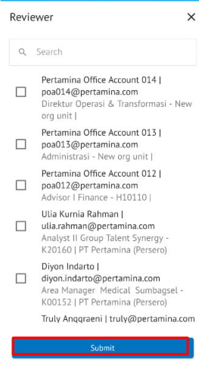 

5. Pilih **Submit** untuk mengirimkan kepada pejabat/reviewer yang dituju dan surat keluar akan tersimpan di menu “**Sent Item - Surat Keluar**”. Untuk pejabat/reviewer baru akan menerima surat keluar di menu **Draft – Direct** label **Surat Keluar**

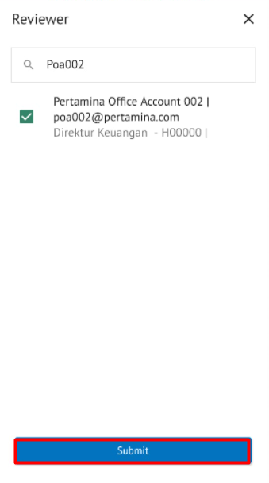

