**Role yang sesuai**

- *Member User* (Pekerja)

Konseptor dapat menambah surat keluar pada aplikasi E-Corr.

## **E-Corr Versi Web**

Langkah-langkah untuk menambah surat keluar via Web adalah sebagai berikut:

1. Klik menu **New Correspondence**

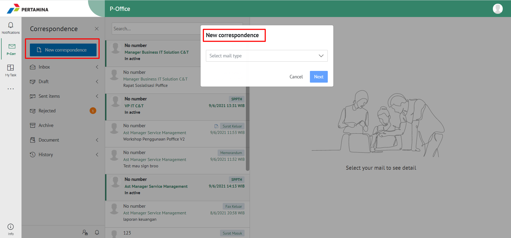

2. Pilih jenis surat **"Surat Keluar"**

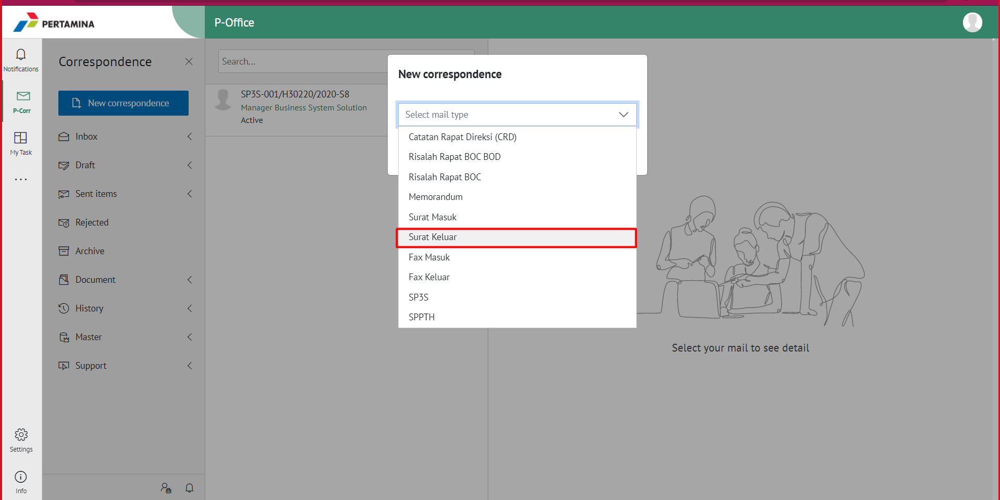

3. Isi *form* tambah surat keluar. Terdapat bebarapa aksi untuk menindaklanjuti surat keluar yang sudah diisi *form*nya yaitu **Send**, **Save** dan **Save as Template**

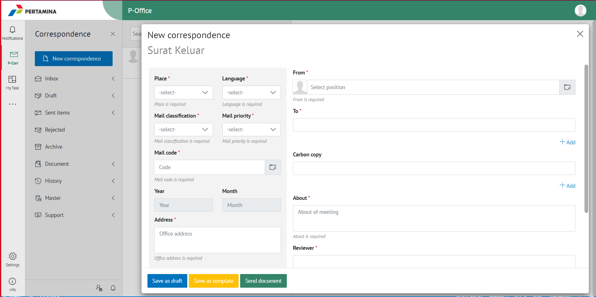

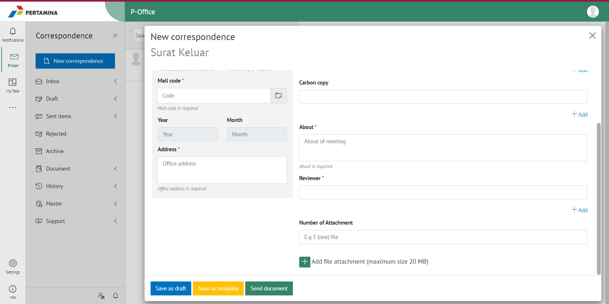

#### Simpan Surat Keluar

Langkah - langkah untuk menyimpan surat keluar adalah sebagai berikut:

1. Isi *form* surat keluar kemudian klik **Save**

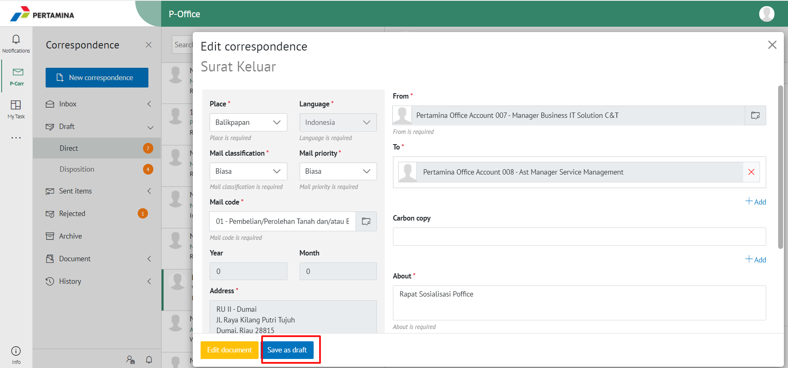

2. Sistem akan menampilkan tampilan *preview* surat keluar dalam bentuk Word yang dapat di edit. Untuk melakukan *editing* terhadap isi surat klik **Ubah Isi** kemudian sistem akan menampilkan *pop up* konfirmasi **Ubah Word Desktop** atau **Ubah Online**

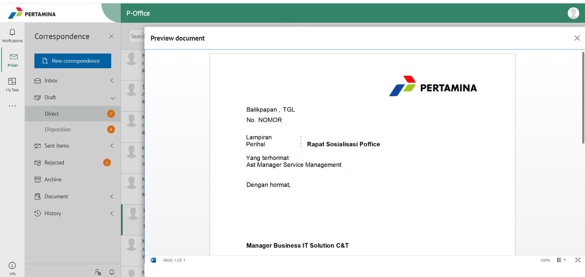

##### [Edit] Word Desktop

Langkah - langkah untuk mengubah isi surat keluar melalui Word Desktop adalah sebagai berikut

1. Klik **Ubah di Word** untuk mengubah melalui aplikasi Microsoft Word

2. Lakukan perubahan pada isi surat. Klik **Close** pada aplikasi Isi surat akan otomatis tersimpan

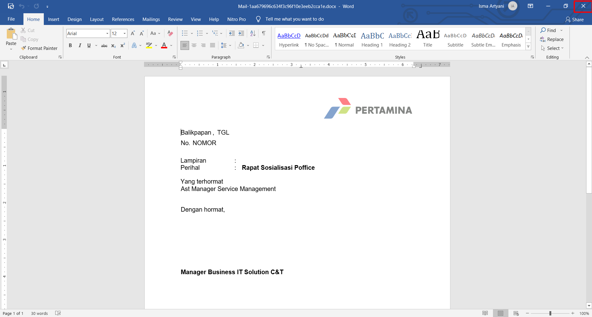

##### [Edit] Ubah Online

Langkah - langkah untuk mengubah isi surat keluar secara *online* adalah sebagai berikut

1. Klik **Ubah Online** untuk mengubah isi surat secara *online*

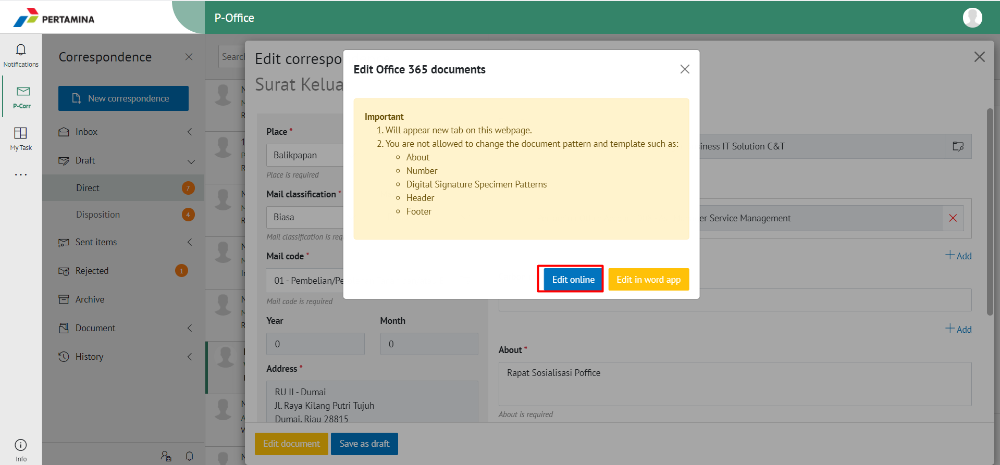

2. Lakukan perubahan pada isi surat. Klik **Close** pada aplikasi

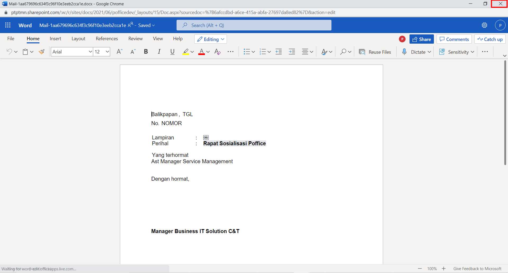

3. Isi surat akan otomatis tersimpan. Jika surat akan disimpan sebagai draft, maka klik **Yes**  

4. Surat yang sudah selesai diubah maka akan tersimpan di menu **"Draft - Surat Keluar"**

#### Kirim Surat Keluar

Langkah - langkah untuk mengirim surat keluar adalah sebagai berikut

1. Pada tampilan *Edit Correspondence* surat keluar, klik **Send Document** untuk mengirim surat ke pejabat tujuan

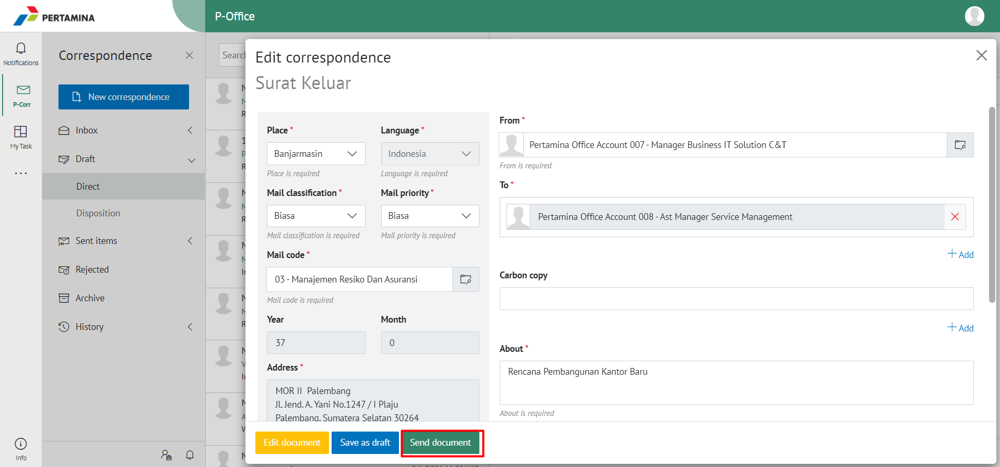

2. Sistem menyimpan perubahan dan surat keluar akan tersimpan di menu **"Sent Item - Surat Keluar"**

## **E-Corr Versi Mobile (Android & iOS)**

Langkah - langkah untuk menambah surat keluar via Mobile (Android & iOS) adalah sebagai berikut :

1. Klik tanda **(+)** pada surat keluar
   
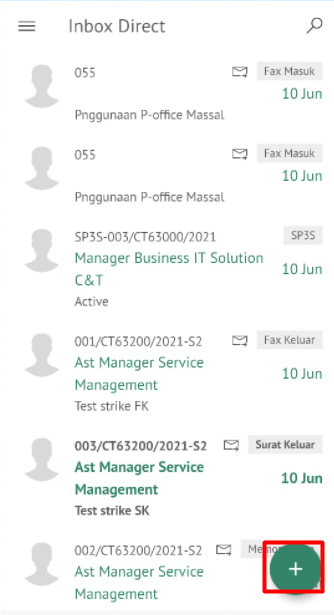

2. Pilih jenis surat “**Surat Keluar**” lalu klik **Next**

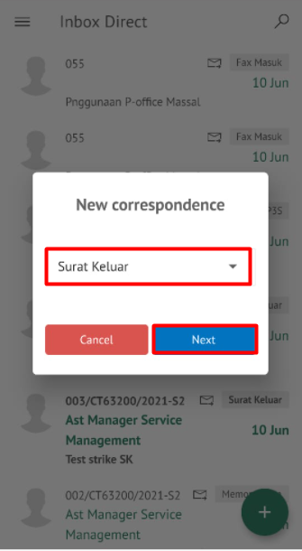 

3. Isi _form_ tambah surat keluar lalu klik tombol **Next**. Terdapat beberapa aksi untuk menindaklanjuti surat keluar yang sudah diisi yaitu **Save as draft**, **Save as Template**, dan **Send document**

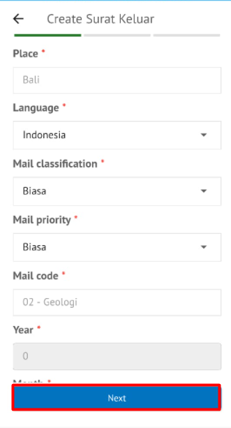
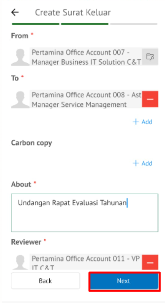 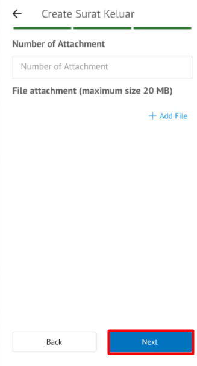 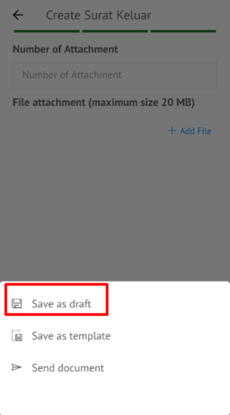  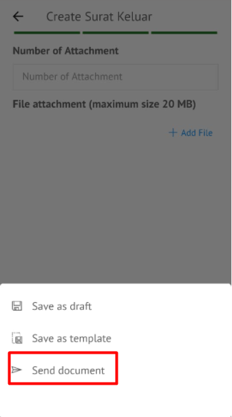

**Simpan Surat Keluar**

Langkah – langkah untuk menyimpan surat keluar adalah sebagai berikut.

1. Isi _form_ surat keluar kemudian klik **Save**

2. Surat keluar akan tersimpan di menu **Draft - Direct** label **Surat Keluar** 

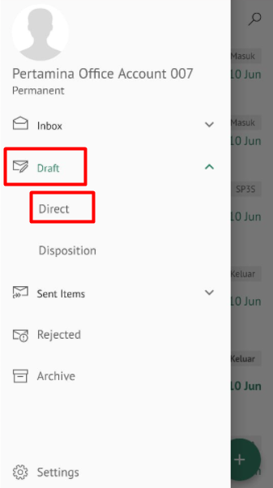
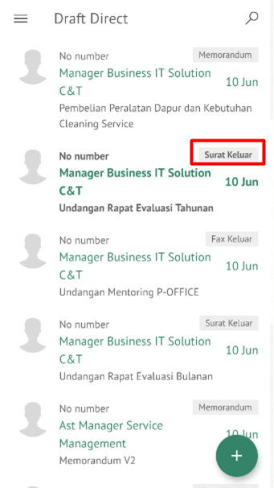

