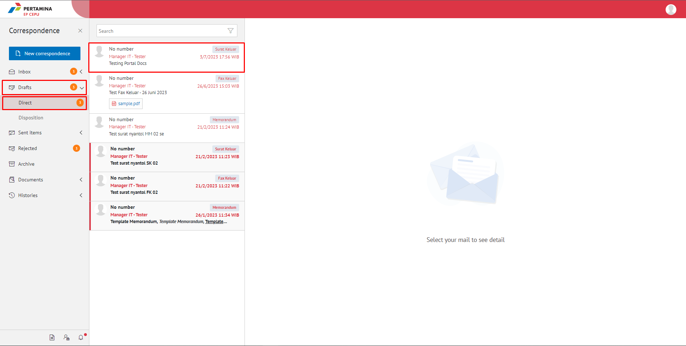
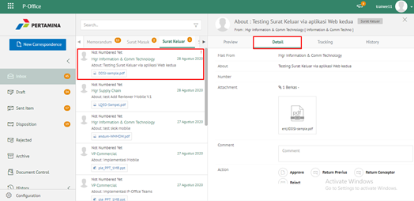
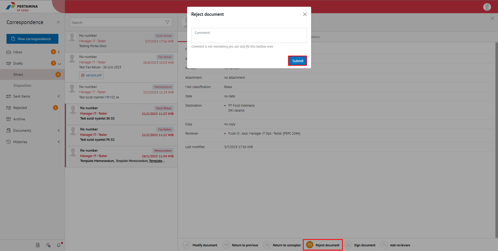

**Role yang sesuai**

- *Approver User*
- *Reviewer User*

*User* dapat menolak surat keluar yang akan dikembalikan ke konseptor jika hasil review surat keluar belum atau tidak sesuai. 

## **E-Corr Versi Web**
-langkah untuk menolak surat keluar via Web adalah sebagai berikut

1. Klik menu **Draft** dan Klik menu **Direct**  kemudian pilih surat yang berlabel **Surat Keluar**

2. Pilih surat keluar yang akan ditindak lanjuti kemudian pilih tab **Detail**

3. Klik tombol **Reject** dan pilih **Submit**. Isikan komentar jika diperlukan

4. Sistem berhasil menyimpan perubahan. Surat keluar yang sudah ditolak akan otomatis terhapus akan tersimpan di menu **Rejected** label **Surat Keluar** user penolak dengan label **Rejected**

