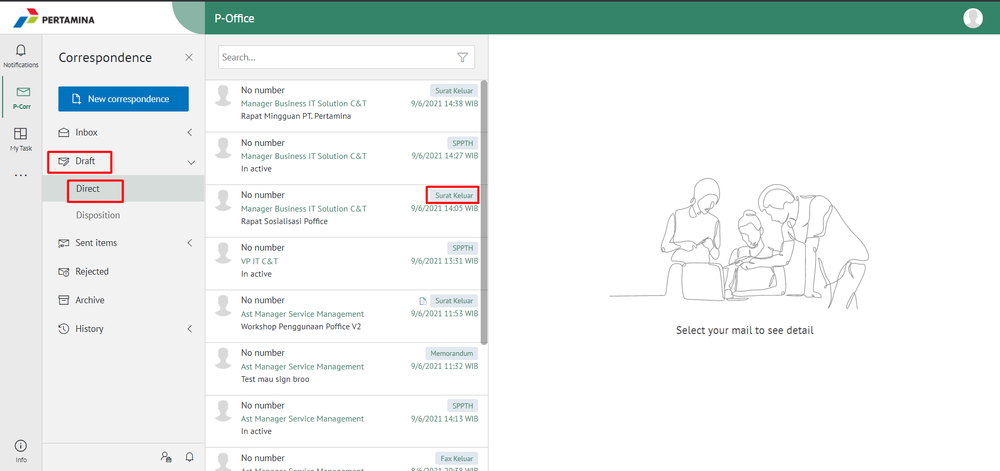
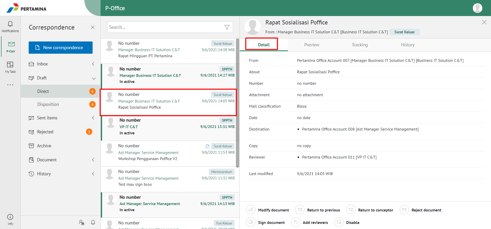
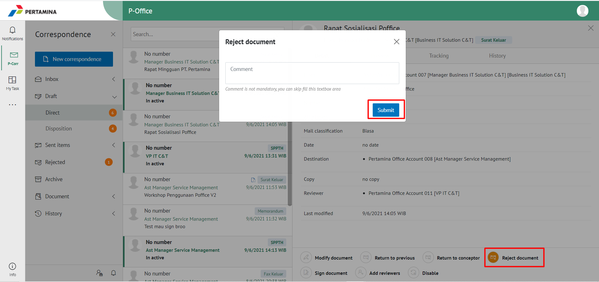
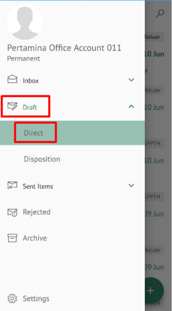
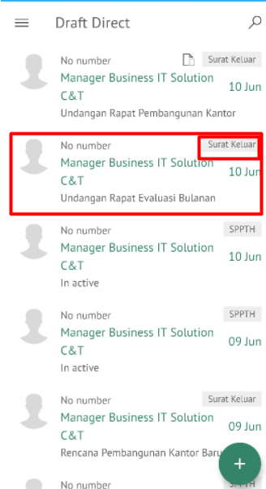
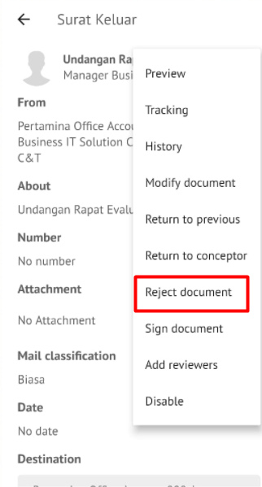
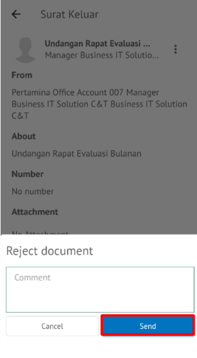

**Role yang sesuai**

- *Approver User*
- *Reviewer User*

*User* dapat menolak surat keluar yang akan dikembalikan ke konseptor jika hasil review surat keluar belum atau tidak sesuai. 

## **E-Corr Versi Web**
-langkah untuk menolak surat keluar via Web adalah sebagai berikut

1. Klik menu **Draft** dan Klik menu **Direct**  kemudian pilih label **Surat Keluar**

2. Pilih surat keluar yang akan ditindak lanjuti kemudian pilih tab **Detail**

3. Klik tombol **Reject** dan pilih **Submit**. Isikan komentar jika diperlukan

4. Sistem berhasil menyimpan perubahan. Surat keluar yang sudah ditolak akan otomatis terhapus akan tersimpan di menu **Rejected document** label **Surat Keluar** user penolak dengan label **Rejected**

## **E-Corr Versi Mobile (Android & iOS)**

Langkah-langkah untuk menolak surat keluar via Mobile (Android & iOS) adalah sebagai berikut :

1. Klik menu **Draft - Direct** dan pilih label **Surat Keluar**

 

2. Pilih surat keluar yang akan ditindaklanjuti kemudian pilih icon **Option**
   

3. Klik tombol **Reject** dan pilih **Send** Isikan komentar jika diperlukan

 

4. Sistem berhasil menyimpan perubahan surat keluar yang sudah di tolak akan tersimpan dimenu “**Rejected- Surat keluar”** user penolak pada label “**Rejected**”

