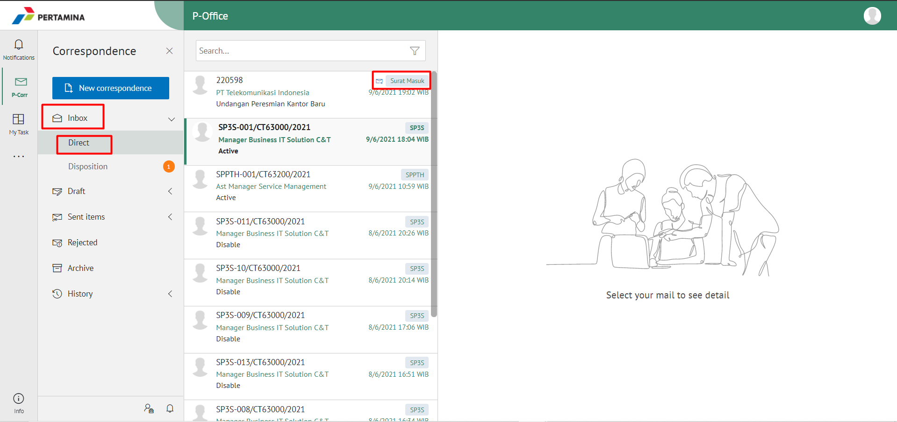
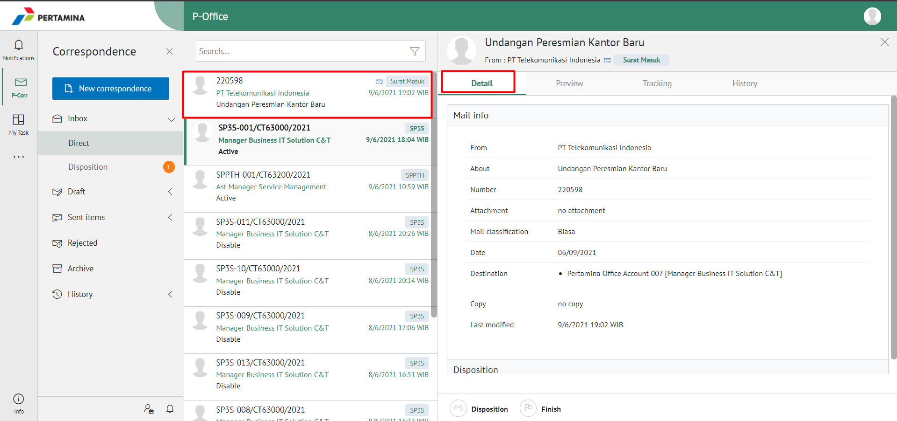
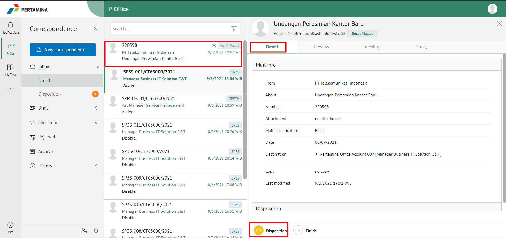
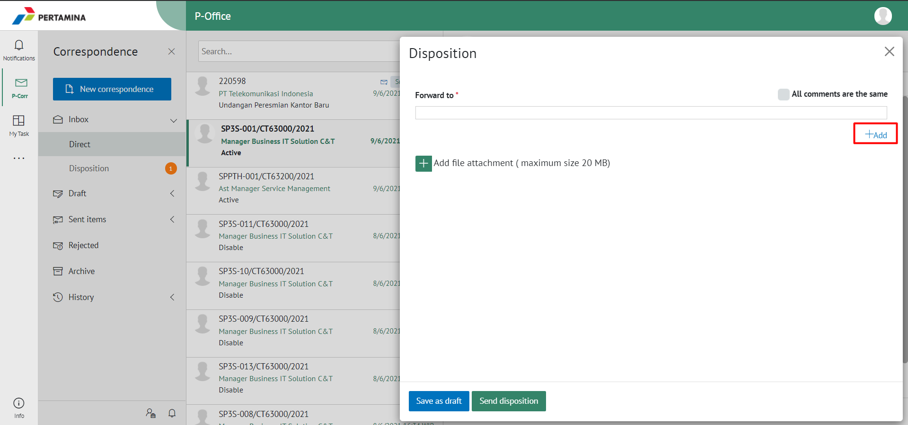
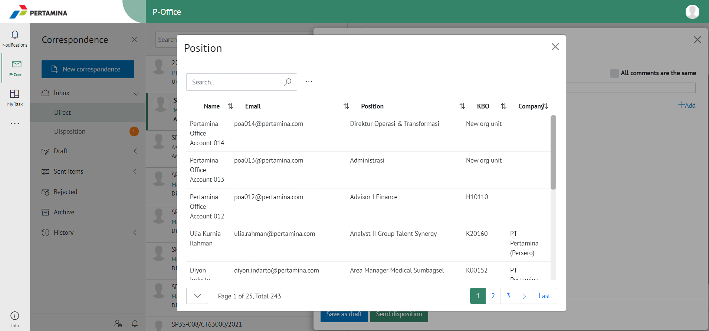
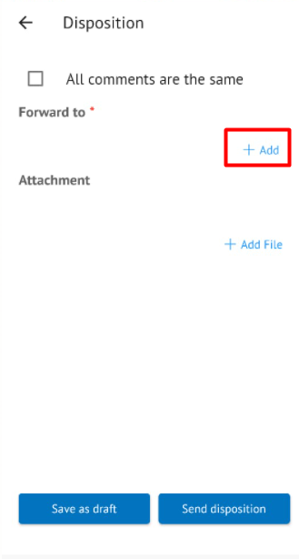
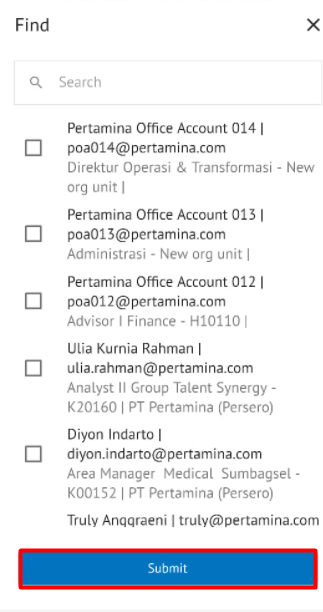
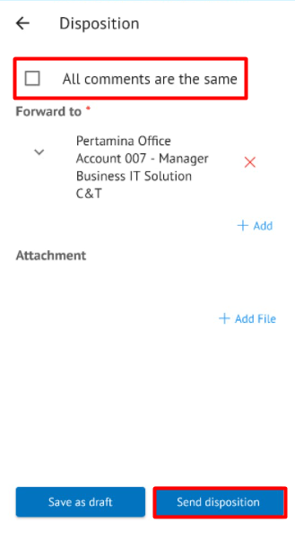

**Role yang sesuai**

- *Approver User*
- *Reviewer User*

 _User_ dapat melakukan _custom_ penerima disposisi terhadap pejabat penerima yang akan menerima perintah disposisi. Secara _default_ pejabat yang akan menerima disposisi adalah pejabat yang ada dibawahnya. Tetapi terdapat _case_ jika _user_ membutuhkan _custom_ penerima disposisi sehingga disediakan fitur untuk memilih pejabat selain pejabat yang ada dibawahnya

## **E-Corr Versi Web**

Langkah - langkah untuk custom penerima disposisi via Web adalah sebagai berikut :

1. Klik menu **Inbox** dan pilih label **Surat Masuk**

2. Pilih surat masuk yang akan didisposisikan kemudian pilih tab **Detail**

3. Klik tombol **Disposisi**

4. Sistem menampilkan form disposisi. Klik icon "+" pada field **Forward To.** Isikan informasi disposisi dan perintah untuk masing-masing penerima disposisi.

5. Sistem menampilkan daftar pejabat yang dapat dipilih untuk didisposikan

6. Isikan perintah dan keterangan pada masing-masing penerima disposisi. Tambahkan lampiran disposisi jika diperlukan. Fitur **Same All Comment** dapat digunakan _user_ untuk memberikan komentar yang sama untuk masing-masing pejabat penerima disposisi. Klik **Save** untuk menyimpan perubahan dan klik **Send Disposition** untuk mengirim disposisi.

## **E-Corr Versi Mobile (Android & iOS)**

Langkah - langkah untuk melakukan custom penerima disposisi masuk via Mobile (Android & iOS) adalah sebagai berikut:

1. Klik menu **Inbox - Direct** dan pilih label **Surat masuk**

  

2. Pilih surat masuk yang akan didisposisikan kemudian pilih icon **Option**

3. Klik tombol **Disposition** lalu sistem akan menampilkan form disposisi. Klik icon **“+ Add ”** pada field **Forward To** Isikan informasi disposisi dan perintah untuk masing-masing penerima disposisi.
   
 

4. Sistem menampilkan daftar pejabat yang dapat dipilih untuk didisposikan lalu pilih **Submit**
   

5. Isikan perintah dan keterangan pada masing-masing penerima disposisi. Tambahkan lampiran disposisi jika diperlukan. Fitur **Same Comment For All** dapat digunakan _user_ untuk memberikan komentar yang sama untuk masing-masing pejabat penerima disposisi. Klik **Save** untuk menyimpan perubahan dan klik **Send** untuk mengirim disposisi.
   

