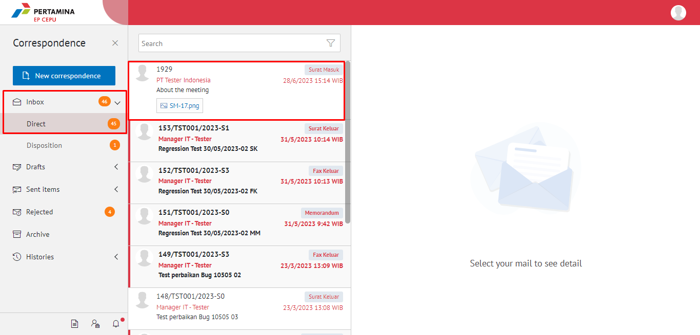
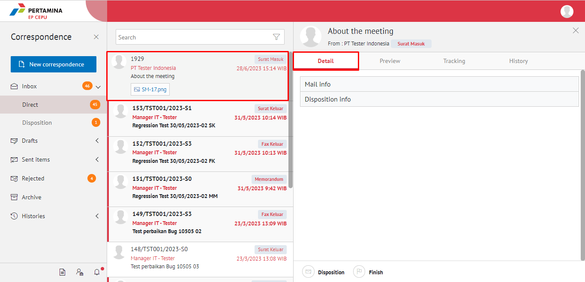
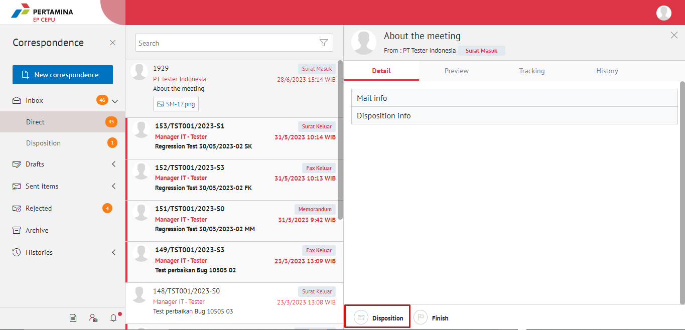
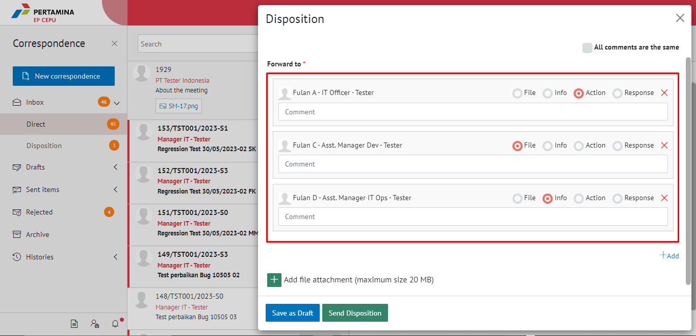
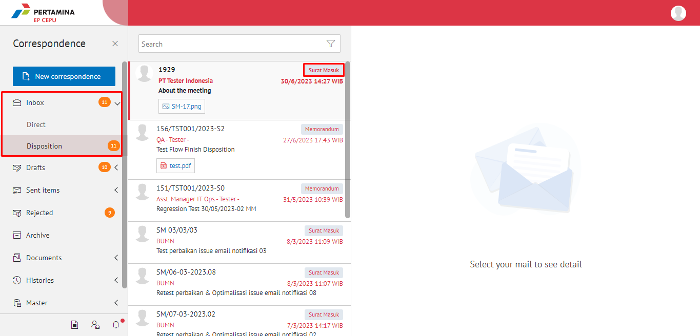
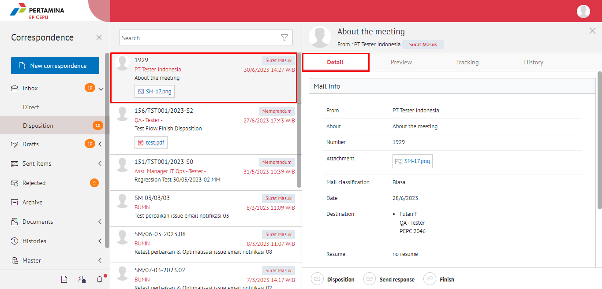
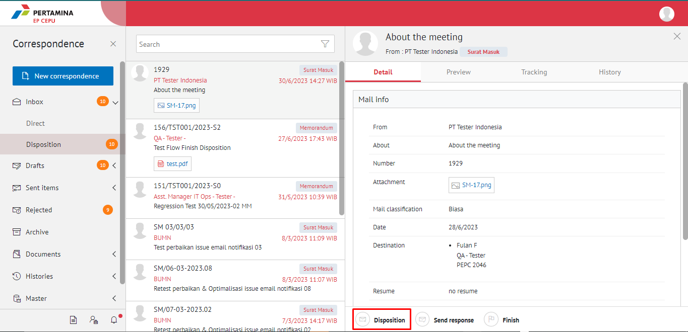
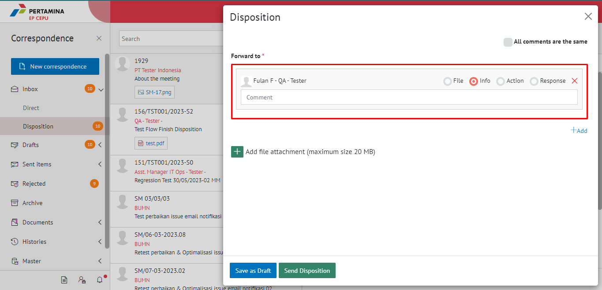

**Role yang sesuai**

- *Approver User*
- *Reviewer User*

_User_ menerima surat masuk baru di menu "**Inbox - Surat Masuk**" atau menu "**Disposisi - Surat Masuk**". Surat masuk dapat didisposisikan kepada pejabat yang dipilih atau pejabat yang ada dibawahnya. Disposisi surat masuk dapat dilakukan dengan dua cara yaitu melalui menu **Inbox** jika surat masuk yang diterima merupakan surat masuk yang ditujukan langsung dari sekretaris ke pejabat pemilik KBOnya atau melalui menu **Disposisi** jika surat masuk sudah dilakukan tindak lanjut oleh pejabat pemilik KBO dan pemilik KBO akan mendisposisikan ke pejabat selanjutnya atau pejabat yang ada dibawahnya.

## **E-Corr Versi Web**

Langkah - langkah untuk mendisposisikan surat masuk via Web adalah sebagai berikut :

####   **Disposisi melalui Menu Inbox - Direct**

1.    Klik menu **Inbox** - **Direct** dan pilih label **Surat Masuk**

2.    Pilih surat masuk yang akan didisposisikan kemudian pilih tab **Detail**

3.    Klik tombol **Disposition**

4.    Sistem menampilkan form disposisi. Isikan informasi disposisi dan perintah untuk masing-masing penerima disposisi.

5.    Klik **Save as Draft** untuk menyimpan draft disposisi surat masuk dan surat masuk akan tersimpan di menu "**Draft - Disposition**". Klik **Send Item - Disposition** untuk mengirim disposisi ketujuan dan disposisi surat masuk akan tersimpan di menu "**Sent Item - Disposisi**".

####   **Disposisi melalui Menu Disposisi**

1.    Klik menu **Inbox - Disposition** dan kemudian pilih label **Surat Masuk**

2.    Pilih surat masuk yang akan didisposisikan kemudian pilih tab **Detail**

3.    Klik tombol **Disposition**

4.    Sistem menampilkan form disposisi. Isikan informasi disposisi dan perintah untuk masing-masing penerima disposisi.

5.    Klik **Save as Draft** untuk menyimpan draft disposisi surat masuk dan surat masuk akan tersimpan di menu "**Draft - Surat masuk**". Klik **Send Disposition** untuk mengirim disposisi ketujuan dan disposisi surat masuk akan tersimpan di menu "**Sent Item - Disposisi**".

