**Role yang sesuai**

- Sekretaris

Sekretaris dapat melakukan _drafting_ surat masuk pada aplikasi E-Corr. _Drafting_ surat masuk dilakukan jika _user_ akan meneruskan dan melakukan perubahan pada surat masuk yang sudah disimpan pada menu **Draft.**

## **E-Corr Versi Web**

Langkah - langkah untuk drafting Surat Masuk via Web adalah sebagai berikut :

1.    Klik menu **Draft** dan pilih sub menu  **Direct**

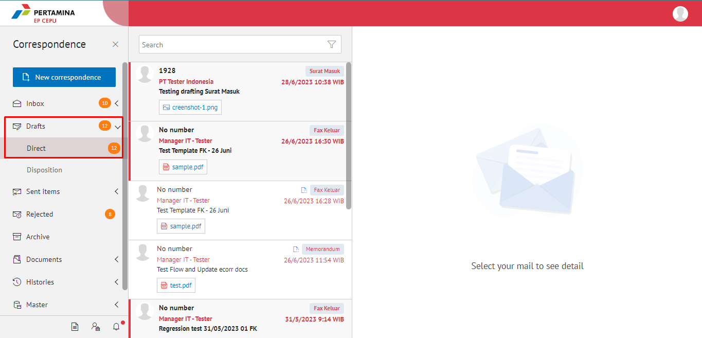

2.    Pilih Surat Masuk yang akan diubah. Pilih tab **Detail** kemudian klik **Modify document**

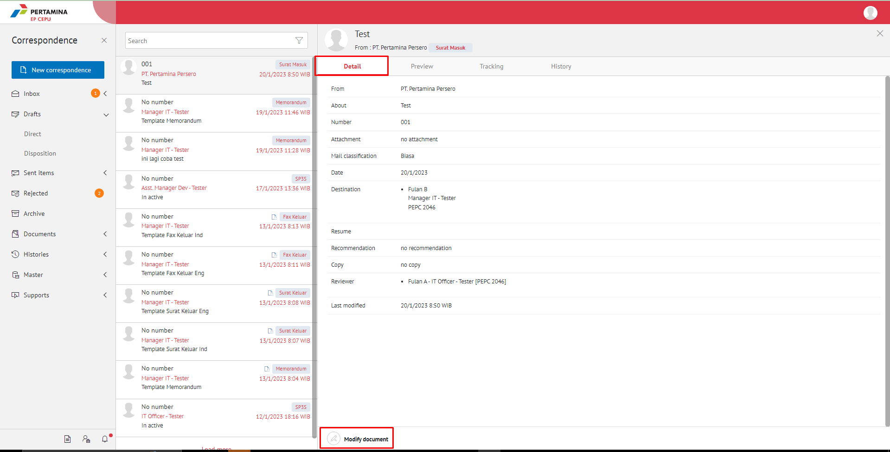

3.    Sistem akan menampilkan _form_ **Edit Correspondence**

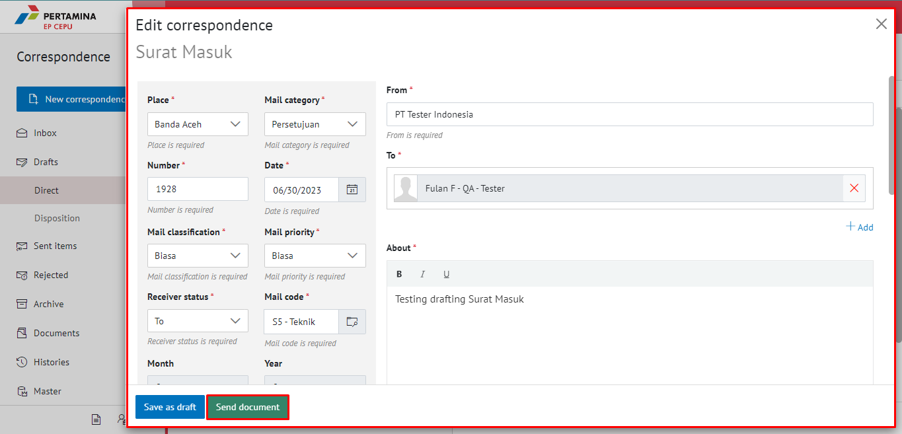

4.	  Lakukan perubahan pada _form_. Klik **Send Document** untuk mengirim surat masuk ke pejabat tujuan. Surat yang terkirim akan tersimpan di menu "**Sent Item - Surat Masuk"**

# **E-Corr Versi Mobile (Android & iOS)**

Langkah-langkah untuk Drafting surat masuk via Mobile (Android & iOS) adalah sebagai berikut:

1. Klik menu **Draft - Direct** dan pilih label **Surat Masuk**

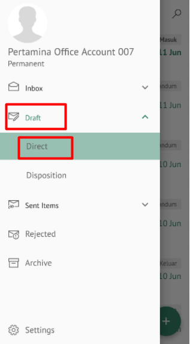 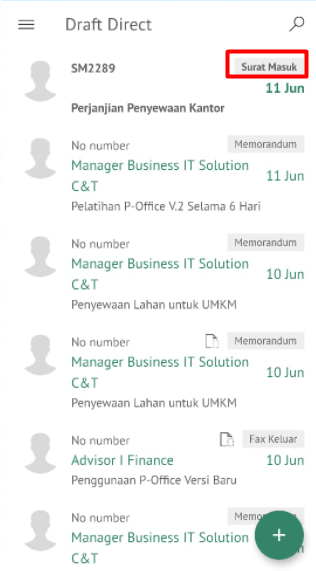

2. Pilih surat masuk yang akan diubah. Pilih tombol **button** kemudian klik **Modify document**

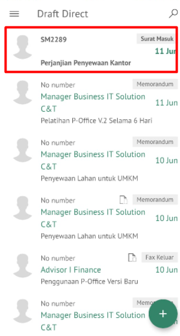 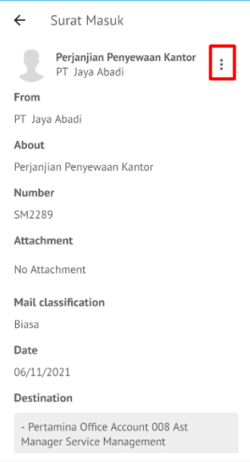 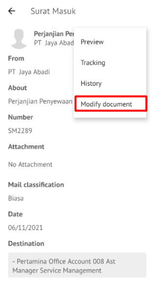

3. Sistem akan menampilkan _form_ **Edit Surat Masuk** kemudian klik **Next**

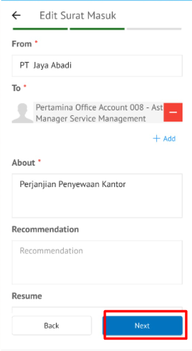 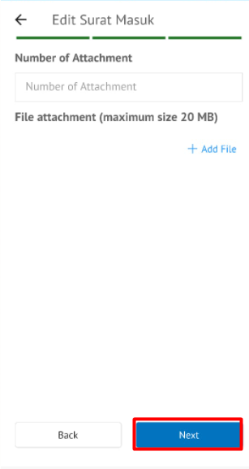

4. Lakukan perubahan pada _form_. Klik **Send document** untuk mengirim surat masuk ke pejabat tujuan. Surat yang terkirim akan tersimpan di menu “**Sent Item - Direct** label **Surat Masuk”**

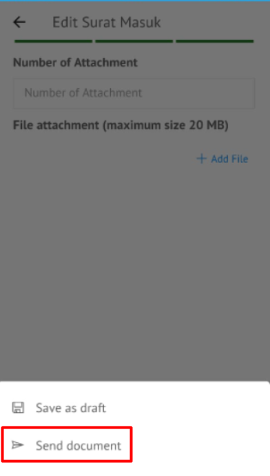

