**Role yang sesuai**

- *Approver User*
- *Reviewer User*
- *Member User* (Pekerja)
- Sekretaris

_User_ dapat melihat informasi lengkap surat masuk termasuk _preview_ surat masuk, detail surat masuk, _tracking_ surat masuk dan _history_ surat masuk. 

## **P-Office Versi Web**

Langkah-langkah untuk melihat informasi surat masuk via Web adalah sebagai berikut.

1.    Klik menu **Inbox/Draft/Sent Item** dan pilih label **Surat Masuk.** Pilih salah satu surat masuk yang akan dilihat informasinya

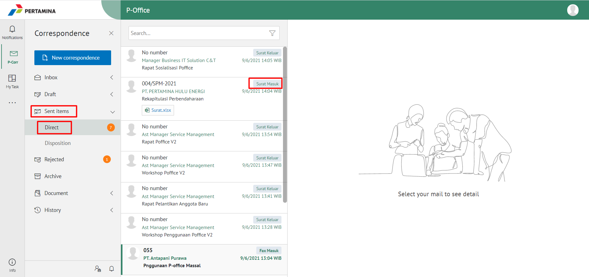

####   **Preview Surat Masuk**

Pada tab **Preview**, ditampilkan _preview_ surat masuk yang merupakan hasil unggahan yang diinputkan oleh sekretaris/konseptor.

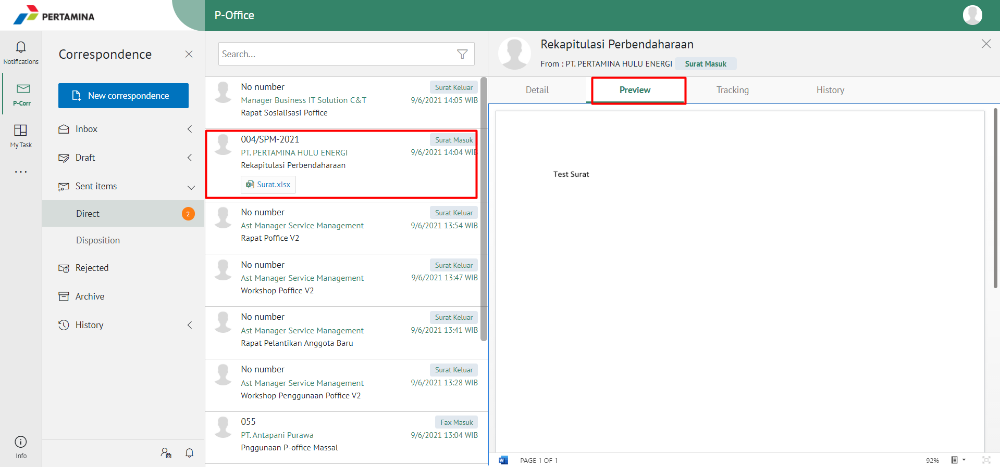

####   **Detail Surat Masuk**

Pada tab **Detail**, terdapat informasi asal surat, perihal, file lampiran, kategori surat, resume, rekomendasi, nomor surat, klasifikasi surat, tanggal surat dan tujuan.

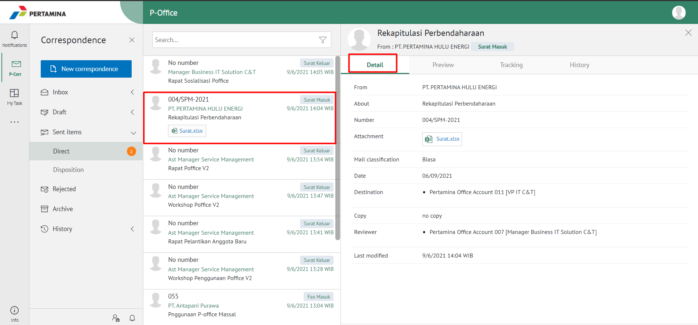

####   **Tracking Surat Masuk**

Pada tab **Tracking**, ditampilkan informasi _tracking_ surat masuk dalam bentuk _chart_

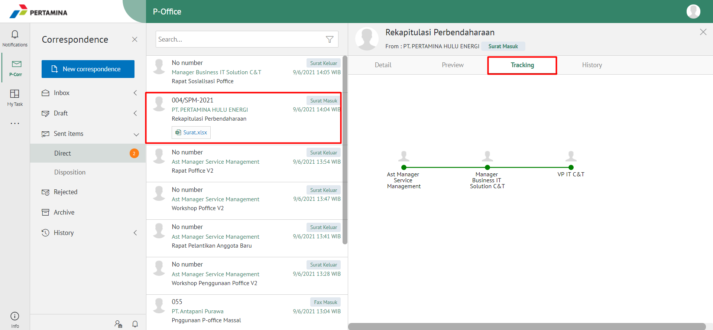

####   **History Surat Masuk**

Pada tab **History**, ditampilkan riwayat surat masuk yang terdapat informasi jabatan, tanggal, tindakan dan komentar

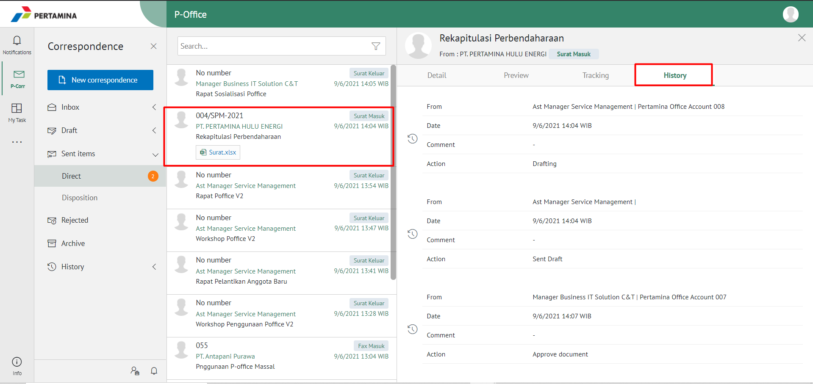

## **P-Office Versi Teams**

Langkah - langkah untuk Informasi surat masuk via Teams adalah sebagai berikut:

1. Klik menu **Inbox/Draft/Sent Item** dan pilih tab **Surat Masuk**. Pilih salah satu surat masuk yang akan dilihat informasinya

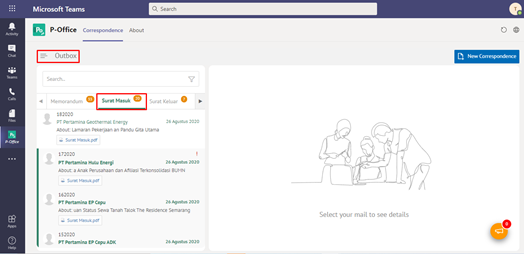

####   **Preview Surat Masuk**

Pada button **Preview**, ditampilkan preview surat masuk yang merupakan hasil unggahan yang diinputkan oleh sekretaris/konseptor.

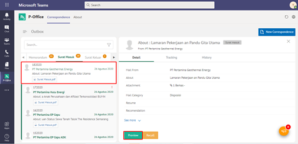

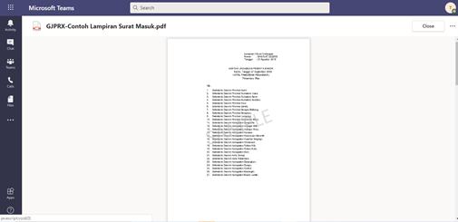

####   **Detail Surat Masuk**

Pada tab **Detail**, terdapat informasi asal surat, perihal, file lampiran, kategori surat, resume, rekomendasi, nomor surat, klasifikasi surat, tanggal surat dan tujuan.

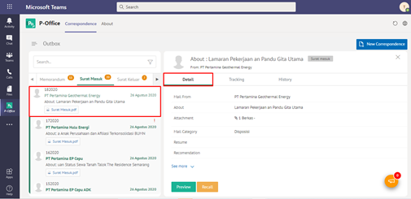

####   **Tracking Surat Masuk**

Pada tab **Tracking**, ditampilkan informasi tracking surat masuk dalam bentuk chart

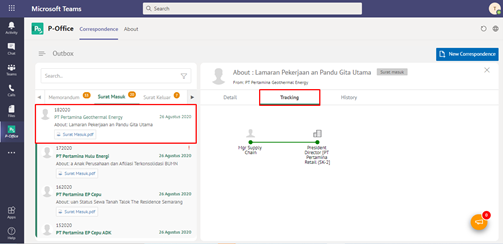

####   **History Surat Masuk**

Pada tab **History**, ditampilkan riwayat surat masuk yang terdapat informasi jabatan, tanggal, tindakan dan komentar

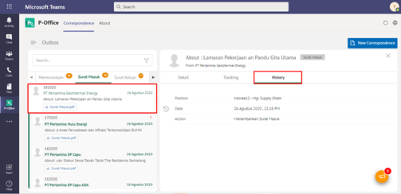

# **P-Office Versi Mobile (Android & iOS)**

Langkah - langkah untuk melihat informasi surat masuk via Mobile (Android & iOS) adalah sebagai berikut:

1. Klik menu **Inbox/Draft/Sent Item** dan pilih tab **Surat Masuk** pilih salah satu surat masuk yang akan dilihat informasinya

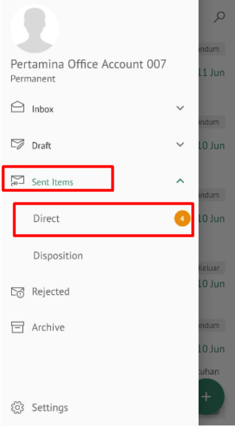 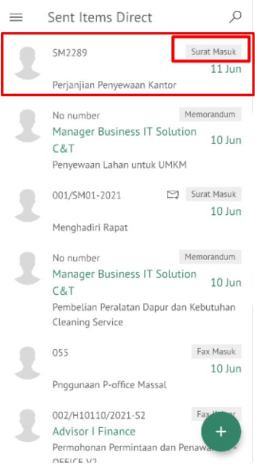

**Detail Surat Masuk**

Pada tab **Detail**, terdapat informasi asal surat, perihal, file lampiran, kategori surat, resume, rekomendasi, nomor surat, klasifikasi surat, tanggal surat dan tujuan

**Preview Surat Masuk**

Pada tab **Preview**, ditampilkan _preview_ surat masuk yang merupakan hasil unggahan yang diinputkan oleh sekretaris/konseptor.

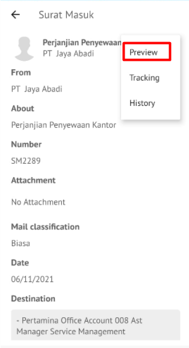 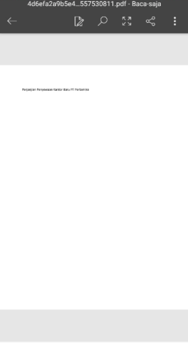

**History Surat Masuk**

Pada tab **History**, ditampilkan riwayat surat masuk yang terdapat informasi jabatan, tanggal, tindakan dan komentar

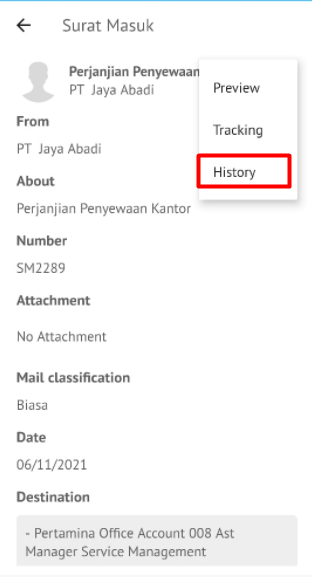 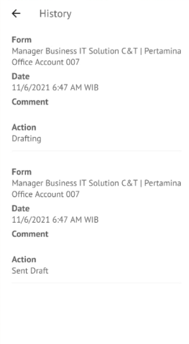

