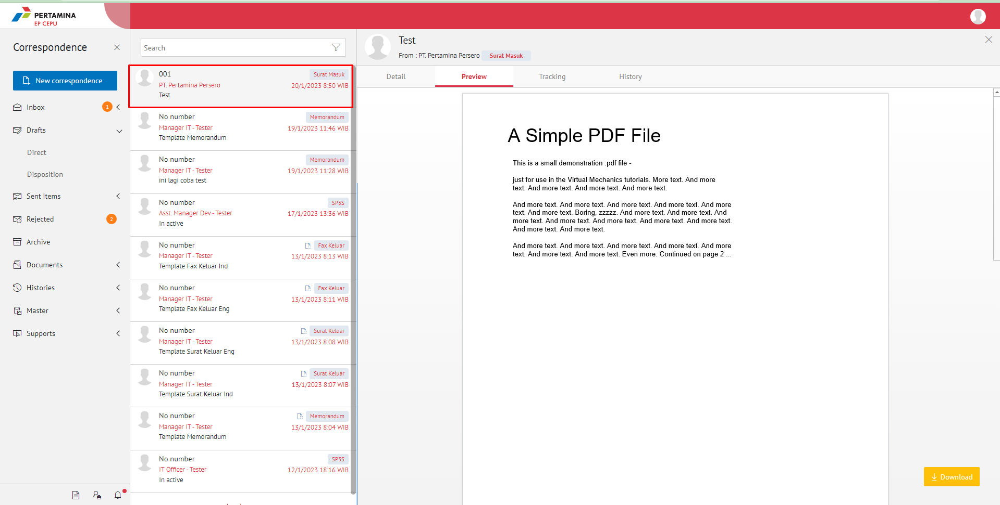
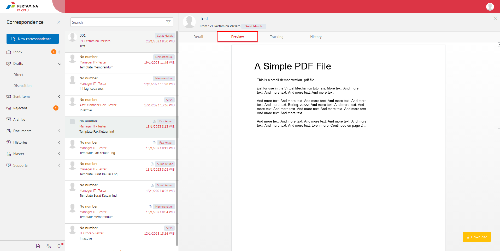
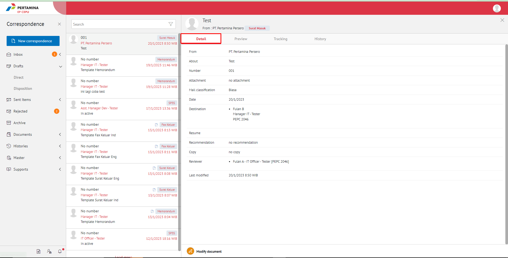
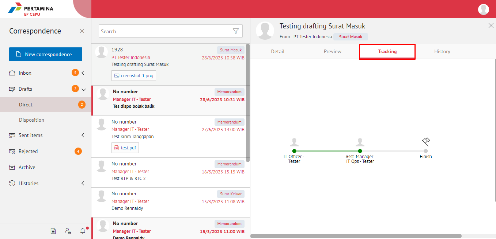
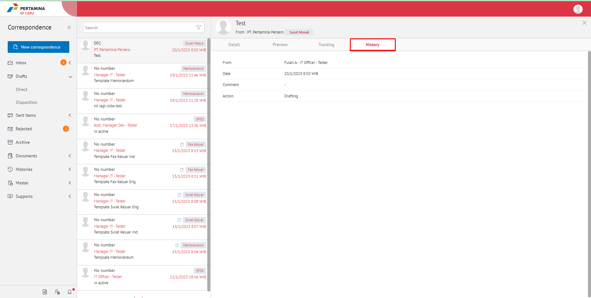

**Role yang sesuai**

- *Approver User*
- *Reviewer User*
- *Member User* (Pekerja)
- Sekretaris

_User_ dapat melihat informasi lengkap surat masuk termasuk _preview_ surat masuk, detail surat masuk, _tracking_ surat masuk dan _history_ surat masuk. 

## **E-Corr Versi Web**

Langkah-langkah untuk melihat informasi surat masuk via Web adalah sebagai berikut.

1.    Klik menu **Inbox/Draft/Sent Item** dan pilih label **Surat Masuk.** Pilih salah satu surat masuk yang akan dilihat informasinya

####   **Preview Surat Masuk**

Pada tab **Preview**, ditampilkan _preview_ surat masuk yang merupakan hasil unggahan dari dokumen yang diunggah oleh sekretaris/konseptor.

####   **Detail Surat Masuk**

Pada tab **Detail**, terdapat informasi asal surat, perihal, file lampiran, kategori surat, resume, rekomendasi, nomor surat, klasifikasi surat, tanggal surat dan tujuan.

####   **Tracking Surat Masuk**

Pada tab **Tracking**, ditampilkan informasi _tracking_ surat masuk dalam bentuk _chart_

####   **History Surat Masuk**

Pada tab **History**, ditampilkan riwayat surat masuk yang terdapat informasi jabatan, tanggal, tindakan dan komentar

