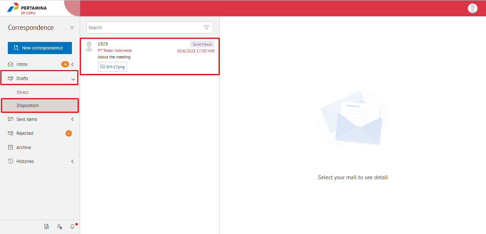
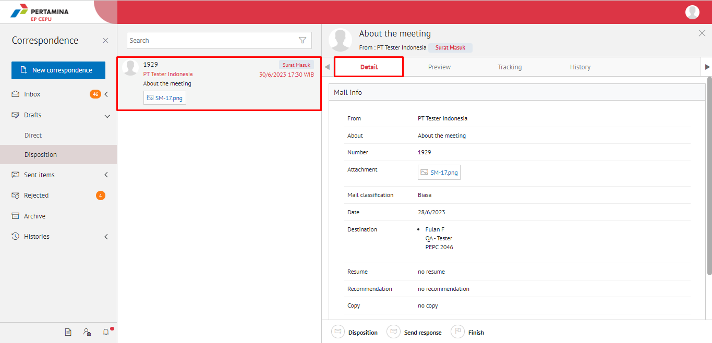

**Role yang sesuai**

- *Reviewer User*
- *Member User* (Pekerja)
- Sekretaris

 _User_ dapat mengirim tanggapan disposisi surat masuk yang ditujukan untuk pejabat pengirim disposisi. Langkah-langkah untuk mengirim tanggapan disposisi surat masuk adalah sebagai berikut

## **E-Corr Versi Web**

Langkah - langkah untuk mengirim tanggapan via Web adalah sebagai berikut :

1.    Klik menu **Draft** - **Disposition** dan lalu pilih surat yang berlabel **Surat Masuk**

2.    Pilih disposisi yang akan dikirim tanggapan kemudian pilih tab **Detail**

3.    Pilih tombol **Send Response** kemudian _user_ harus mengisi keterangan kirim tanggapan disposisi kemudian klik **Send Response**

4.    Sistem menyimpan perubahan dan informasi tanggapan disposisi akan tersimpan di detail disposisi

