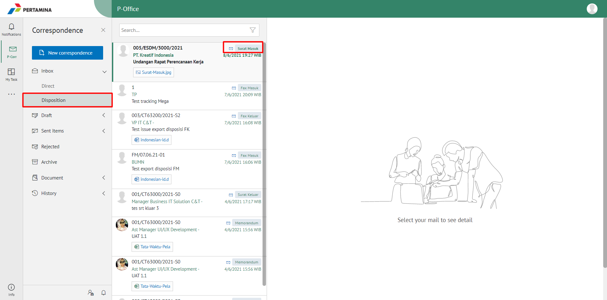
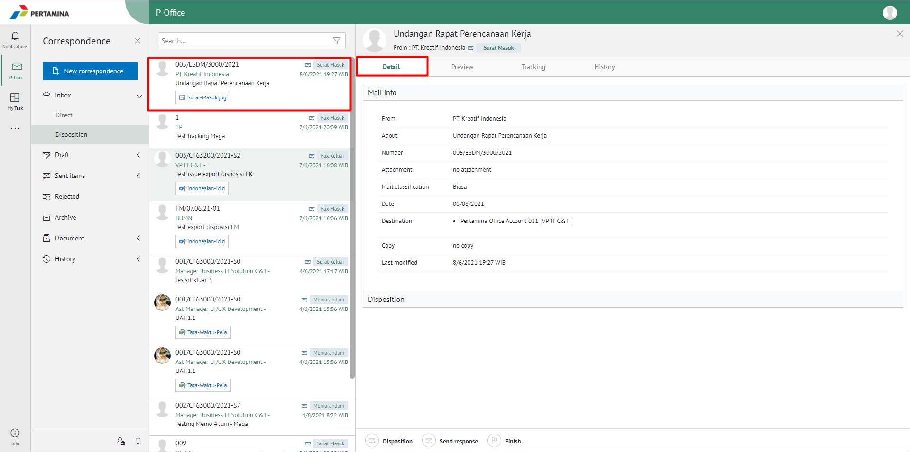
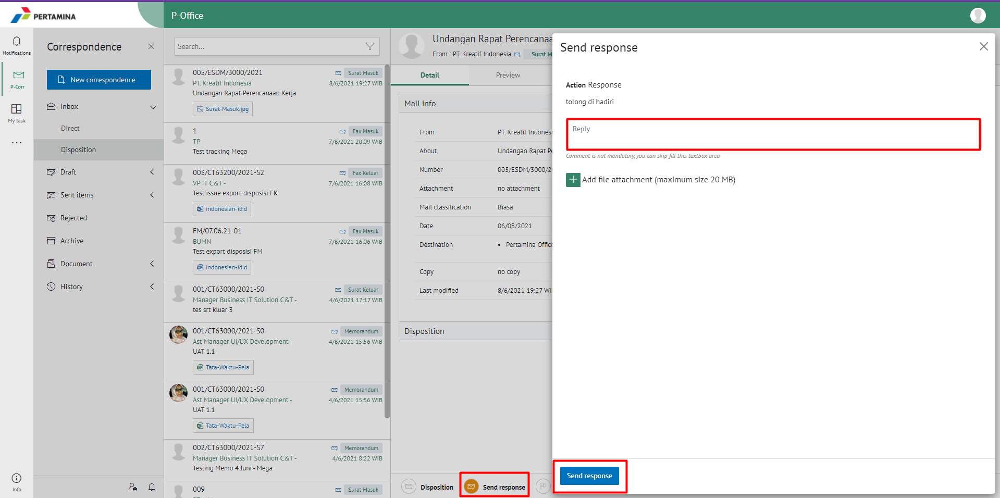
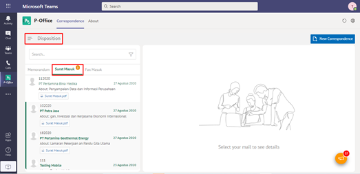
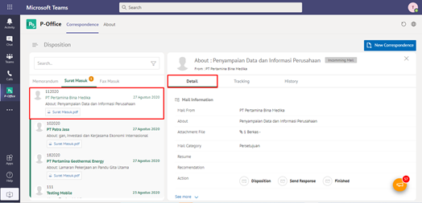
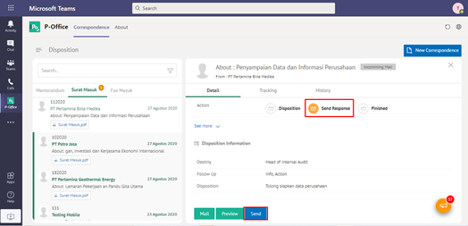
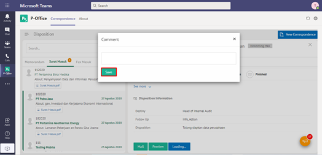
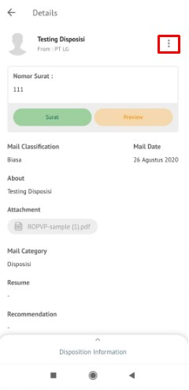
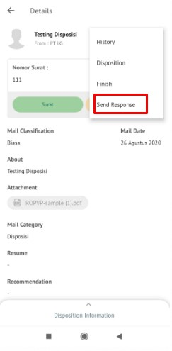
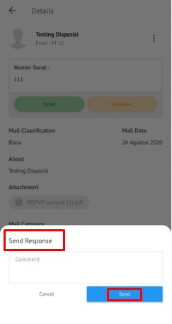

**Role yang sesuai**

- *Reviewer User*
- *Member User* (Pekerja)
- Sekretaris

 _User_ dapat mengirim tanggapan disposisi surat masuk yang ditujukan untuk pejabat pengirim disposisi. Langkah-langkah untuk mengirim tanggapan disposisi surat masuk adalah sebagai berikut

## **E-Corr Versi Web**

Langkah - langkah untuk mengirim tanggapan via Web adalah sebagai berikut :

1.    Klik menu **Draft** lalu klik **Disposition** dan pilih surat yang berlabel **Surat Masuk**

2.    Pilih disposisi yang akan dikirim tanggapan kemudian pilih tab **Detail**

3.    Pilih tombol **Send Response** kemudian _user_ harus mengisi keterangan kirim tanggapan disposisi kemudian klik **Send Response**

4.    Sistem menyimpan perubahan dan informasi tanggapan disposisi akan tersimpan di detail disposisi

## **E-Corr Versi Teams**

Langkah - langkah untuk kirim tanggapan via Teams adalah sebagai berikut :

1. Klik menu **Disposition** dan pilih tab **Surat Masuk**

2. Pilih disposisi yang akan dikirim tanggapan kemudian pilih tab **Detail**

3. Pilih tombol **Send Response** kemudian klik **Send**

4. Sistem menampilkan pop up konfirmasi dan _user_ harus mengisi keterangan kirim tanggapan disposisi kemudian klik **Save**

5.    Sistem menyimpan perubahan dan informasi tanggapan disposisi akan tersimpan di detail disposisi

## **E-Corr Versi Mobile (Android & iOS)**

Langkah - langkah untuk mengirim tanggapan via Android adalah sebagai berikut :

1.  Klik menu **Draft** lalu klik **Disposition** dan pilih surat yang berlabel **Surat Masuk**
   
  

2. Pilih disposisi yang akan dikirim tanggapan kemudian pilih icon **Option**

  

3. Pilih tombol **Send Response** kemudian sistem akan menampilkan pop up konfirmasi dan user harus mengisi komentar send response disposisi kemudian klik **Send**

  

4. Sistem menyimpan perubahan dan informasi tanggapan disposisi akan tersimpan di detail disposisi

