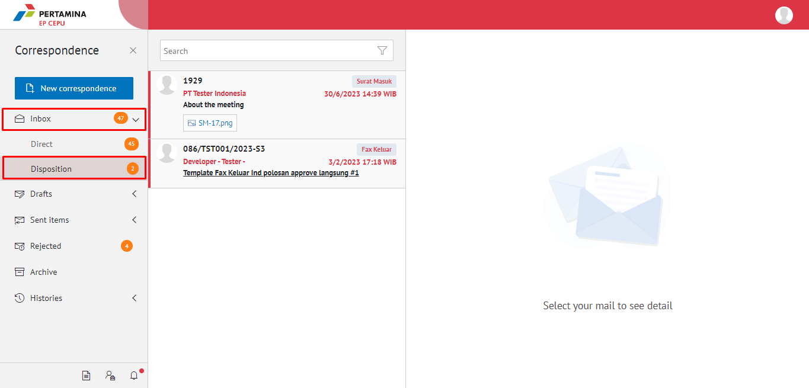

**Role yang sesuai**

- *Approver User* (Pemilik KBO)
- *Reviewer User*
- *Member User* (Pekerja)
- Sekretaris 

User dapat melihat daftar disposisi surat masuk pada pada menu **Disposisi**

## **E-Corr Versi Web**

Langkah - langkah untuk melihat daftar disposisi surat masuk via Web adalah sebagai berikut

1.	Klik menu **Inbox / Draft / Sent Item** - **Disposition** dan pilih surat yang berlabel **Surat Masuk**

