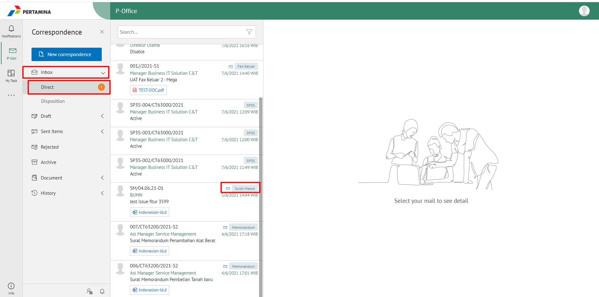
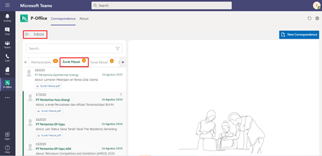
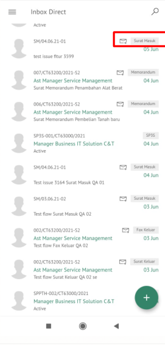

### **Melihat Daftar Surat Masuk**

**Role yang sesuai**

- *Approver User*
- *Reviewer User*
- *Member User* (Pekerja) 
- Sekretaris

 _User_ dapat melihat daftar surat masuk yang ditujukan pada sekretaris tersebut. 

## **E-Corr Versi Web**

Langkah-langkah untuk melihat daftar surat masuk via Web adalah sebagai berikut:

 1.  Klik menu **Inbox / Draft / Sent Item** dan pilih surat yang berlabel **Surat Masuk**

## **E-Corr Versi Teams**

Langkah - langkah untuk melihat surat masuk via Teams adalah sebagai berikut :

1.	Klik menu **Inbox** dan pilih tab **Surat Masuk**. Sistem akan menampilkan daftar surat masuk yang ditujukan pada suatu user
 

## **E-Corr Versi Mobile (Android & iOS)**

Langkah - langkah untuk melihat daftar surat masuk via Android adalah sebagai berikut :

1. Klik menu **Inbox / Draft / Sent Item** dan pilih surat yang berlabel **Surat Masuk**

 

