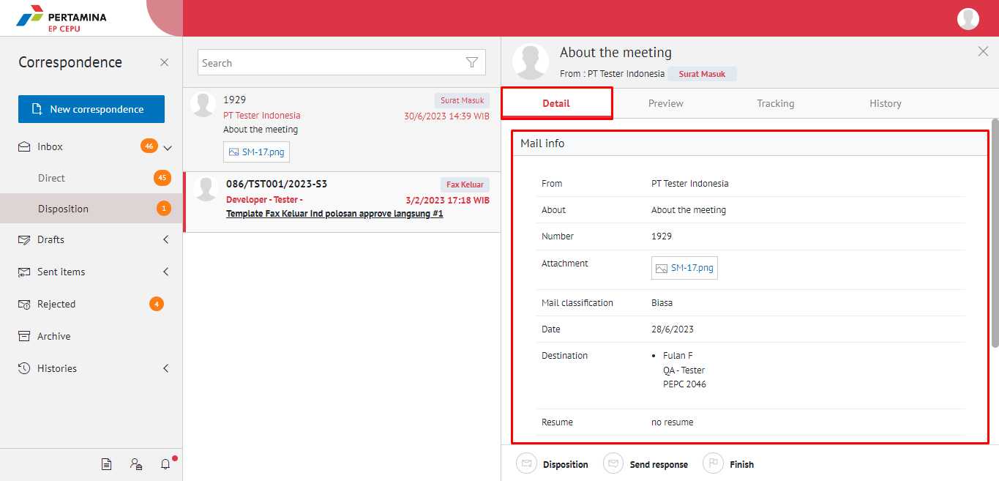
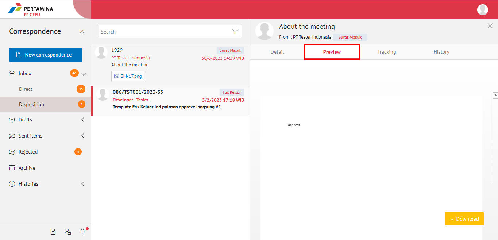
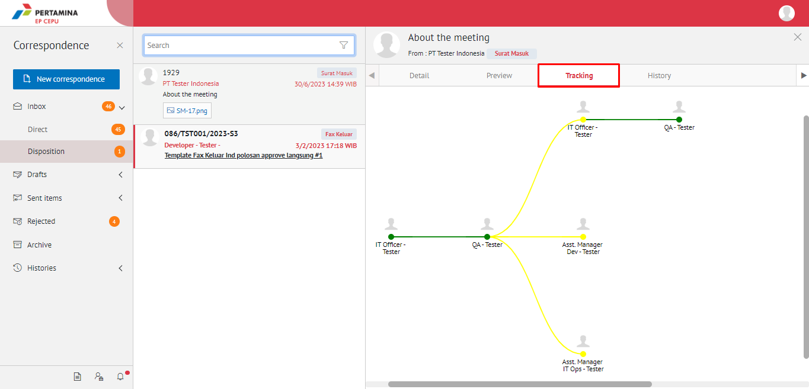
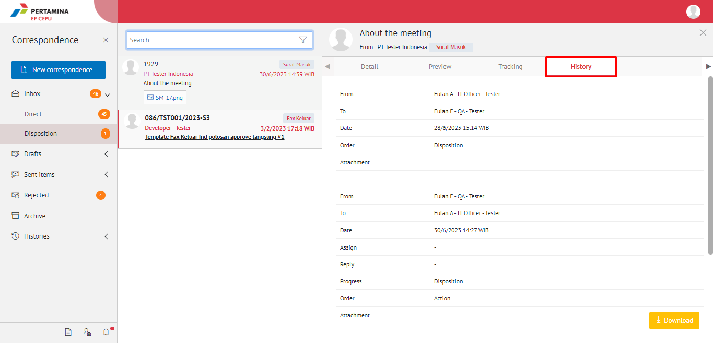

**Role yang sesuai**

- *Approver User*
- *Reviewer User*
- *Member User* (Pekerja) 
- Sekretaris

_User_ dapat melihat informasi lengkap disposisi surat masuk pada detail disposisi

## **E-Corr Versi Web**

Langkah - langkah untuk melihat informasi lengkap disposisi surat masuk via Web adalah sebagai berikut :

1. Klik menu **Inbox/Draft/Sent Item** - **Disposition** dan lalu klik surat yang berlabel **Surat Masuk** yang akan dilihat informasinya

#### **Detail Disposisi Surat Masuk**

Pada tab **Detail,** terdapat informasi asal surat, perihal, file lampiran, kategori surat, resume, rekomendasi serta informasi disposisi yang mencakup lampiran disposisi, tujuan, tindak lanjut dan disposisi permasing-masing pejabat penerima disposisi

#### **Preview Surat**

Pada tab **Preview**, ditampilkan informasi lembar penerus disposisi yang berisi informasi daftar nama pejabat dan perintah disposisi yang harus dilakukan oleh pejabat penerima disposisi

#### **Tracking Surat Masuk**

Pada tab **Tracking**, ditampilkan informasi _tracking_ surat masuk dalam bentuk _chart_

#### **History Surat Masuk**

Pada tab **History**, ditampilkan riwayat surat masuk yang terdapat informasi jabatan, tanggal, tindakan dan komentar.

