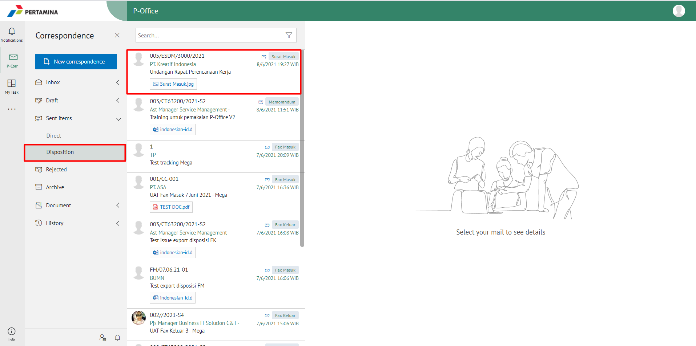
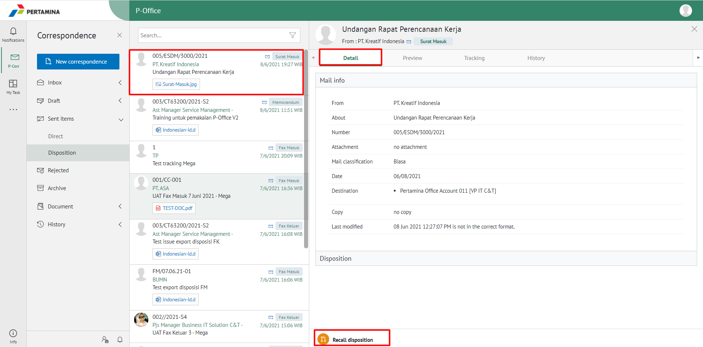
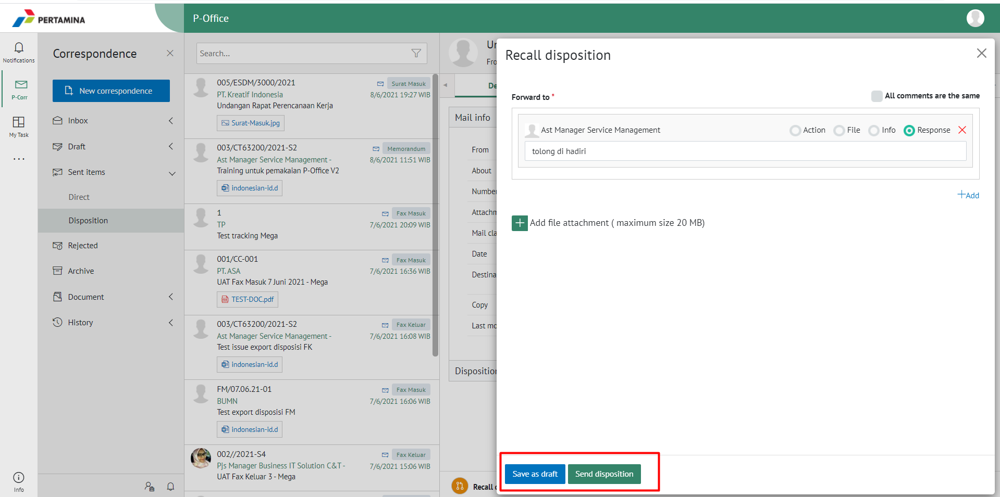
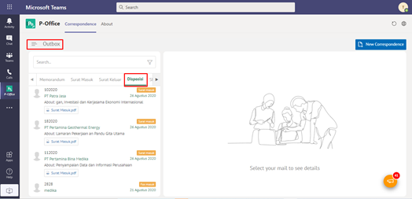
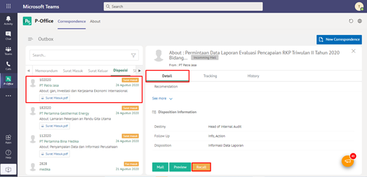
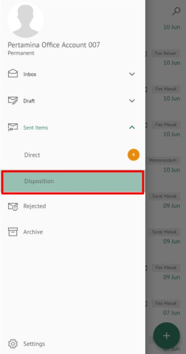
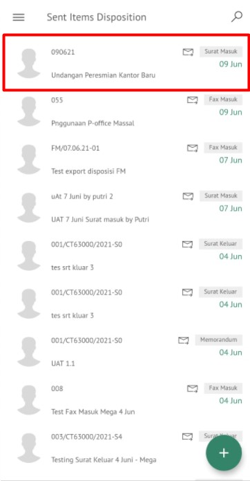
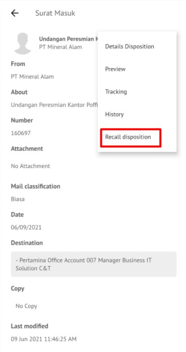

**Role yang sesuai**

- *Approver User*
- *Reviewer User*

_User_ dapat melakukan _recall_ / tarik disposisi surat masuk yang sudah dikirim kepada pejabat penerima disposisi. Surat masuk yang sudah dikirim ke pejabat penerima disposisi akan tersimpan di menu "**Sent Item - Disposisi**"

## **E-Corr Versi Web**

Langkah - langkah untuk recall disposisi surat masuk via Web adalah sebagai berikut :

1.    Klik menu **Sent Item** dan pilih **Disposisi**

2.    Pilih surat masuk yang akan di-_Recall_ kemudian klik tab **Detail** kemudian klik **Recall Disposition** lalu muncul pop up template lembar disposisi untuk mengubah isi keterangan kemudian pilih **Save As Draft** atau **Send Disposition** 

3.    Surat masuk yang sudah di-_recall_ akan tersimpan di menu "**Draft - Disposisi**" pendisposisi jika memilih Save As Draft

## **E-Corr Versi Teams**

Langkah - langkah untuk recall disposisi via Teams adalah sebagai berikut :

1. Klik menu **Sent Item** dan pilih tab **Disposisi**

2. Pilih surat masuk yang akan direcall kemudian klik tab **Detail** kemudian klik **Recall**

3.    Surat masuk yang sudah di-_recall_ akan tersimpan di menu "**Draft - Disposisi**" pendisposisi

## **E-Corr Versi Android**

Langkah - langkah untuk recall disposisi surat masuk via Android adalah sebagai berikut :

1. Klik menu **Sent Item** lalu **Direct** dan pilih menu **Disposistion** kemudian pilih surat masuk yang akan di *Recall*  
   
 

2. Pilih icon **Option** pada detail kemudian klik **Recall Disposition**

3. Surat masuk yang sudah di-_recall_ akan tersimpan di menu “**Draft - Direct - Disposisi**” pendisposisi
   