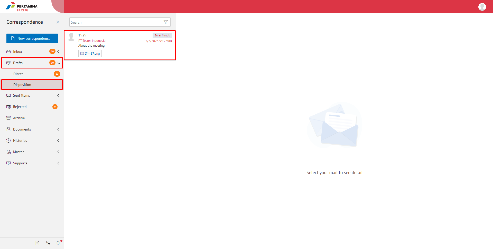
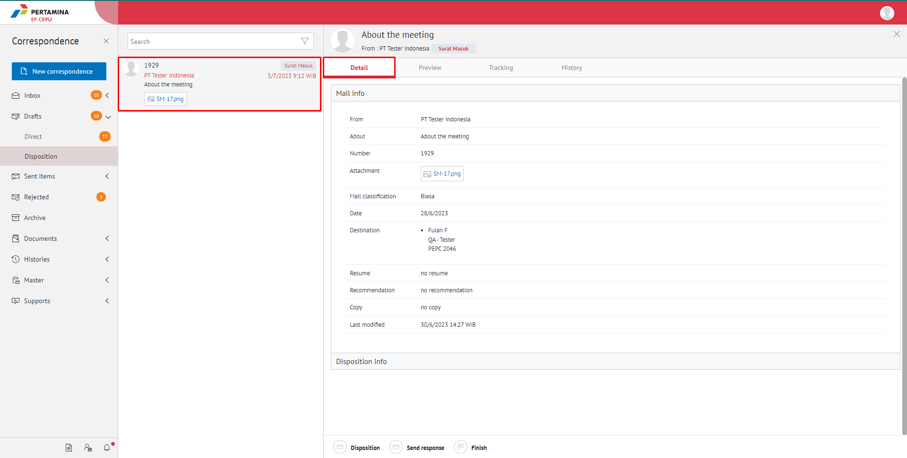
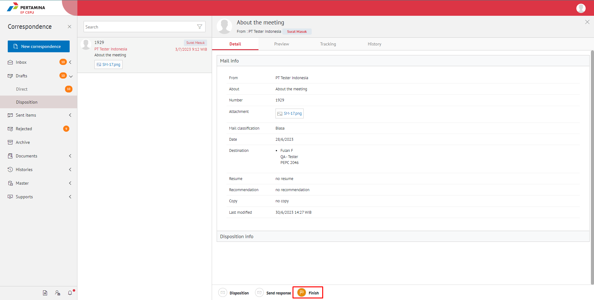

### **Menyelesaikan Disposisi Surat Masuk**

**Role yang sesuai**

- *Approver User*
- *Reviewer User*
- *Member User* (Pekerja)
- Sekretaris 

_User_ dapat menyelesaikan disposisi surat masuk jika _user_ tidak akan melanjutkan untuk mendisposisikan surat masuk ke pejabat lain

## **E-Corr Versi Web**

Langkah - langkah untuk menyelesaikan disposisi via Web adalah sebagai berikut :

1.  Klik menu **Inbox** dan pilih **Disposition** lalu klik surat yang berlabel **Surat Masuk**

2.    Pilih disposisi yang akan diselesaikan kemudian pilih tab **Detail**

3.    Pilih dan klik tombol **Finish**

4.    Sistem menampilkan _pop up_ konfirmasi dan _user_ harus mengisi keterangan selesaikan disposisi kemudian klik **Finish**.

5.    Sistem menyimpan perubahan dan informasi selesai disposisi akan tersimpan di detail disposisi

