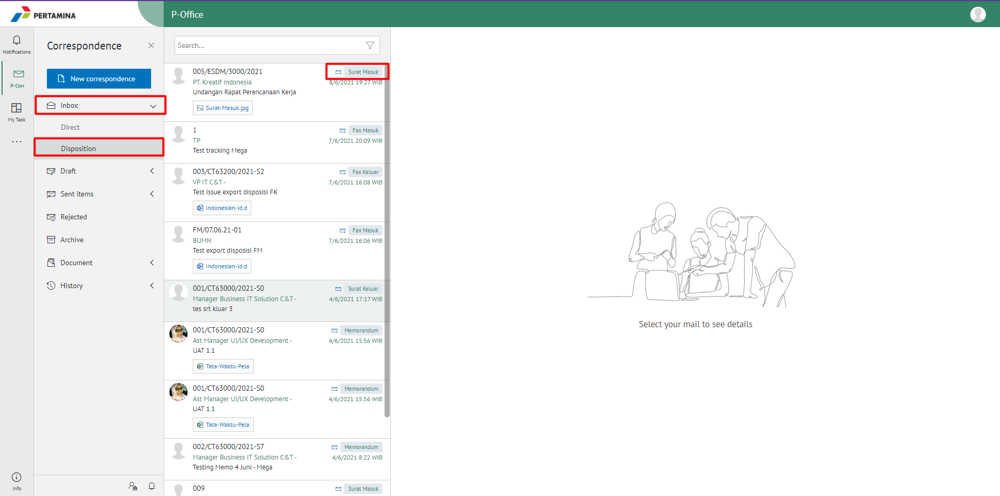
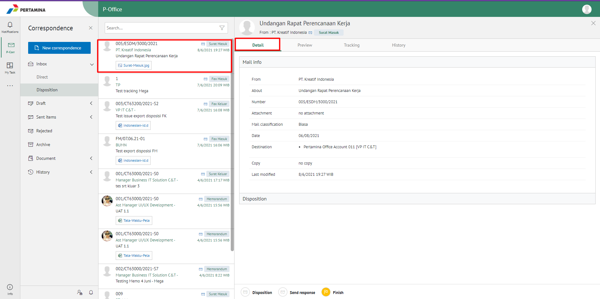
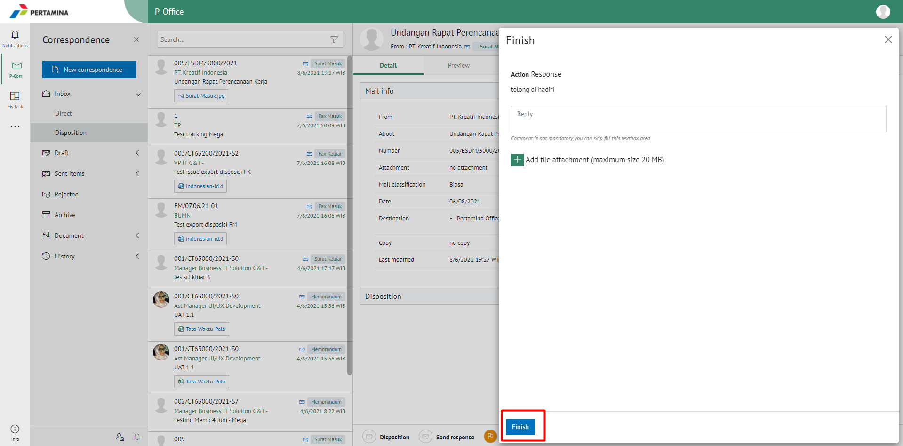
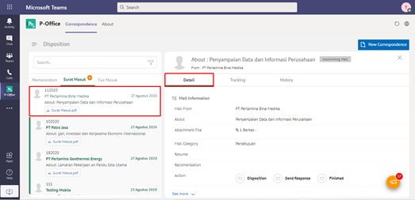
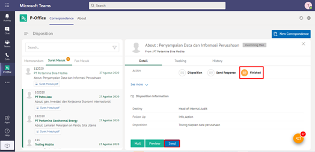
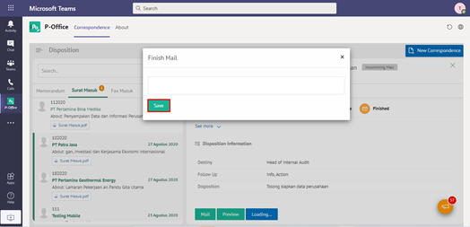
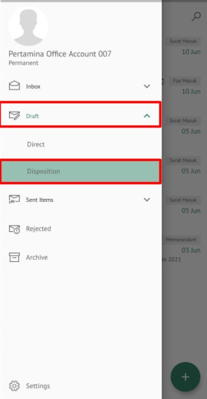
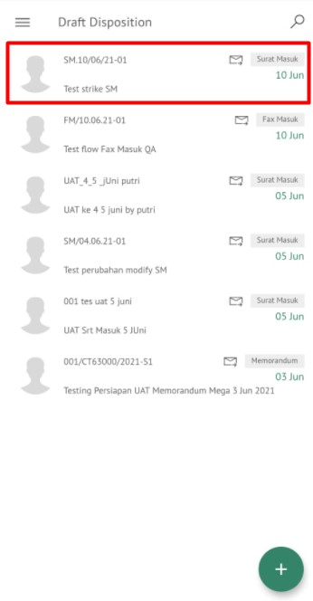
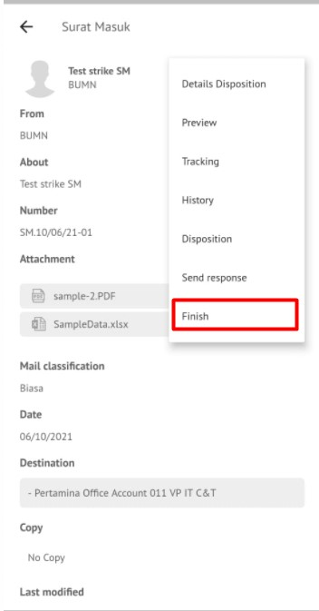
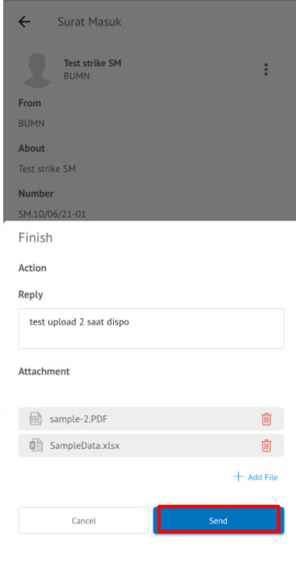

### **Menyelesaikan Disposisi Surat Masuk**

**Role yang sesuai**

- *Approver User*
- *Reviewer User*
- *Member User* (Pekerja)
- Sekretaris 

_User_ dapat menyelesaikan disposisi surat masuk jika _user_ tidak akan melanjutkan untuk mendisposisikan surat masuk ke pejabat lain

## **P-Office Versi Web**

Langkah - langkah untuk menyelesaikan disposisi via Web adalah sebagai berikut :

1.  Klik menu **Inbox** dan pilih **Disposition** lalu klik surat yang berlabel **Surat Masuk**

2.    Pilih disposisi yang akan diselesaikan kemudian pilih tab **Detail**

3.    Pilih tombol **Finish** kemudian klik **Send**

4.    Sistem menampilkan _pop up_ konfirmasi dan _user_ harus mengisi keterangan selesaikan disposisi kemudian klik **Finish**.

5.    Sistem menyimpan perubahan dan informasi selesai disposisi akan tersimpan di detail disposisi

## **P-Office Versi Teams**

Langkah - langkah untuk selesaikan disposisi via Teams adalah sebagai berikut :

1. Klik menu **Disposition** dan pilih tab **Surat Masuk**

2. Pilih disposisi yang akan diselesaikan kemudian pilih tab **Detail**

3. Pilih tombol **Finished** kemudian klik **Send**

4. Sistem menampilkan pop up konfirmasi dan _user_ harus mengisi keterangan selesaikan disposisi kemudian klik **Save**

 5.    Sistem menyimpan perubahan dan informasi selesai disposisi akan tersimpan di detail disposisi

## **P-Office Versi Mobile (Android & iOS)**

Langkah - langkah untuk menyelesaikan disposisi surat masuk via Android adalah sebagai berikut:

1. Klik menu **Draft** lalu pilih **Disposisi** kemudian pilih surat yang berlabel **Surat Masuk** yang akan dilihat informasinya

  

2. Pada menu detail terdapat **Option** lalu pilih **Finish** 

  

3. Pilih tombol **Finish** kemudian sistem akan menampilkan pop up konfirmasi dan _user_ harus mengisi komentar disposisi kemudian klik **Send**

 !  

4. Sistem menyimpan perubahan dan informasi selesai disposisi akan tersimpan di Sent Item-disposisi
