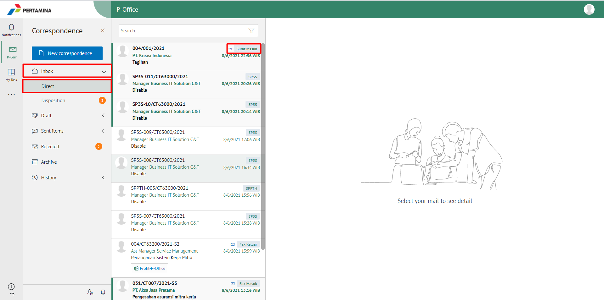
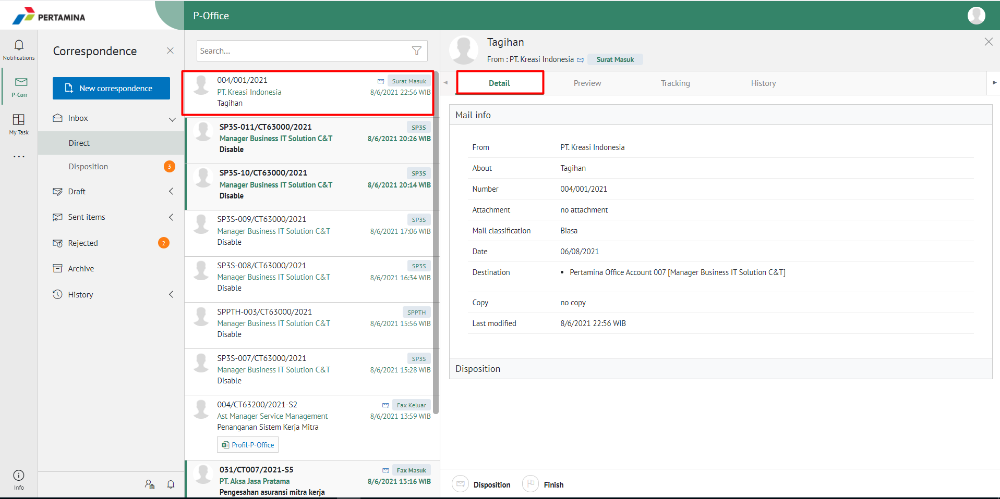
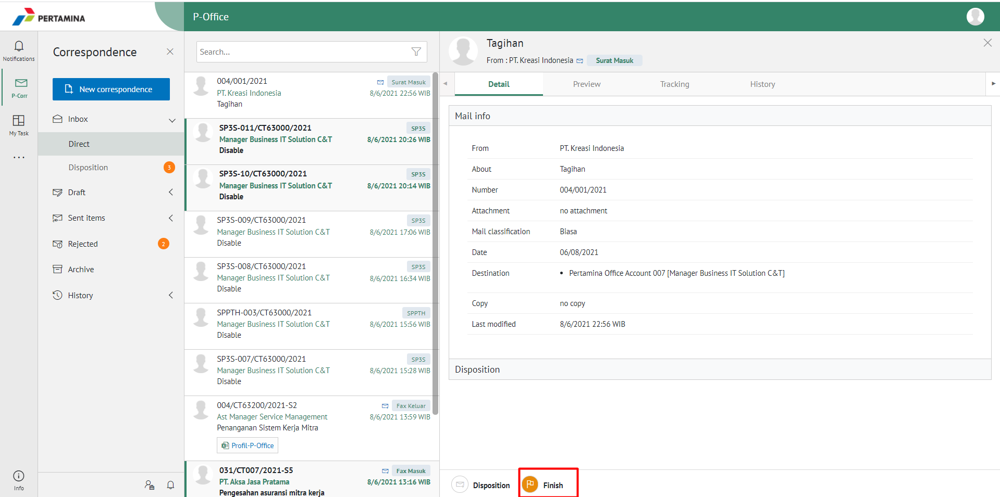
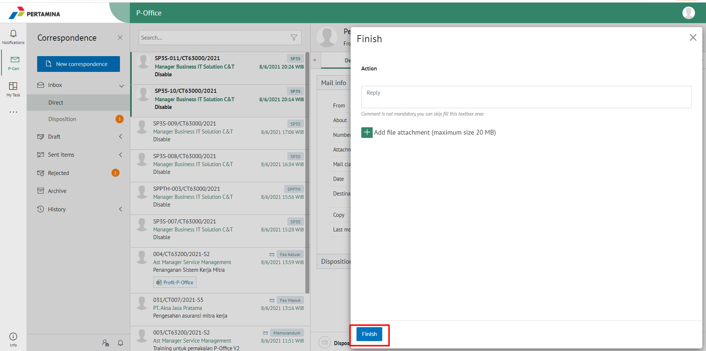
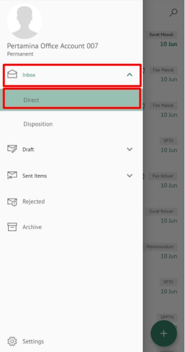
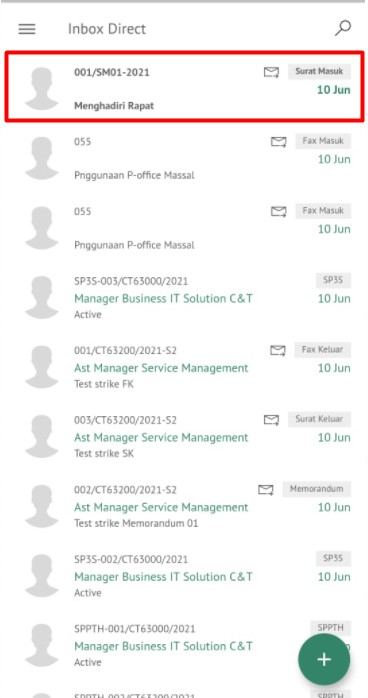
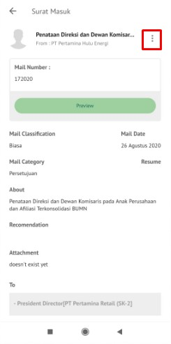
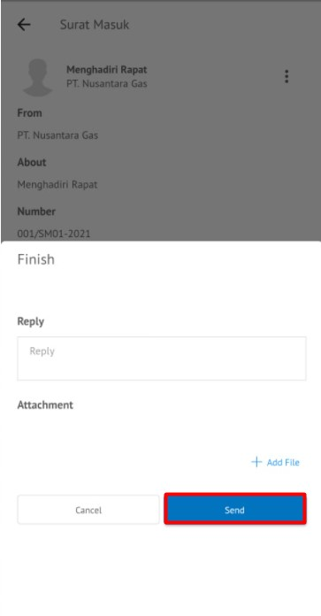

### **Menyelesaikan Surat Masuk**

**Role yang sesuai**

- *Approver User*

_User_ dapat menyelesaikan surat masuk jika _user_ tidak akan melanjutkan untuk mendisposisikan surat masuk ke pejabat lain atau surat masuk selesai pada _user_ tersebut. 

## **E-Corr Versi Web**

Langkah-langkah untuk menyelesaikan surat masuk via Web adalah sebagai berikut:

1.    Klik menu **Inbox** dan pilih **Direct** lalu klik Surat yang berlabel **Surat Masuk**

2.    Pilih surat masuk yang akan diselesaikan kemudian pilih tab **Detail**

3.    Pilih tombol **Finish** kemudian Sistem menampilkan _pop up_ konfirmasi dan _user_ harus mengisi keterangan selesaikan disposisi kemudian klik **Finish**.

5.    Sistem menyimpan perubahan dan informasi selesai disposisi akan tersimpan di detail disposisi.

## **E-Corr Versi (Android & iOS)**

Langkah - langkah untuk menyelesaikan surat masuk menu via Android adalah sebagai berikut :

1. 	Klik menu **Inbox** lalu **Direct** dan pilih surat yang berlabel **Surat masuk**

 

2. 	Pilih surat masuk yang akan diselesaikan kemudian pilih **Option** kemudian klik **Finish** maka Sistem menampilkan _pop up_ konfirmasi dan _user_ harus mengisi keterangan kemudian klik **Send**

  

4. Sistem menyimpan perubahan dan informasi selesai akan tersimpan di **Sent Item - Direct - Surat Masuk**.