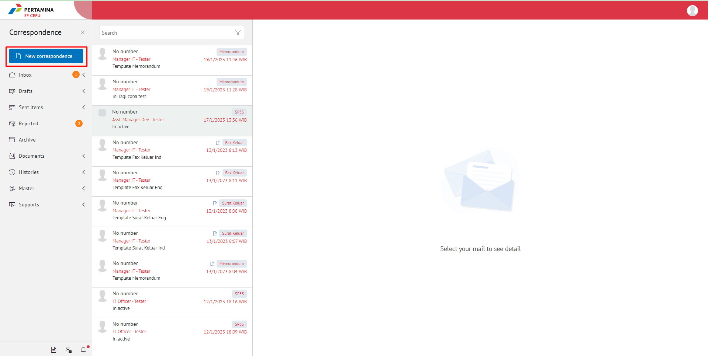
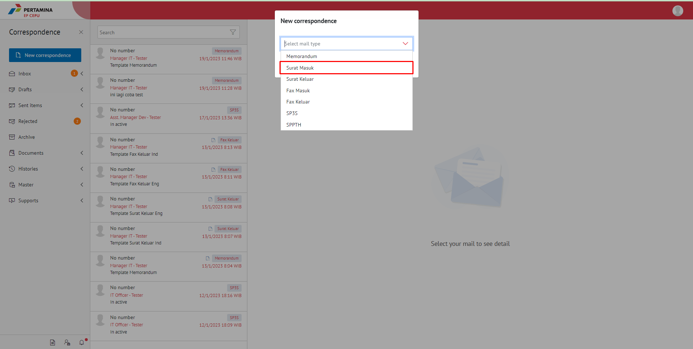
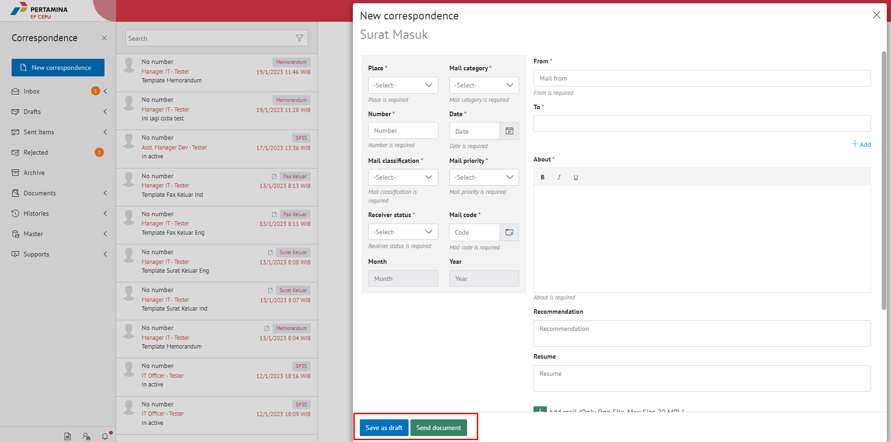
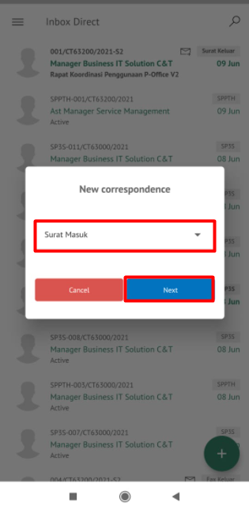
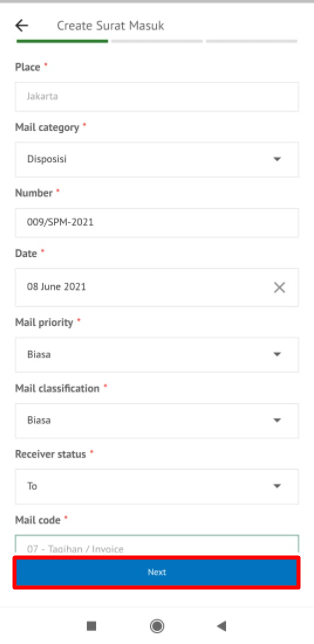
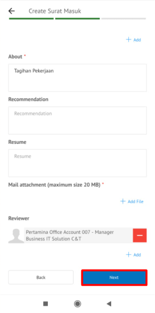
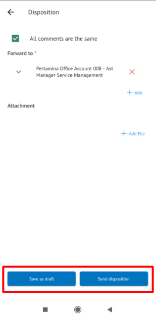

**Role yang sesuai**

- Sekretaris

Sekretaris dapat menambah surat masuk pada aplikasi E-Corr.

## **E-Corr Versi Web**

Langkah-langkah untuk menambah surat masuk via Web adalah sebagai berikut.

1. Klik menu **New Correspondence**

2. Pilih jenis surat "**Surat Masuk**"

3. Isi form tambah surat masuk. Klik **Save as Draft** untuk menyimpan form surat dan surat akan tersimpan di menu "**Draft - Surat Masuk**". Klik **Send** untuk mengirim surat masuk dan surat masuk akan tersimpan di menu "**Sent Item - Surat Masuk**"

4.  Sistem berhasil menyimpan perubahan

## **E-Corr Versi Mobile (Android & iOS)**

Langkah-langkah untuk tambah surat masuk adalah sebagai berikut.

1. Klik tanda **(+)** pada surat masuk

2. Pilih jenis surat “**Surat Masuk**” lalu klik **Next**

3. Isi form tambah surat masuk. Klik **Save As Draft** untuk menyimpan form surat dan surat akan tersimpan di menu “**Draft –Direct - Surat Masuk**”. Klik **Send Document** untuk mengirim surat masuk dan surat masuk akan tersimpan di menu “**Sent Item –Direct-Surat Masuk**”

  

4. Sistem berhasil menyimpan perubahan

