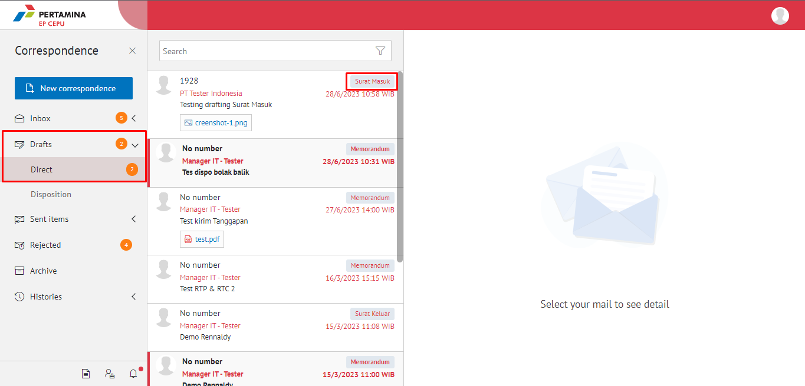
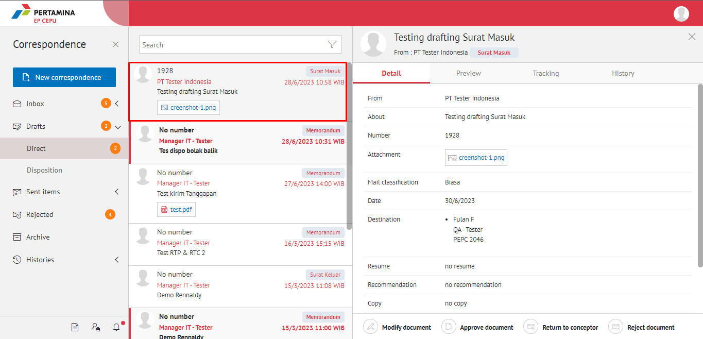
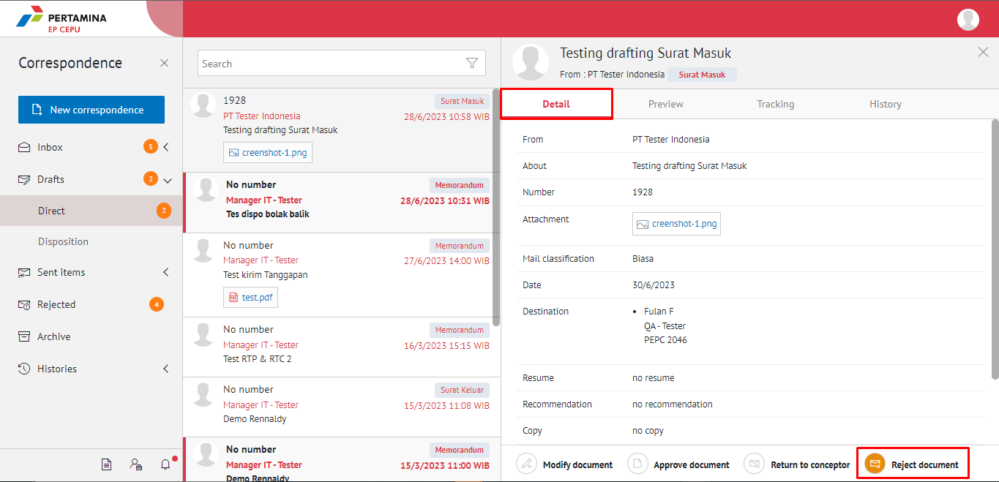
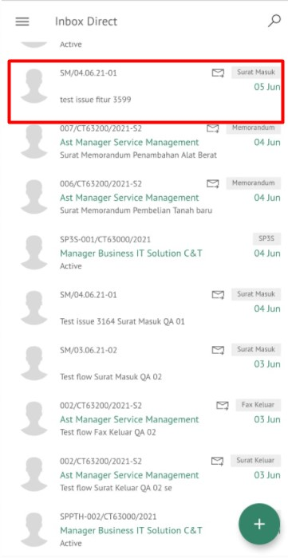
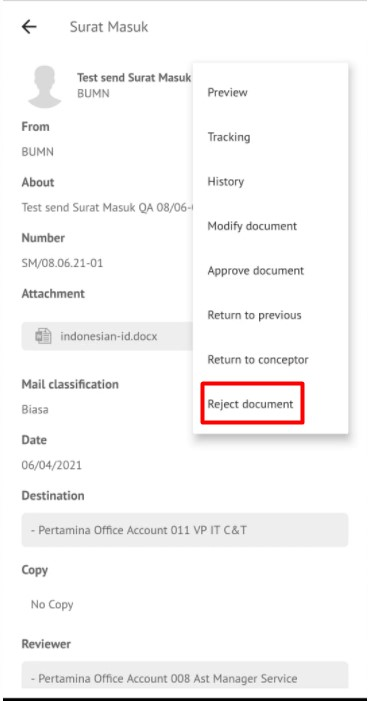
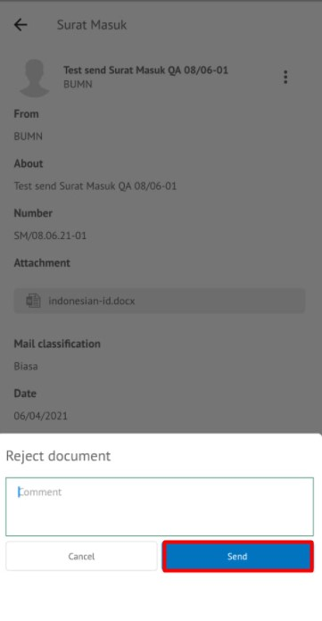

### **Menolak Surat Masuk**

**Role yang sesuai**

- *Approver User*

## **E-Corr Versi Web**

Langkah-langkah untuk menolak surat masuk via Web adalah sebagai berikut:

1.    Klik menu **Draft** dan pilih sub menu **Direct** lalu klik surat yang berlabel **Surat Masuk**

2.    Pilih surat masuk yang akan ditolak kemudian pilih tab **Detail**

3.    Klik tombol **Reject Document** dan Isikan komentar jika diperlukan

4.    Sistem menampilkan _pop up_ konfirmasi dan _user_ harus mengisi keterangan tolak surat masuk kemudian klik **Submit**.

5.    Sistem menyimpan perubahan dan informasi tolak surat masuk. Surat masuk yang sudah ditolak akan tersimpan di menu “**Rejected – Surat Masuk”** user penolak dengan label **Rejected**

## **E-Corr Versi (Android & iOS)**

Langkah-langkah untuk menolak surat masuk adalah sebagai berikut.

1. Klik menu **Inbox** lalu **Direct** dan pilih surat yang berlabel **Surat Masuk** , kemudian Pilih surat masuk yang akan di Reject
   
 

3. Pada detail kli Option lalu pilih **Reject Document** maka Sistem menampilkan _pop up_ konfirmasi dan _user_ harus mengisi keterangan reject surat masuk kemudian klik **Send**
   
 

4. Sistem menyimpan perubahan dan informasi tolak surat masuk. Surat masuk yang sudah ditolak akan tersimpan dimenu **Rejected**
