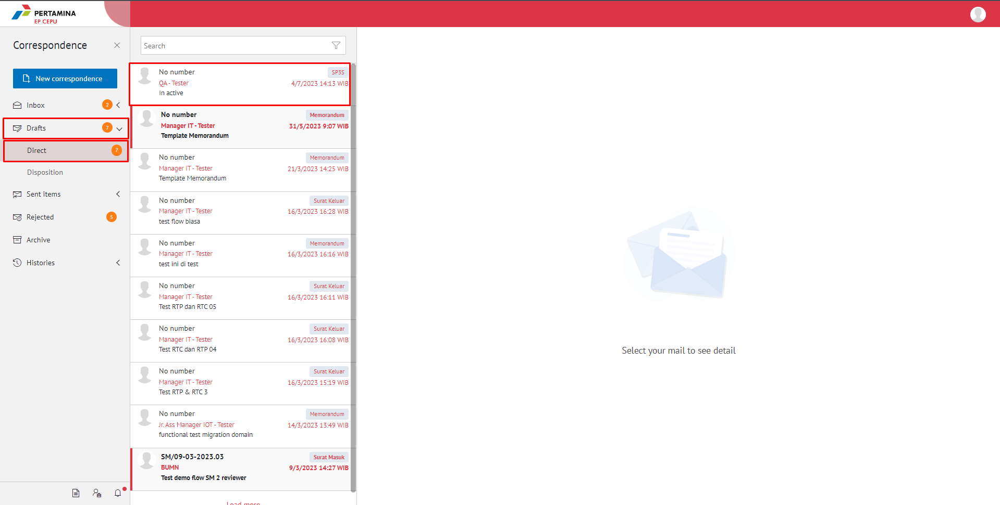
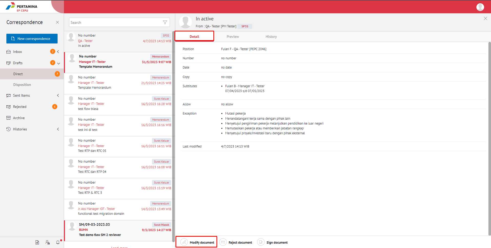
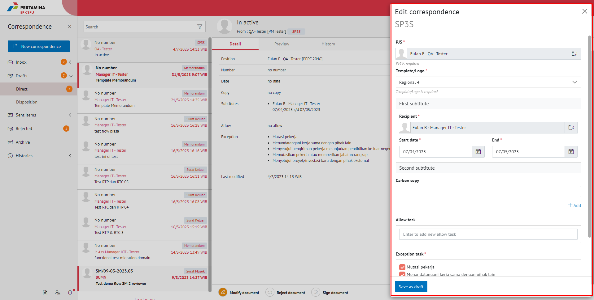
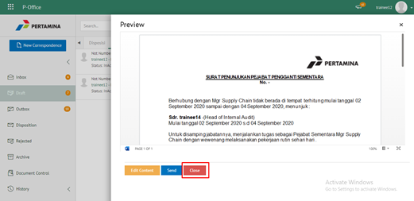
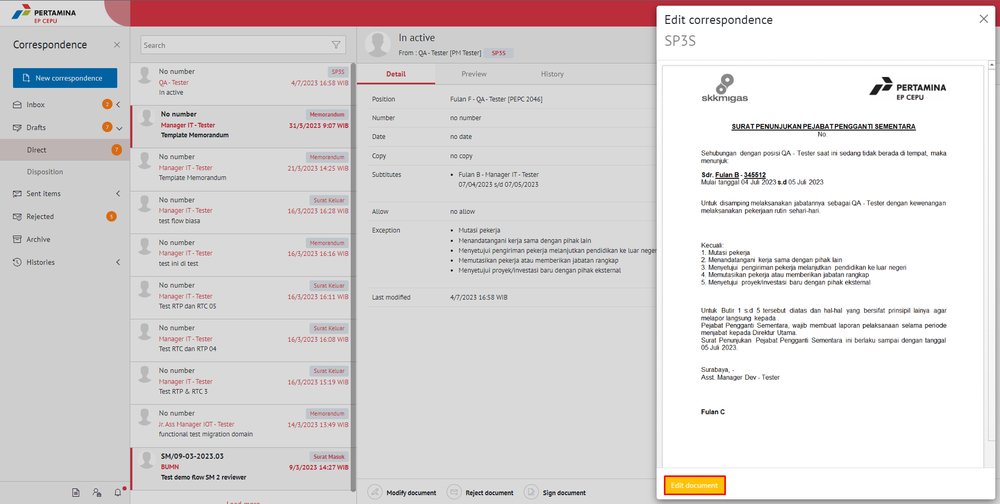
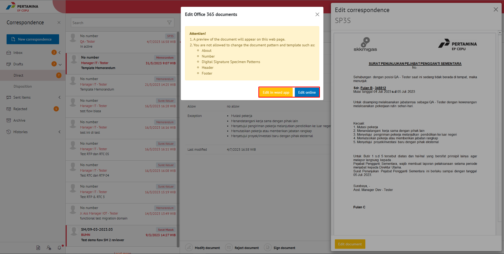
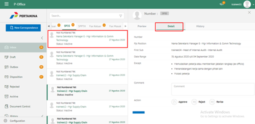

**Role yang sesuai**

- *Approver User*
- *Reviewer User*
- *Member User* (Pekerja)
- Sekretaris

*User* dapat melakukan *drafting* SP3S pada aplikasi E-Corr. *Drafting* SP3S dilakukan jika *user* akan meneruskan dan melakukan perubahan pada SP3S yang sudah disimpan pada menu **Draft.**

## **E-Corr Versi Web**

Langkah - langkah untuk melakukan drafting SP3S via Web adalah sebagai berikut :

1. Klik menu **Draft** dan pilih **Direct** lalu pilih surat yang berlabel **SP3S**

2. Pilih SP3S yang akan diubah. Pilih tab **Detail** kemudian klik **Modify Document**

3. Sistem akan menampilkan *form* **Edit Correspondence**

4. Lakukan perubahan pada *form*. Klik **Save as draft** untuk menyimpan perubahan pada *form* SP3S. Surat yang disimpan akan tersimpan di menu **"Draft - Direct"**

5. Klik **Edit document** untuk mengubah isi SP3S

6. Sistem menampilkan tampilan *preview* SP3S dalam bentuk Word yang dapat di edit. Untuk melakukan *editing* terhadap isi surat klik **Edit Content** kemudian sistem akan menampilkan *pop up* konfirmasi **Edit in Word app** atau **Edit Online**

#### **[Edit] Word Desktop**

Langkah - langkah untuk mengubah isi SP3S melalui Word Desktop adalah sebagai berikut.

1. Klik **Edit in Word app** untuk mengubah melalui aplikasi Microsoft Word

2. Lakukan perubahan pada isi surat. Klik **Close** pada aplikasi dan isi surat akan otomatis tersimpan

#### **[Edit] Ubah Online**

Langkah - langkah untuk mengubah isi SP3S secara *online* adalah sebagai berikut

1. Klik **Ubah Online** untuk mengubah isi surat secara *online*

2. Lakukan perubahan pada isi surat. Klik **Close** pada aplikasi

3. Isi surat akan otomatis tersimpan. Jika surat akan disimpan sebagai draft, maka klik **Close.**

4. Surat yang sudah selesai diubah maka akan tersimpan di menu **"Draft - Direct"**

#### **Kirim SP3S**

Langkah - langkah untuk mengirim SP3S adalah sebagai berikut.

1. Pada tampilan **Modify Document** klik **Send Document** untuk mengirim surat ke pejabat tujuan

2. Sistem menyimpan perubahan dan SP3S akan tersimpan di menu **"Sent Item - Direct"**

