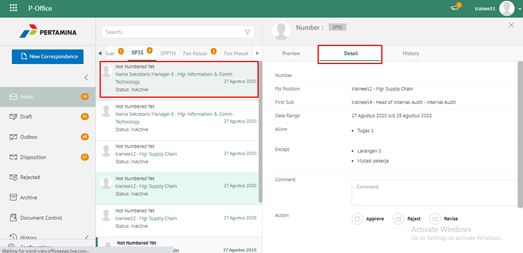
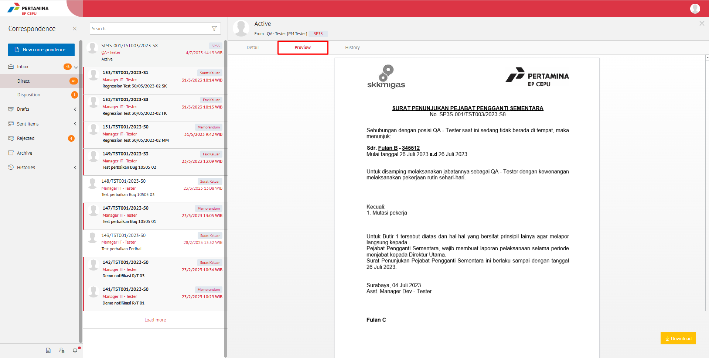
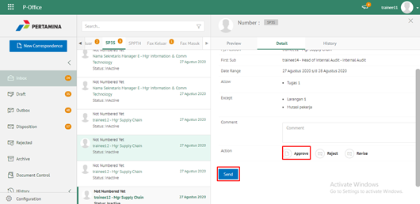
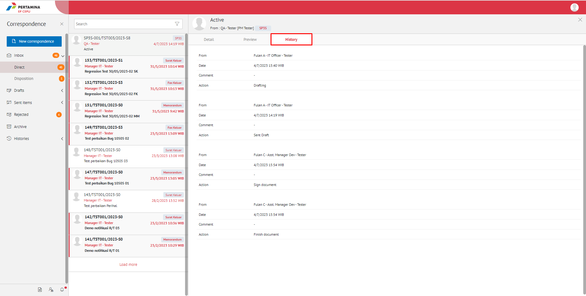

**Role yang sesuai**

- *Approver User*
- *Reviewer User*
- *Member User* (Pekerja)
- Sekretaris

*User* dapat melihat informasi lengkap SP3S termasuk *preview* SP3S, detail SP3S dan *history* SP3S

## **E-Corr Versi Web**

Langkah - langkah untuk informasi lengkap SP3S via Web adalah sebagai berikut :

1. Klik menu **Inbox/Draft/Sent Item** dan pilih menu **Direct** Lalu pilih salah satu surat yang berlabel **SP3S.**

#### **Preview SP3S**

Pada tab **Preview**, ditampilkan *preview* SP3S yang sudah dibuat. *Preview* SP3S disesuaikan dengan template berdasarkan jenis surat

#### **Detail SP3S**

Pada tab Detai, terdapat informasi nomor SP3S, jabatan PJS, Pejabat pengganti pertama, jangka waktu, pejabat pengganti kedua (jika ada), jangka waktu pejabat pengganti kedua (jika ada), task yang diizinkan dan task pengecualian.

#### **History SP3S**

Pada tab **History**, ditampilkan riwayat SP3S yang terdapat informasi jabatan, tanggal, tindakan dan komentar

