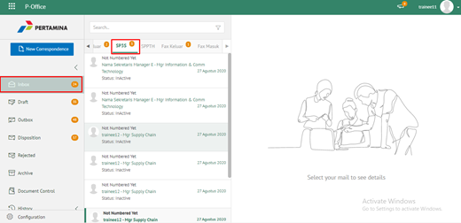
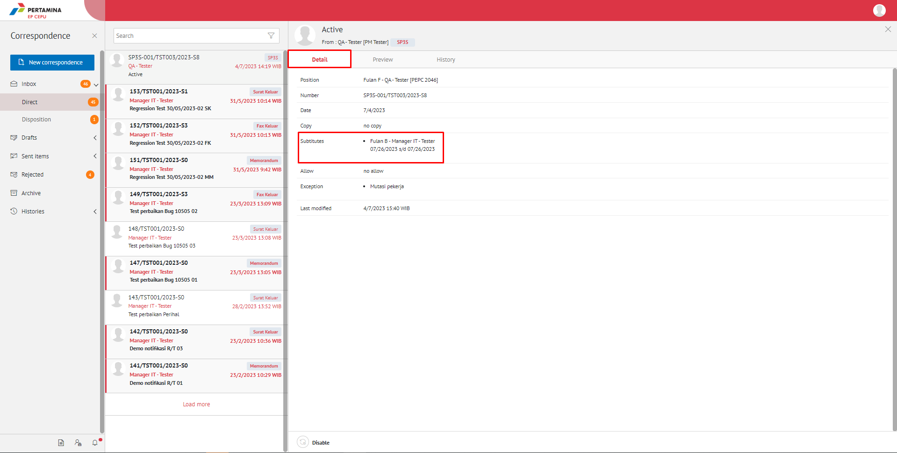

**Role yang sesuai**

- *Approver User*
- *Reviewer User*
- Sekretaris

*User* dapat melihat daftar SP3S pada pada menu **Inbox, Draft atau Sent Item** pada masing - masing akun.

## **E-Corr Versi Web**

Langkah - langkah untuk melihat daftar SP3S via Web adalah sebagai berikut

1. Klik menu **Inbox/Draft/Sent Item** dan pilih salah satu surat jenis **SP3S** yang akan dilihat informasinya

2. Klik tab **Detail** untuk melihat daftar informasi user PJS 

## **E-Corr Versi Mobile (Android & iOS)**

Langkah - langkah untuk melihat daftar SP3S via Android yaitu :

1. Klik menu **Inbox / Draft / Sent Item** lalu pilih **Direct** kemudian pilih surat yang berlabel **SP3S**

 

