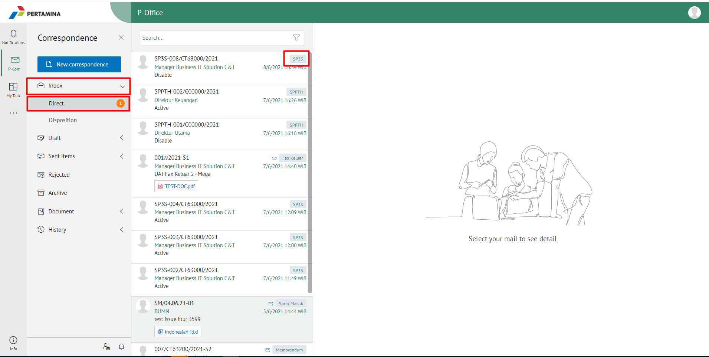
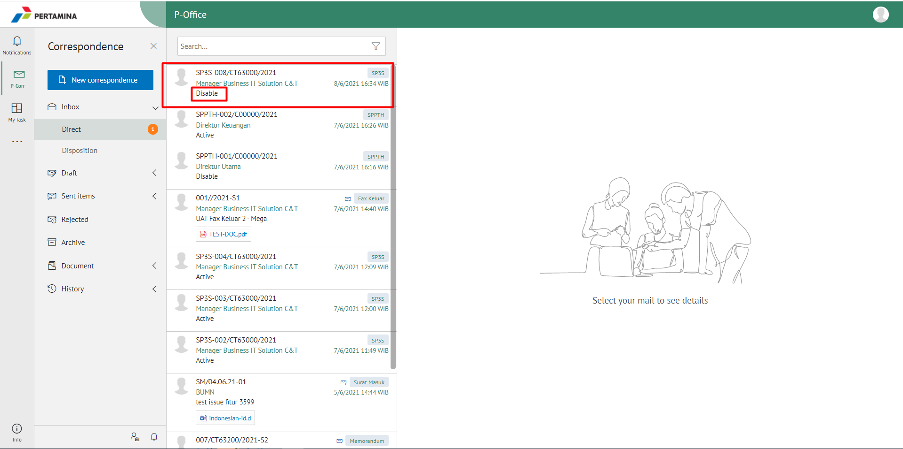
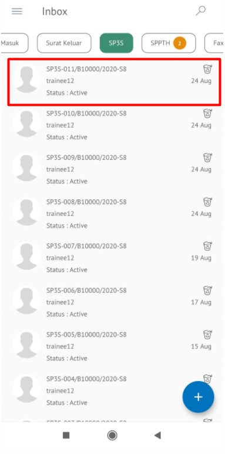
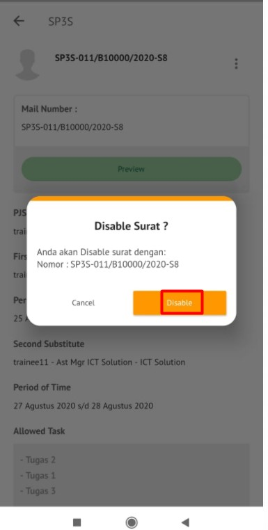

**Role yang sesuai**

- *Approver User* (Pejabat Pjs)
- *Reviewer User* (Pejabat Pjs)

SP3S yang masih berlaku akan non-aktif secara otomatis apabila sudah habis masa jabatan pejabat yang sedang di PJS-kan.  Namun, apabila pejabat definitif kembali bekerja sebelum masa PJS nya habis, maka pejabat tersebut harus menon-aktifkan SP3S yang berlaku dengan cara sebagai berikut:

## **P-Office Versi Web**

Langkah - langkah untuk menonaktifkan SP3S via Web adalah sebagai berikut :

1. Klik menu **Inbox** lalu **Direct** dan pilih surat yang berlabel **SP3S**

2. Pilih SP3S yang akan dinon-aktifkan kemudian pilih icon **Disable.**

3. SP3S yang sudah tidak aktif akan tersimpan di menu **"Sent Item - Direct - SP3S"** approver. Untuk pejabat PJS dan pejabat yang meninggalkan tempat, surat akan tersimpan di menu **"Inbox - Direct - SP3S"**

## **P-Office Versi Teams**

Langkah - langkah untuk menonaktifkan SP3S via Teams adalah sebagai berikut :

1. Klik menu **Inbox** dan pilih tab **SP3S**

2. Pilih SP3S yang akan dinon-aktifkan kemudian pilih icon **Disable.**
 

3. SP3S yang sudah tidak aktif akan tersimpan di menu “**Sent Item – SP3S**” approver. Untuk pejabat PJS dan pejabat yang meninggalkan tempat, surat akan tersimpan di menu **“Inbox – SP3S”**

## **P-Office Versi Android**

Langkah - langkah untuk menonaktifkan SP3S via Android adalah sebagai berikut : 

1. Klik menu **Inbox** dan pilih tab **SP3S**

  

2. Pilih SP3S yang akan dinon-aktifkan kemudian pilih tombol button klik **Disable** 

   

3. SP3S yang sudah tidak aktif akan tersimpan di menu “**Sent Item – SP3S**” approver. Untuk pejabat PJS dan pejabat yang meninggalkan tempat, surat akan tersimpan di menu “**Inbox – SP3S**”

