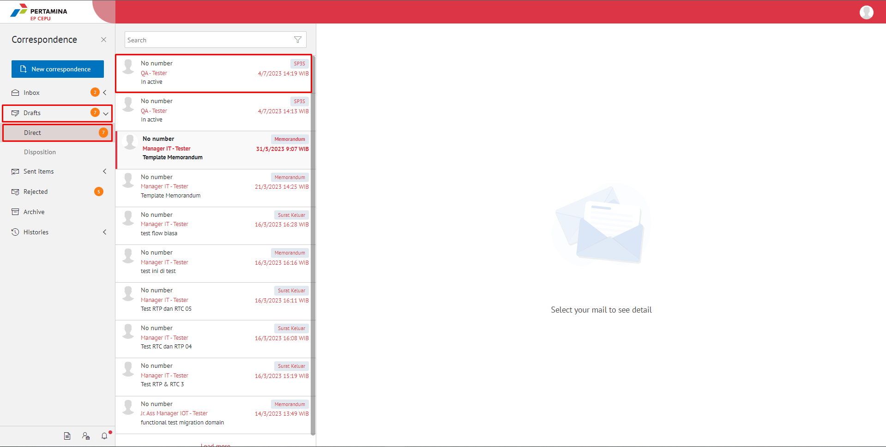
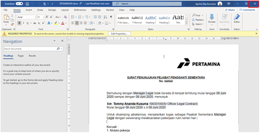
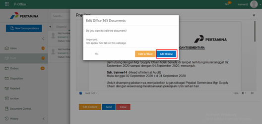
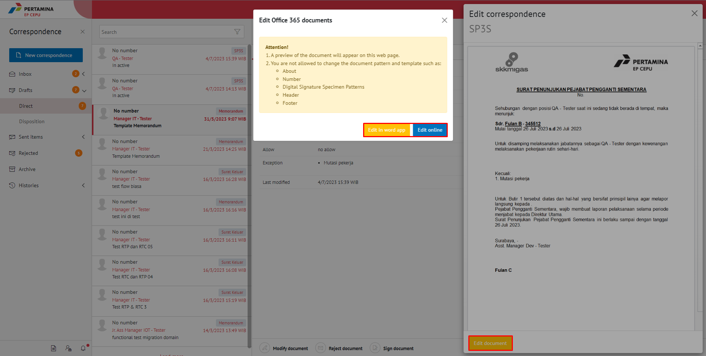
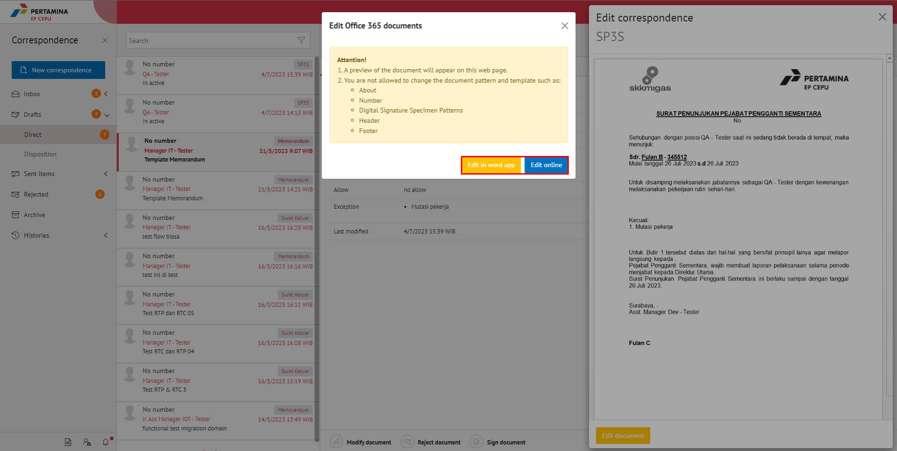
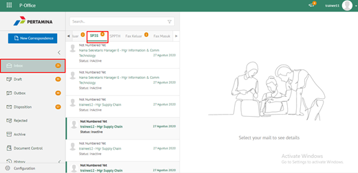
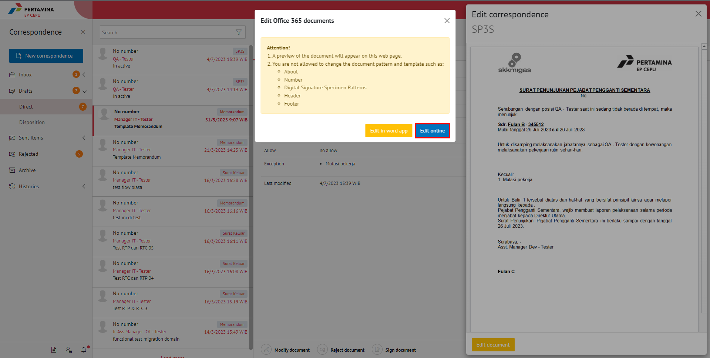
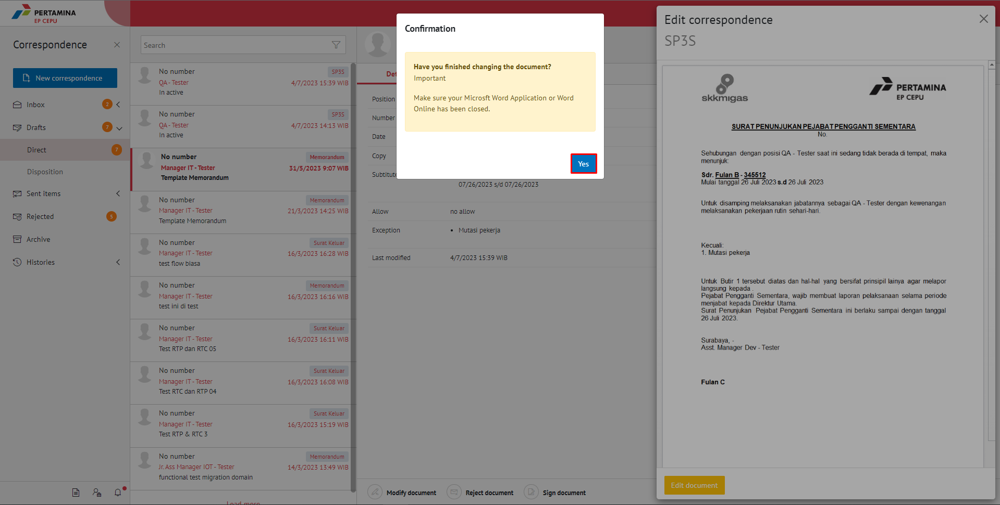

**Role yang sesuai**

- *Approver User*

*User* dapat merevisi SP3S yang sudah dikirimkan oleh konseptor. 

## **E-Corr Versi Web**

Langkah - langkah untuk merevisi SP3S via Web adalah sebagai berikut :

1. Klik menu **Draft** dan pilih **Direct** lalu klik surat yang berlabel **SP3S**

2. Pilih SP3S yang akan diubah. Pilih tab **Detail** kemudian klik **Modify Document**

3. Sistem akan menampilkan *form* **Edit Correspondence**

4. Lakukan perubahan pada *form*. Klik **Save As Draft** untuk menyimpan perubahan pada *form* SP3S. Surat yang disimpan akan tersimpan di menu **"Draft - Direct"**

5. Klik **Edit document** untuk mengubah isi SP3S

6. Sistem menampilkan tampilan *preview* SP3S dalam bentuk Word yang dapat di edit. Untuk melakukan *editing* terhadap isi surat klik **Edit document** kemudian sistem akan menampilkan *pop up* konfirmasi **Edit in Word app** atau **Edit Online**

#### **[Edit] Word Desktop**

Langkah - langkah untuk mengubah isi SP3S melalui Word Desktop adalah sebagai berikut.

1. Klik **Edit in Word app** untuk mengubah melalui aplikasi Microsoft Word

2. Lakukan perubahan pada isi surat. Klik **Close** pada aplikasi dan isi surat akan otomatis tersimpan

#### **[Edit] Ubah Online**

Langkah - langkah untuk mengubah isi SP3S secara *online* adalah sebagai berikut

1. Klik **Ubah Online** untuk mengubah isi surat secara *online*

2. Lakukan perubahan pada isi surat, selanjutnya close button **x** pada Word Online. Klik **Yes** pada aplikasi

3. Surat yang sudah selesai diubah maka akan tersimpan di menu **"Draft - Direct"**

