**Role yang sesuai**

- *Approver User*

*User* dapat merevisi SP3S yang sudah dikirimkan oleh konseptor. 

## **P-Office Versi Web**

Langkah - langkah untuk merevisi SP3S via Web adalah sebagai berikut :

1. Klik menu **Draft** dan pilih **Direct** lalu klik surat yang berlabel **SP3S**

2. Pilih SP3S yang akan diubah. Pilih tab **Detail** kemudian klik **Modify Document**

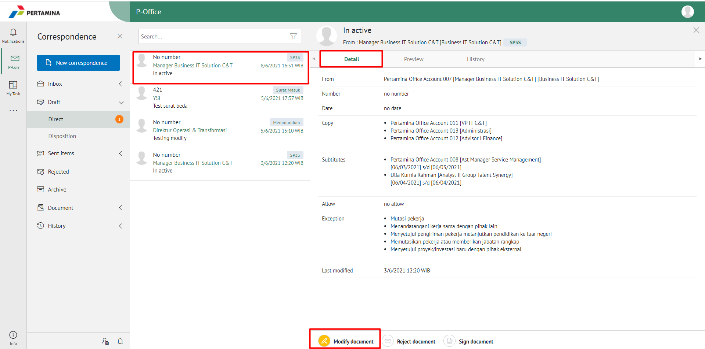

3. Sistem akan menampilkan *form* **Edit Correspondence**

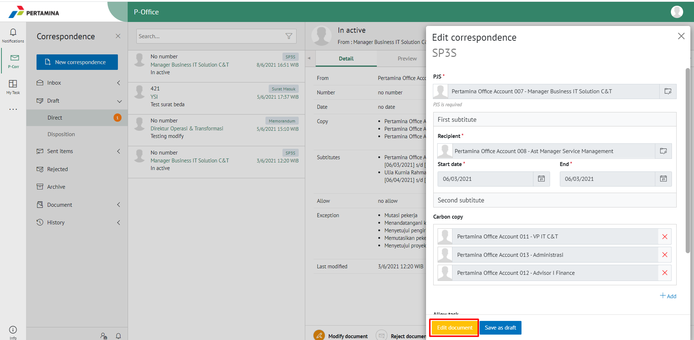

4. Lakukan perubahan pada *form*. Klik **Save As Draft** untuk menyimpan perubahan pada *form* SP3S. Surat yang disimpan akan tersimpan di menu **"Draft - Direct - SP3S"**

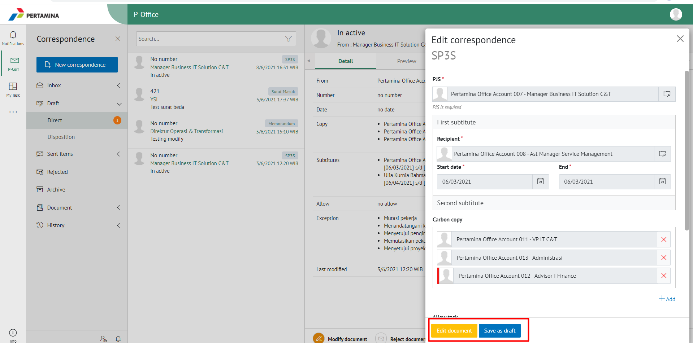

5. Klik **Edit Content** untuk mengubah isi SP3S

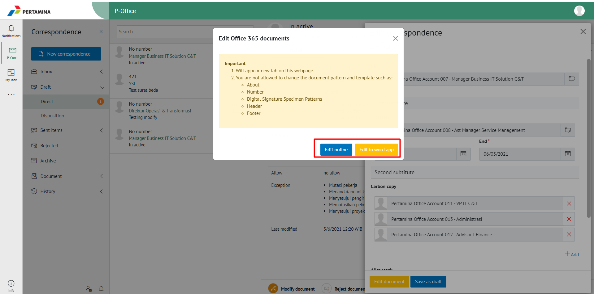

6. Sistem menampilkan tampilan *preview* SP3S dalam bentuk Word yang dapat di edit. Untuk melakukan *editing* terhadap isi surat klik **Edit Content** kemudian sistem akan menampilkan *pop up* konfirmasi **Ubah Word Desktop** atau **Ubah Online**

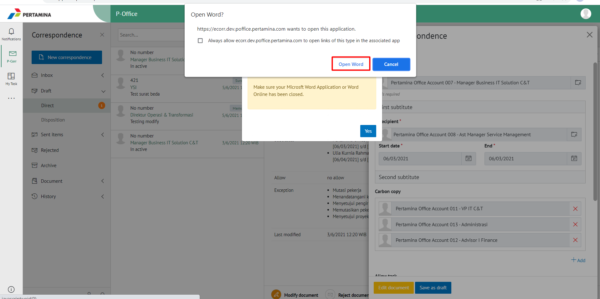

#### **[Edit] Word Desktop**

Langkah - langkah untuk mengubah isi SP3S melalui Word Desktop adalah sebagai berikut.

1. Klik **Ubah di Word** untuk mengubah melalui aplikasi Microsoft Word

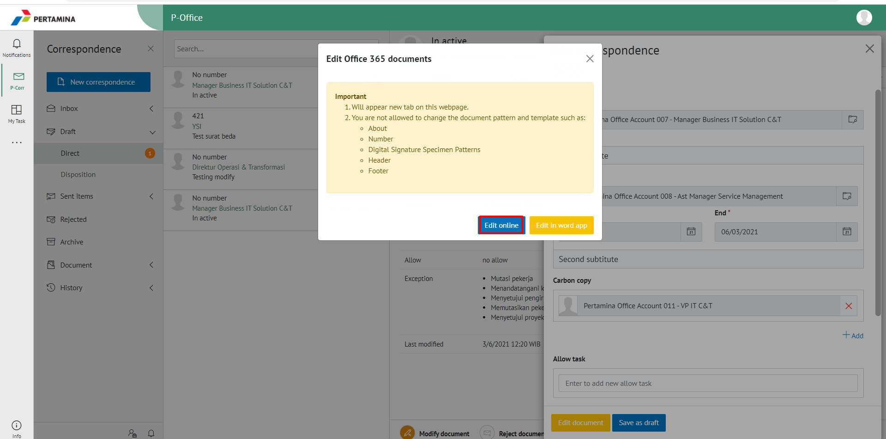

2. Lakukan perubahan pada isi surat. Klik **Close** pada aplikasi dan isi surat akan otomatis tersimpan

#### **[Edit] Ubah Online**

Langkah - langkah untuk mengubah isi SP3S secara *online* adalah sebagai berikut

1. Klik **Ubah Online** untuk mengubah isi surat secara *online*

2. Lakukan perubahan pada isi surat. Klik **Yes** pada aplikasi

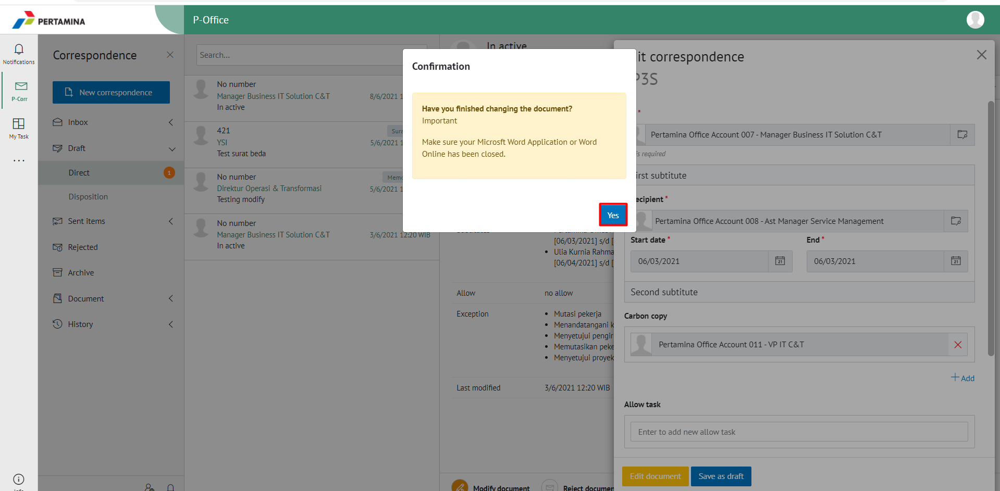

3. Surat yang sudah selesai diubah maka akan tersimpan di menu **"Draft - Direct -SP3S"**

## **P-Office Versi Teams**

Langkah - langkah untuk merevisi SP3S via Teams adalah sebagai berikut :

1. Klik menu **Inbox** dan pilih tab **SP3S**

2. Pilih SP3S yang akan disetujui kemudian pilih tab **Detail**

3. Klik tombol **Revise** dan pilih **Send**. Isikan komentar jika diperlukan

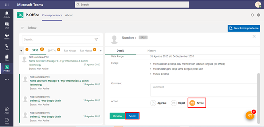

4.	Sistem menampilkan form **Edit Correspondence**

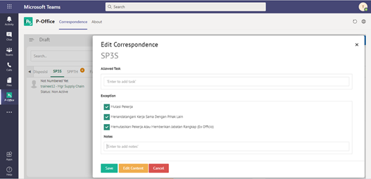

5.	Lakukan perubahan pada form. Klik **Save** untuk menyimpan perubahan pada form SP3S. Surat yang disimpan akan tersimpan di menu **“Inbox – SP3S”**

6.	Klik **Edit Content** untuk mengubah isi SP3S

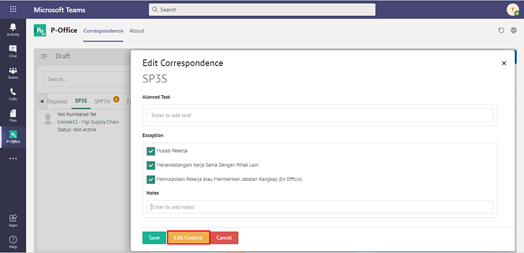

7. Sistem menampilkan tampilan preview SP3S dalam bentuk Word yang dapat di edit. Untuk melakukan editing terhadap isi surat klik **Edit Content** kemudian sistem akan menampilkan pop up konfirmasi Ubah Word Desktop atau Ubah Online

#### **[Edit] Word Desktop**

Langkah – langkah untuk mengubah isi surat keluar melalui Word Desktop adalah sebagai berikut :

1.	Klik **Open In Desktop App** untuk mengubah melalui aplikasi Microsoft Word

2.	Lakukan perubahan pada isi surat. Klik **Close** pada aplikasi Isi surat akan otomatis tersimpan

#### **[Edit] Ubah Online**

Langkah – langkah untuk mengubah isi surat keluar secara online adalah sebagai berikut :

1.Ketika Klik button **Edit Content** maka secara otomatis akan membuka dokumen dan bisa mengubah isi surat secara online

2. Lakukan perubahan pada isi surat

3. Isi surat akan otomatis tersimpan. Jika surat akan disimpan sebagai draft, maka klik **Close**

4. Surat yang sudah selesai diubah maka akan tersimpan di menu **“Inbox – Surat SP3S”**

## **P-Office Versi Mobile (Android & iOS)**

Langkah - langkah untuk merevisi SP3S via Android adalah sebagai berikut :

1. Klik menu **Draft** lalu **Direct** dan pilih surat yang berlabel **SP3S**

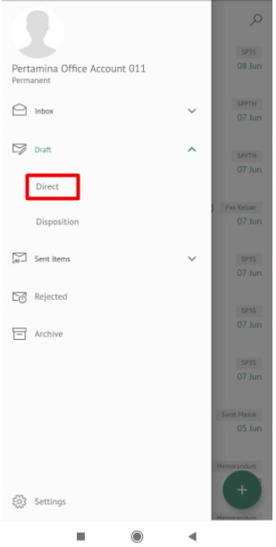 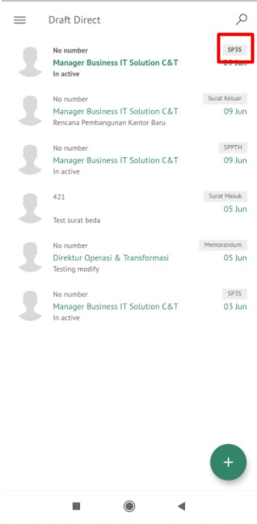 

2. Pilih SP3S yang akan disetujui kemudian pilih **Option**

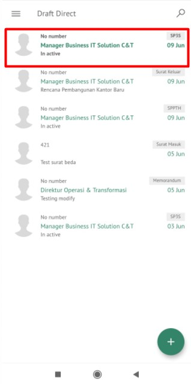 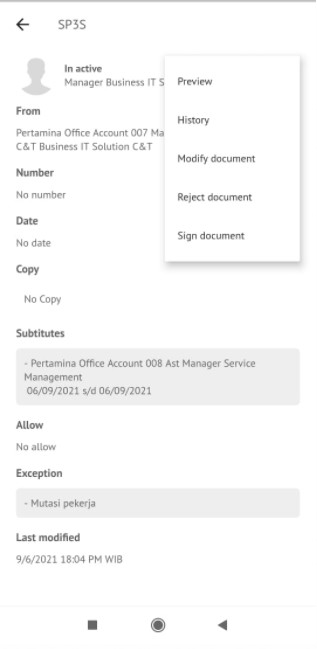 

3. Pilih **Modify Document** pada SP3S

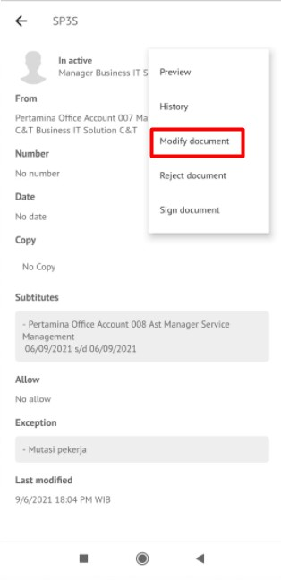 

4. Lakukan perubahan pada _form_. Klik **Save As Draft** untuk menyimpan perubahan pada _form_ SP3S. Surat yang disimpan akan tersimpan di menu “**Draft - Direct - SP3S”**

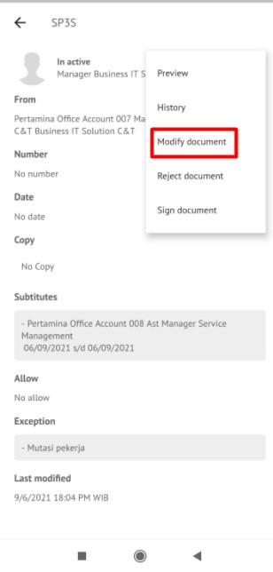  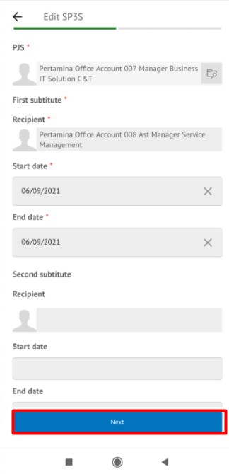 

5. Klik **Edit Document** untuk mengubah isi SP3S

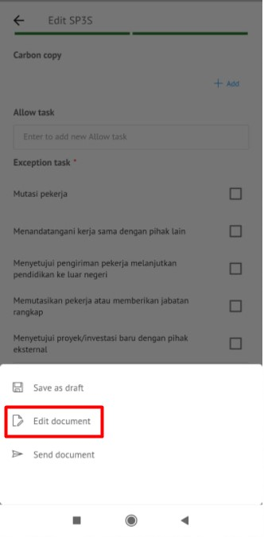  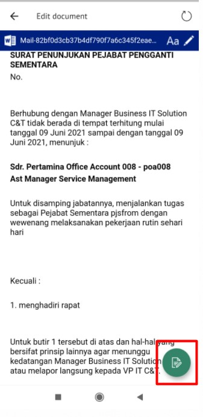 

6. Sistem menampilkan tampilan _preview_ SP3S dalam bentuk Word yang dapat di edit. Untuk melakukan _editing_ terhadap isi surat.

#### **[Edit] Ubah Online**

Langkah – langkah untuk mengubah isi SP3S secara _online_ adalah sebagai berikut.

1. 	Pilih **Modify Document** pada SP3S

![gambar](SP3S/SP3S_Android/RevisiSP3S/02A05.jpg

2. Lakukan perubahan pada _form_. Klik **Save As Draft** untuk menyimpan perubahan pada _form_ SP3S. Surat yang disimpan akan tersimpan di menu “**Draft - Direct - SP3S”**

   

3. Isi surat akan otomatis tersimpan. Jika surat akan disimpan sebagai draft, maka klik **Close**

   

4. Surat yang sudah selesai diubah maka akan tersimpan di menu “**Draft – Direct - SP3S”**
