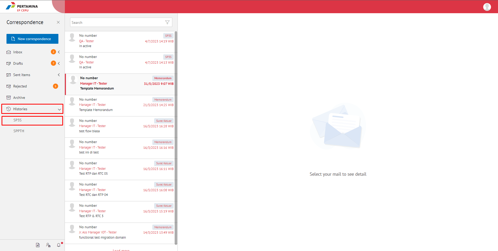
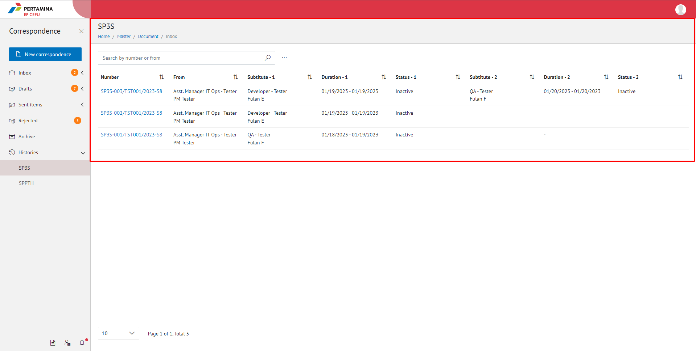

**Role yang sesuai**

- *Approver User*
- *Reviewer User*
- *Member User* (Pekerja)
- Sekretaris

*User* dapat melihat informasi pejabat yang sedang menjabat sebagai Pjs baik dalam status aktif maupun non-aktif. Informasi yang ditampilkan meliputi nomor SP3S, Nama pejabat, jabatan dan status. 

## **E-Corr Versi Web**

Langkah-langkah untuk melihat informasi Riwayat SP3S via Web adalah sebagai berikut:

1. Klik menu **Histories** dan pilih menu **SP3S**

2. Sistem menampilkan riwayat SP3S

