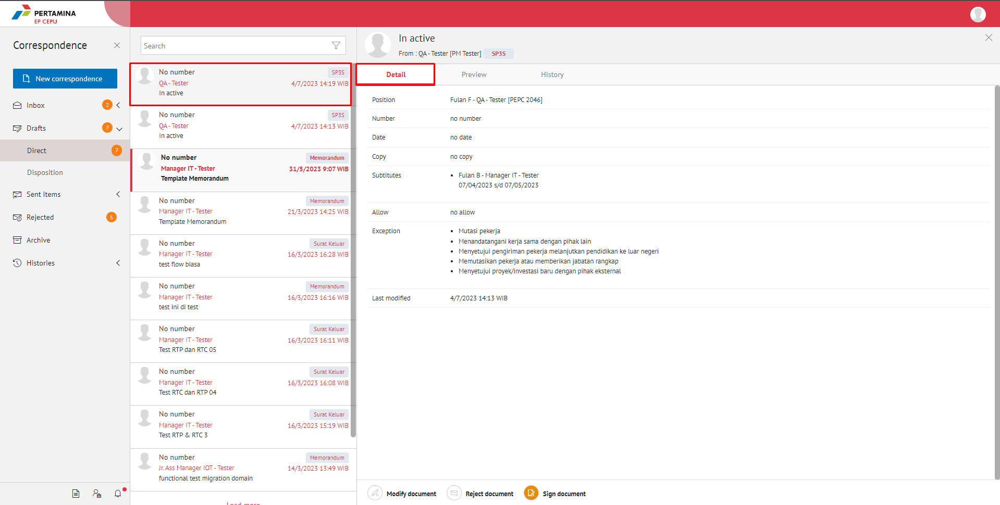
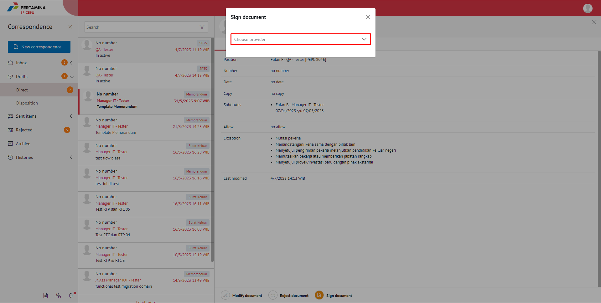
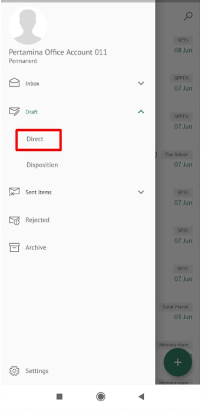
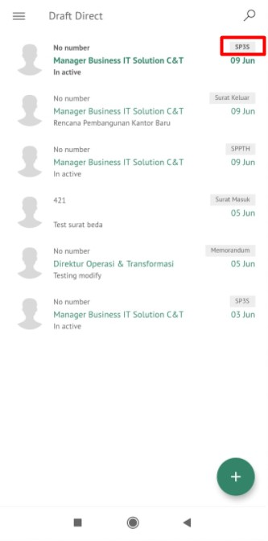
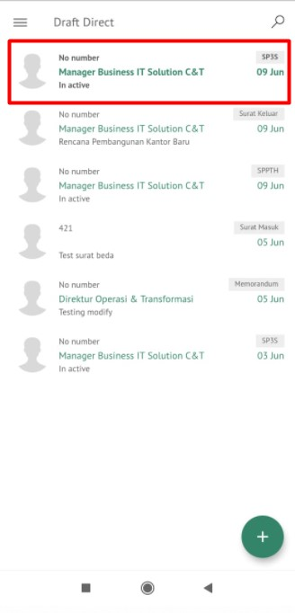
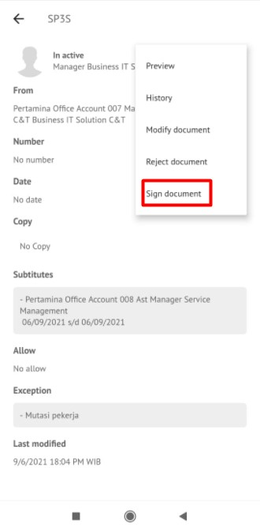
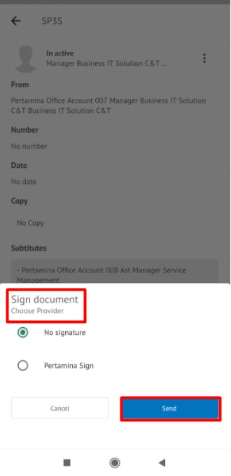

**Role yang sesuai**

- *Approver User*

*User* dapat menyetujui SP3S yang sudah dikirimkan oleh konseptor sehingga nomor SP3S akan ter-*generate* secara otomatis. 

## **E-Corr Versi Web**

Langkah - langkah untuk menyetujui SP3S via Web adalah sebagai berikut :

1. Klik menu **Draft** lalu **Direct** dan pilih surat yang berlabel **SP3S**

2. Pilih SP3S yang akan disetujui kemudian pilih tab **Detail**

3. Klik tombol **Sign Document** lalu **Choose Provider** untuk melakukan approve 

4. Sistem berhasil menyimpan perubahan. SP3S yang sudah di kirim akan tersimpan di menu **Sent Item - Direct**

## **E-Corr Versi Mobile (Android & iOS)**

Langkah - langkah untuk Setujui SP3S via Android adalah sebagai berikut : 

1. Klik menu **Draft** lalu **Direct** dan pilih surat yang berlabel **SP3S**
   
 
   
2. Pilih SP3S yang akan disetujui kemudian pilih icon **Option**

 

3. Klik tombol **Sign Document** kemmudian sistem menampilkan pop up untuk mengisi komentar Approve lalu pilih **Provider** approve

 

4. Sistem berhasil menyimpan perubahan. SP3S yang sudah di kirim akan tersimpan di menu **Sent Item – Direct - SP3S**

