**Role yang sesuai**

- *Approver User*
- *Reviewer User*
- *Member User* (Pekerja)
- Sekretaris

Konseptor penambahan SP3S adalah sekretaris atau pekerja lain yang diperintahkan untuk membuat SP3S atau pejabat yang akan meninggalkan tempat (melimpahkan wewenang/tugas) tersebut. Konseptor mengirimkan SP3S kepada approver / atasan pejabat yang akan meninggalkan tempat, sehingga draft SP3S akan langsung dikirim kepada atasan pejabat yang akan meninggalkan tempat tanpa melalui *reviewer*. 

## **E-Corr Versi Web**

Langkah - langkah untuk menambah SP3S via Web adalah sebagai berikut :

1. Klik menu **New Correspondence**

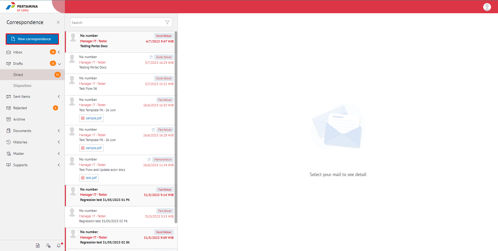

2. Pilih jenis surat **"SP3S"** lalu klik button **Next**

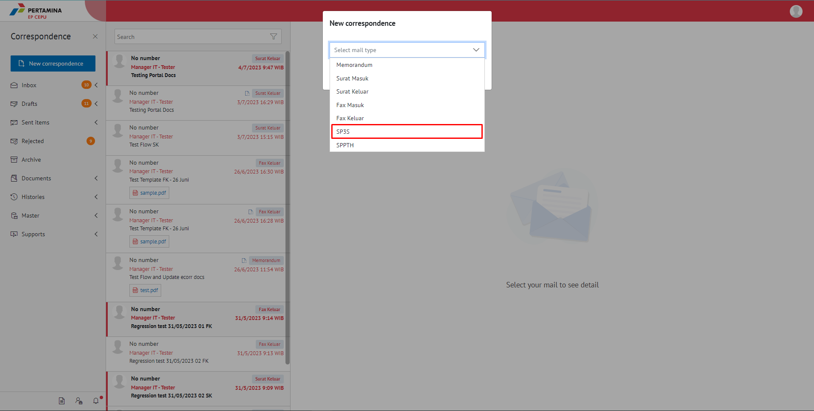

#### **Simpan SP3S**

Langkah - langkah untuk menyimpan SP3S adalah sebagai berikut.

1. Isi *form* SP3S kemudian klik **Save As Draft**

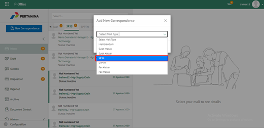

2. Sistem akan menampilkan tampilan *preview* SP3S dalam bentuk Word yang dapat di edit. Untuk melakukan *editing* terhadap isi surat klik **Edit document** kemudian sistem akan menampilkan *pop up* konfirmasi **Edit in Word Desktop** atau **Edit Online**

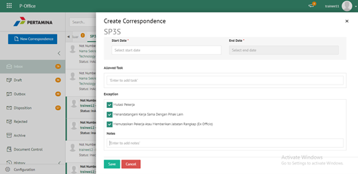
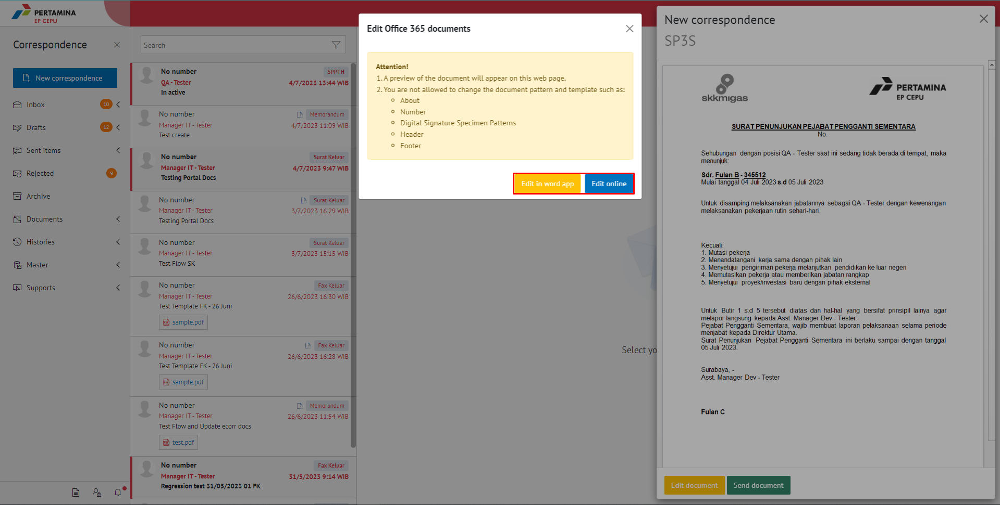

#### **[Edit] Word Desktop**

Langkah - langkah untuk mengubah isi SP3S melalui Word Desktop adalah sebagai berikut.

1. Klik **Edit in Word Desktop** untuk mengubah melalui aplikasi Microsoft Word

2. Lakukan perubahan pada isi surat. Klik **Close** pada aplikasi dan isi surat akan otomatis tersimpan

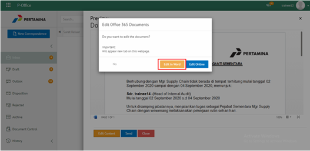

#### **[Edit] Ubah Online**

Langkah - langkah untuk mengubah isi SP3S secara *online* adalah sebagai berikut

1. Klik **Edit Online** untuk mengubah isi surat secara *online*

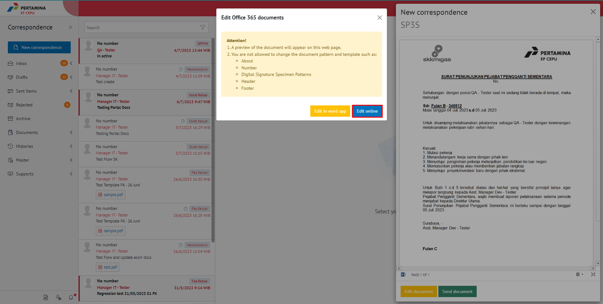

2. Lakukan perubahan pada isi surat. Klik **Close** pada aplikasi

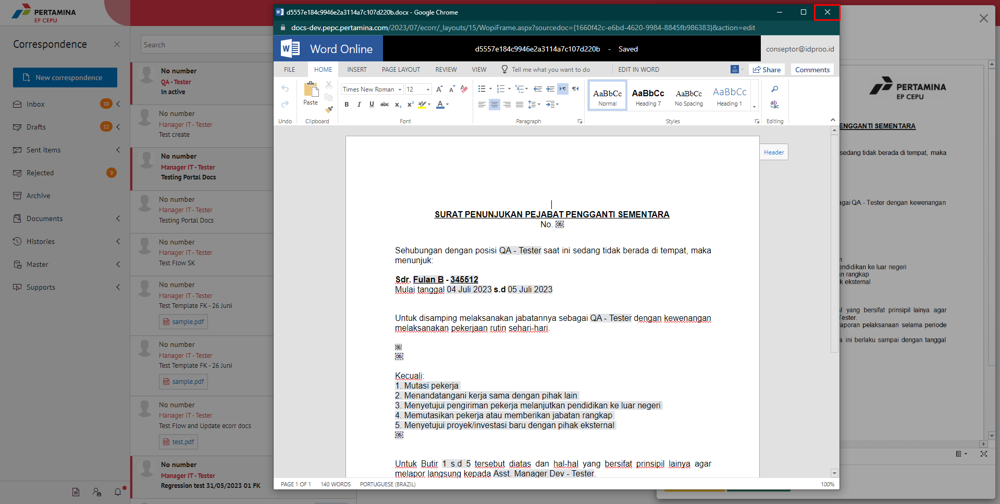

3. Isi surat akan otomatis tersimpan. Jika surat akan disimpan sebagai draft, maka klik **Yes**

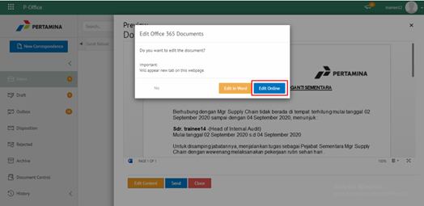

4. Surat yang sudah selesai diubah maka akan tersimpan di menu **"Draft - Direct"** 

#### **Kirim SP3S**

Langkah - langkah untuk mengirim SP3S adalah sebagai berikut.

1. Pada tampilan **Edit correspondance** SP3S, klik **Send document** untuk mengirim surat ke pejabat tujuan

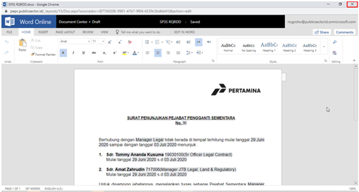

2. Sistem menyimpan perubahan dan SP3S akan tersimpan di menu **"Sent Item - Direct"**

#### **Simpan SP3S**

Langkah – langkah untuk menyimpan SP3S adalah sebagai berikut :

1.	Isi form SP3S kemudian klik **Save as Draft**

2. Sistem akan menampilkan tampilan *preview* SP3S dalam bentuk Word yang dapat di edit. Untuk melakukan *editing* terhadap isi surat klik **Edit document** kemudian sistem akan menampilkan *pop up* konfirmasi **Edit in Word Desktop** atau **Edit Online**

#### **[Edit] Word Desktop**

Langkah – langkah untuk mengubah isi surat keluar melalui Word Desktop adalah sebagai berikut :

1.	Klik **Open In Desktop App** untuk mengubah melalui aplikasi Microsoft Word

2.	Lakukan perubahan pada isi surat. Klik **Close** pada aplikasi Isi surat akan otomatis tersimpan

#### **[Edit] Ubah Online**

Langkah – langkah untuk mengubah isi surat keluar secara online adalah sebagai berikut :

1. Ketika Klik button **Edit Online** maka secara otomatis akan membuka dokumen dan bisa mengubah isi surat secara online

2. Lakukan perubahan pada isi surat

3. Isi surat akan otomatis tersimpan. Jika surat akan disimpan sebagai draft, maka klik **Close**

4. Surat yang sudah selesai diubah maka akan tersimpan di menu **“Sent Item – Direct”**

#### **Kirim SP3S**

Langkah – langkah untuk mengirim SP3S adalah sebagai berikut :

1.	Pada tampilan preview SP3S, klik **Send document** untuk mengirim surat ke pejabat tujuan

2.	Sistem menyimpan perubahan dan SP3S akan tersimpan di menu **“Sent Item - Direct”**

## **E-Corr Versi Mobile (Android & iOS)**

Langkah - langkah untuk tambah SP3S via Android adalah sebagai berikut : 

1. Klik ikon **(+)** pada E-Corr

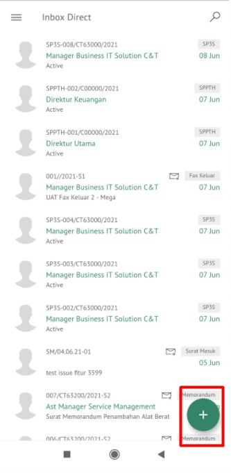 

2. Pilih jenis surat “**SP3S**” lalu **Next**

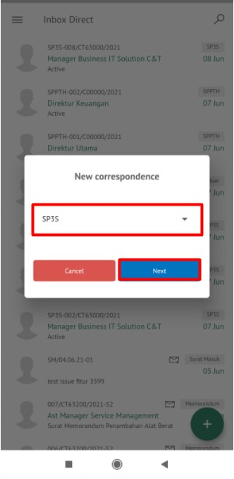

3. Isi _form_ tambah SP3S. Terdapat beberapa aksi untuk menindaklanjuti SP3S yang sudah diisi _form_ nya yaitu **Save As Draft** dan **Send Documment**

#### **Simpan SP3S**

Langkah – langkah untuk menyimpan SP3S adalah sebagai berikut :

1. Isi _form_ SP3S kemudian klik **Save As Draft**

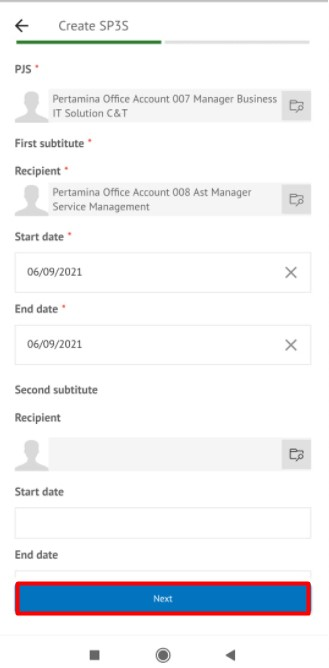 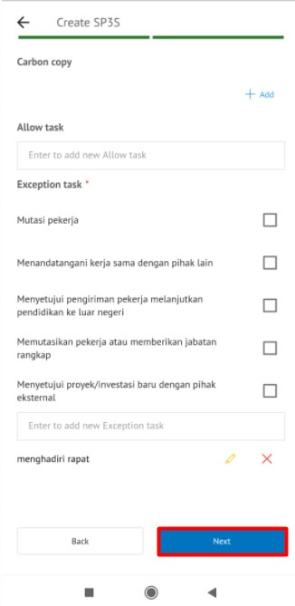 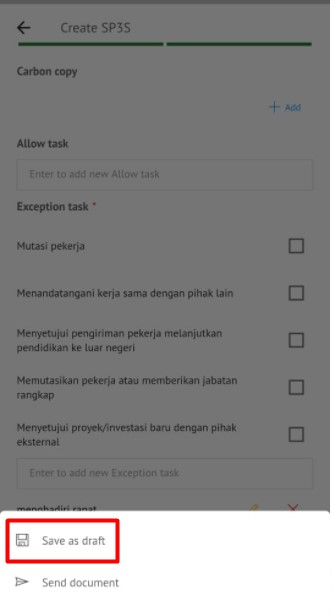

2. Sistem akan menyimpan perubahan dan SP3S akan otomatis tersimpan “**Draft - Direct - SP3S**

###### **[Edit] Ubah Online**

Langkah – langkah untuk mengubah isi SP3S secara online adalah sebagai berikut :

1. Klik tombol **Option** lalu pilih **Modify document** untuk mengubah isi surat secara online

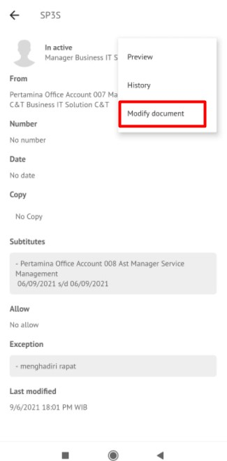 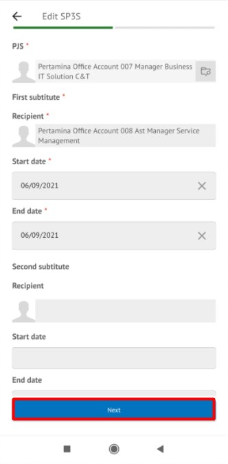 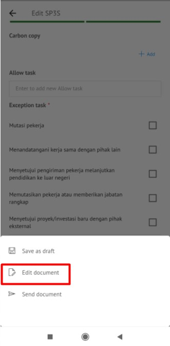 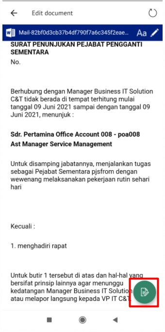

2. Lakukan perubahan pada isi surat. Klik **Close** pada aplikasi

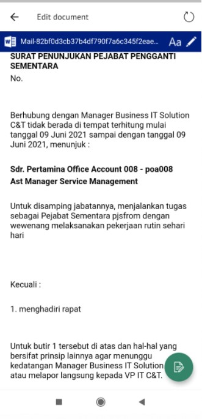

3. Isi surat akan otomatis tersimpan. Jika surat akan disimpan sebagai draft, maka pilih **Save As Draft** dan jika ingin mengirim surat pilih **Send document** 

#### **Kirim SP3S**

Langkah – langkah untuk mengirim SP3S adalah sebagai berikut :

1. Pada tampilan *Modify Document* SP3S, akan menampilkan pilihan surat , pilih **Send doucment** untuk mengirim surat ke pejabat tujuan

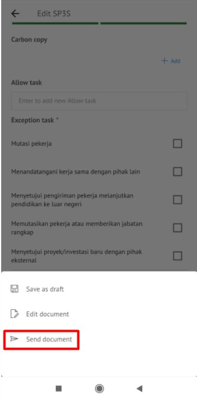

2. Sistem menyimpan perubahan dan SP3S akan tersimpan di menu “**Sent Item - Direct - SP3S**”
