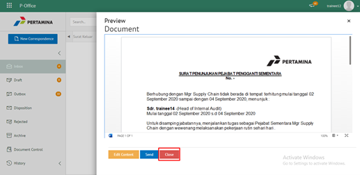
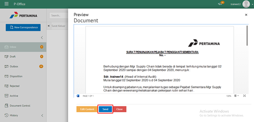
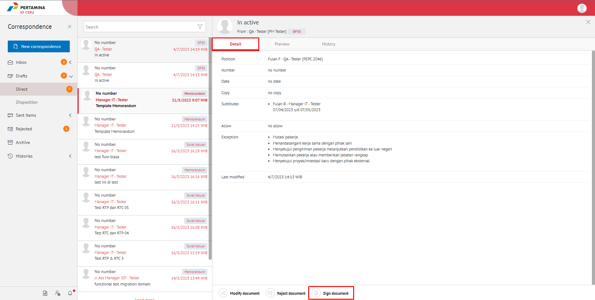

**Role yang sesuai**

- *Approver User*

*User* dapat menolak SP3S yang sudah dikirimkan oleh konseptor. 

## **E-Corr Versi Web**

Langkah - langkah untuk menolak SP3S via Web adalah sebagai berikut :

1. Klik menu **Draft** lalu **Direct** dan klik surat yang berlabel**SP3S**

2. Pilih SP3S yang akan di Reject kemudian pilih tab **Detail**

3. Klik tombol **Reject Document** kemudian Sistem menampilkan pop up konfirmasi dan user harus mengisi keterangan  kemudian klik **Submit**

4. Sistem berhasil menyimpan perubahan. SP3S yang sudah di kirim akan akan akan terhapus dari aplikasi akan tersimpan di menu **“Rejected – Direct - SP3S”** user penolak dengan Menu **Rejected**

