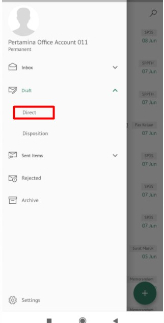
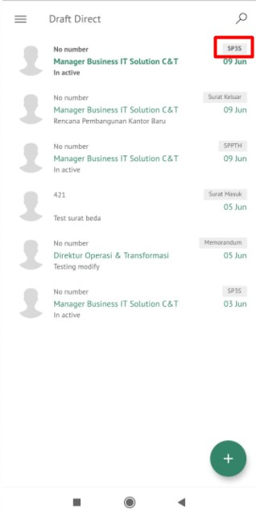
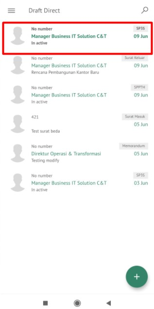
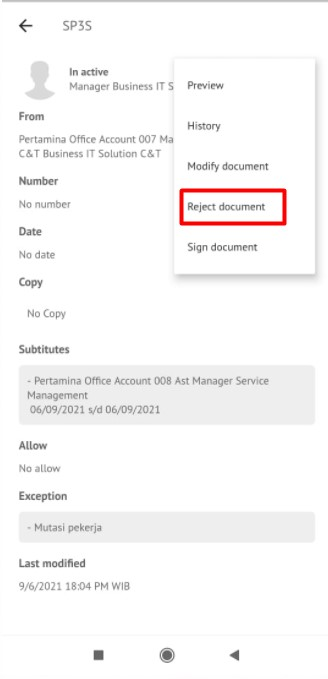
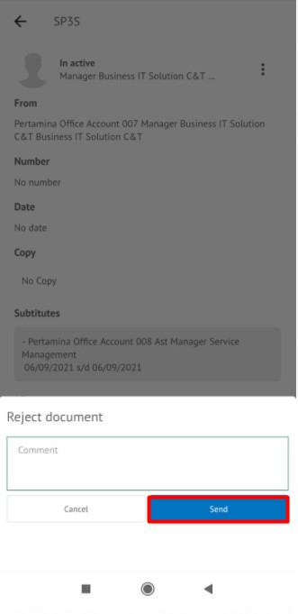

**Role yang sesuai**

- *Approver User*

*User* dapat menolak SP3S yang sudah dikirimkan oleh konseptor. 

## **E-Corr Versi Web**

Langkah - langkah untuk menolak SP3S via Web adalah sebagai berikut :

1. Klik menu **Draft** lalu **Direct** dan klik surat yang berlabel**SP3S**

2. Pilih SP3S yang akan di Reject kemudian pilih tab **Detail**

3. Klik tombol **Reject Document** kemudian Sistem menampilkan pop up konfirmasi dan user harus mengisi keterangan  kemudian klik **Submit**

4. Sistem berhasil menyimpan perubahan. SP3S yang sudah di kirim akan akan akan terhapus dari aplikasi akan tersimpan di menu **“Rejected – Direct - SP3S”** user penolak dengan Menu **Rejected**

## **E-Corr Versi Mobile (Android & iOS)**

Langkah - langkah untuk Tolak SP3S via Android adalah sebagai berikut :

1. Klik menu **Draft** lalu **Direct** dan pilih surat yang berlabel **SP3S**

 

2. Pilih SP3S yang akan disetujui kemudian pilih icon **Option**

 

3. Pada button Detail pilih **Reject Document** kemudian sistem menampilkan pop up dan user pilih **Send.** Isikan komentar jika diperlukan
   

4. Sistem berhasil menyimpan perubahan. SP3S yang sudah di kirim akan tersimpan dimenu “**Rejected- SP3S** user penolak pada label “**Rejected”**.
