**Role yang sesuai**

- *Approver User*
- *Reviewer User*
- Sekretaris

*User* dapat melakukan *drafting* SPPTH pada aplikasi P-Office. *Drafting* SPPTH dilakukan jika *user* akan meneruskan dan melakukan perubahan pada SPPTH yang sudah disimpan pada menu **Draft.**

## **P-Office Versi Web**

Langkah - langkah untuk melakukan drafting SPPTH via Web adalah sebagai berikut :

1. Klik menu **Draft** dan pilih tab **SPPTH**

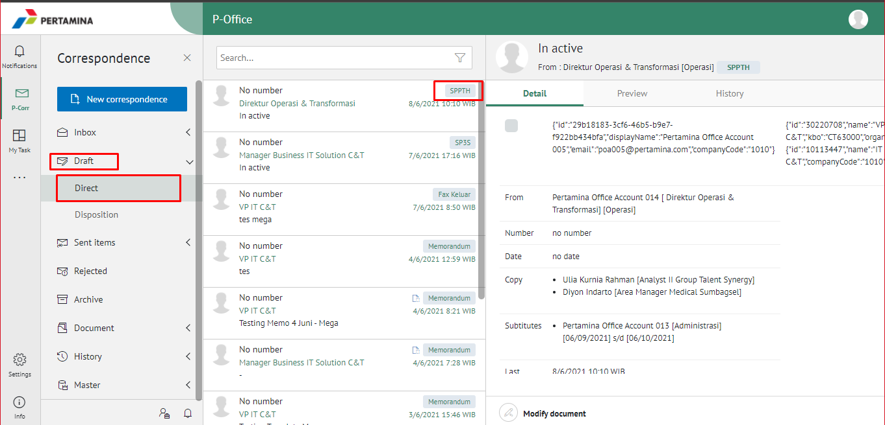

2. Pilih SPPTH yang akan diubah. Pilih tab **Detail** kemudian klik **Modify Document**

3. Sistem akan menampilkan *form* **Edit Correspondence**

4. Lakukan perubahan pada *form*. Klik **Save as Draft** untuk menyimpan perubahan pada *form* SPPTH. Surat yang disimpan akan tersimpan di menu "**Draft**"

5. Klik **Edit Document** untuk mengubah isi SPPTH

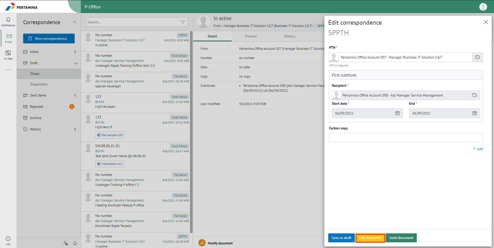

6. Sistem menampilkan pop up konfirmasi untuk melakukan *editing* terhadap isi surat. Pilih **Edit in Word app** untuk mengedit di aplikasi word desktop atau **Edit Online** untuk mengedit menggunakan aplikasi word secara _online_.

#### **[Edit] Word Desktop**

Langkah - langkah untuk mengubah isi SPPTH melalui Word Desktop adalah sebagai berikut

1. Klik **Edit in Word app** untuk mengubah melalui aplikasi Microsoft Word

2. Lakukan perubahan pada isi surat. Klik **Close** pada aplikasi dan isi surat akan otomatis tersimpan

#### **[Edit] Ubah Online**

Langkah - langkah untuk mengubah isi SPPTH secara online adalah sebagai berikut.

1. Klik **Edit Online** untuk mengubah isi surat secara online

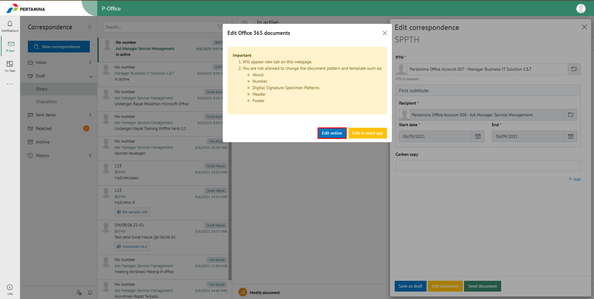

2. Lakukan perubahan pada isi surat. Klik **Close** pada aplikasi

3. Isi surat akan otomatis tersimpan. Jika surat akan disimpan sebagai draft, maka klik **Close.**

4. Surat yang sudah selesai diubah maka akan tersimpan di menu "**Draft**".

#### **Kirim / Setujui SPPTH**

Langkah - langkah untuk mengirim SPPTH adalah sebagai berikut.

1. Pada tampilan *preview* SPPTH, klik **Send Document** untuk mengirim SPPTH ke atasan pejabat

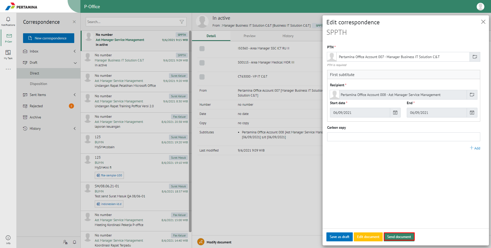

2. Sistem menyimpan perubahan dan SPPTH akan tersimpan di menu "**Sent Item**"

## **P-Office Versi Teams**

Langkah - langkah untuk drafting SPPTH via Teams adalah sebagai berikut :

1.  Klik menu **Draft** dan pilih tab **SPPTH**

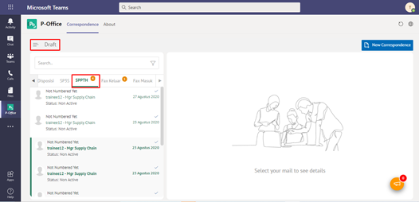

2.	Pilih SPPTH yang akan diubah. Pilih tab **Detail** kemudian klik **Edit**

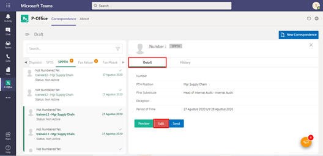

3.	Sistem akan menampilkan form **Edit Correspondence**

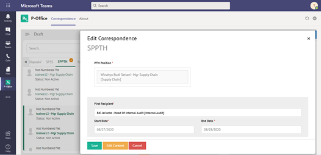

4.  Lakukan perubahan pada form. Klik **Save** untuk menyimpan perubahan pada form SPPTH. Surat yang disimpan akan tersimpan di menu **“Draft – SPPTH”**

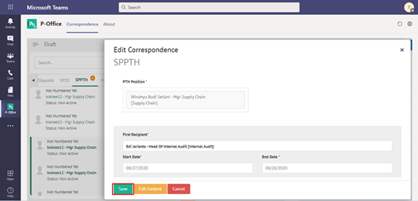

5.	Klik **Edit Content** untuk mengubah isi SPPTH

6.	Sistem akan menampilkan tampilan preview SPPTH dalam bentuk Word yang dapat di edit. Untuk melakukan editing terhadap isi surat klik **Edit Content** kemudian sistem akan menampilkan pop up konfirmasi **Ubah Word Desktop** atau **Ubah Online**

#### **[Edit] Word Desktop**

Langkah – langkah untuk mengubah isi SPPTH melalui Word Desktop adalah sebagai berikut.

1.    Klik **Open In Desktop App** untuk mengubah melalui aplikasi Microsoft Word

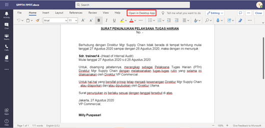

2.    Lakukan perubahan pada isi surat. Klik **Close** pada aplikasi dan isi surat akan otomatis tersimpan

#### **[Edit] Ubah Online**

Langkah – langkah untuk mengubah isi SPPTH secara online adalah sebagai berikut.

1.    Ketika Klik button **Edit Content** maka secara otomatis akan membuka dokumen dan bisa mengubah isi surat secara online

2.    Lakukan perubahan pada isi surat.

3.    Isi surat akan otomatis tersimpan. Jika surat akan disimpan sebagai draft, maka klik **Close** 

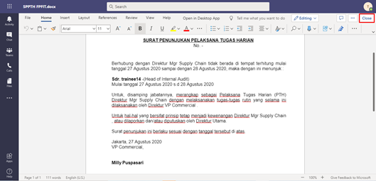

4.    Surat yang sudah selesai diubah maka akan tersimpan di menu **“Draft – SPPTH”**

#### **Kirim SPPTH**

Langkah – langkah untuk mengirim SPPTH adalah sebagai berikut.

1.	Pada tampilan preview SPPTH, klik **Send** untuk mengirim SPPTH ke approver

2. Sistem menyimpan perubahan dan SPPTH akan tersimpan di menu **“Sent Item - SPPTH”**

## **P-Office Versi Mobile (Android & iOS)**

Langkah - langkah untuk Draftting SPPTH via Android dan iOS adalah sebagai berikut :

1. Klik menu **Draft** dan pilih Surat dengan label **SPPTH**

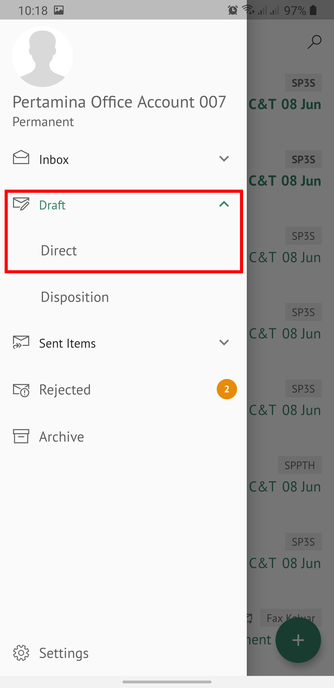 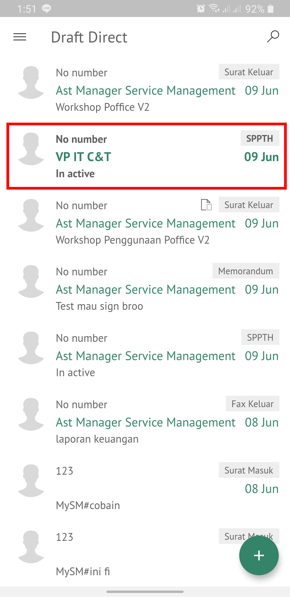

2. Pada halaman **Detail**  klik icon **Option**

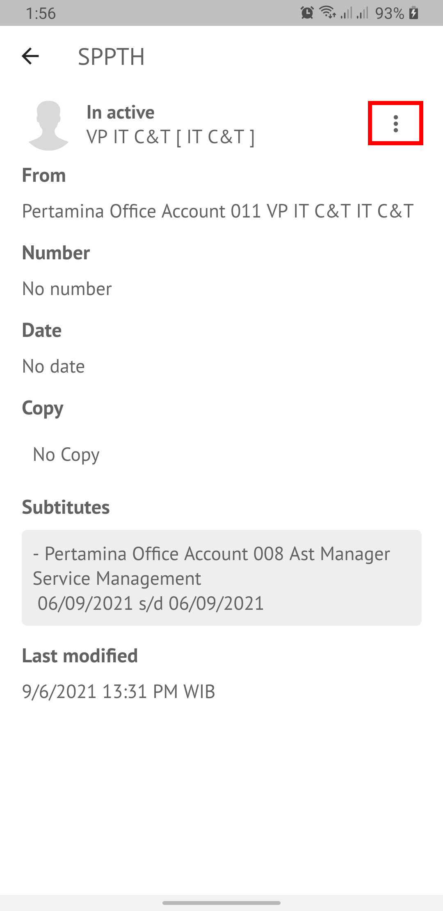

3. Pilih button **Modify Document** kemudian lakukan _editting_ SPPTH.

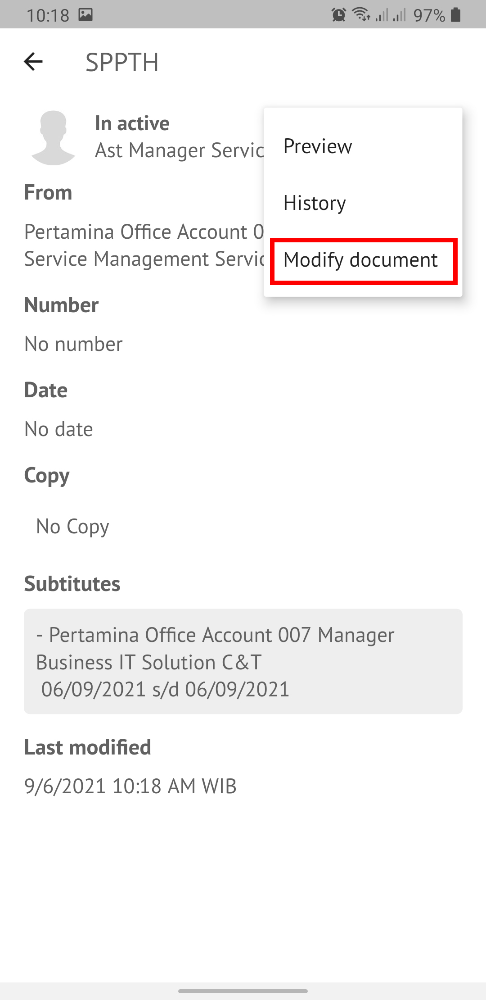

4. Lakukan perubahan pada _form_. Klik **Save Mail** untuk menyimpan perubahan pada _form_ SPPTH. Surat yang disimpan akan tersimpan di menu “**Draft**"

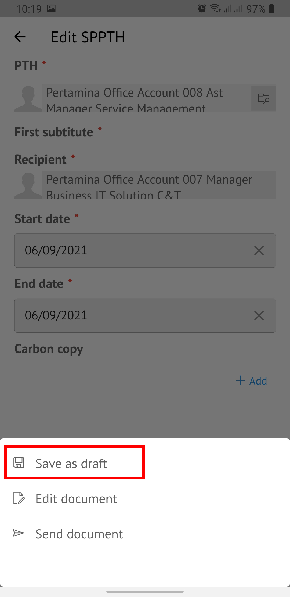 

5. Klik **Edit Document** untuk mengubah isi SPPTH
   

6. Sistem menampilkan tampilan _preview_ SPPTH dalam bentuk Word yang dapat di edit. Untuk melakukan _editing_ terhadap isi surat klik **Edit Document** kemudian sistem akan menampilkan _pop up_ konfirmasi.

#### **[Edit] Ubah Online**

Langkah – langkah untuk mengubah isi SPPTH secara online adalah sebagai berikut :

1. Klik  **button Edit** untuk mengubah isi surat secara online

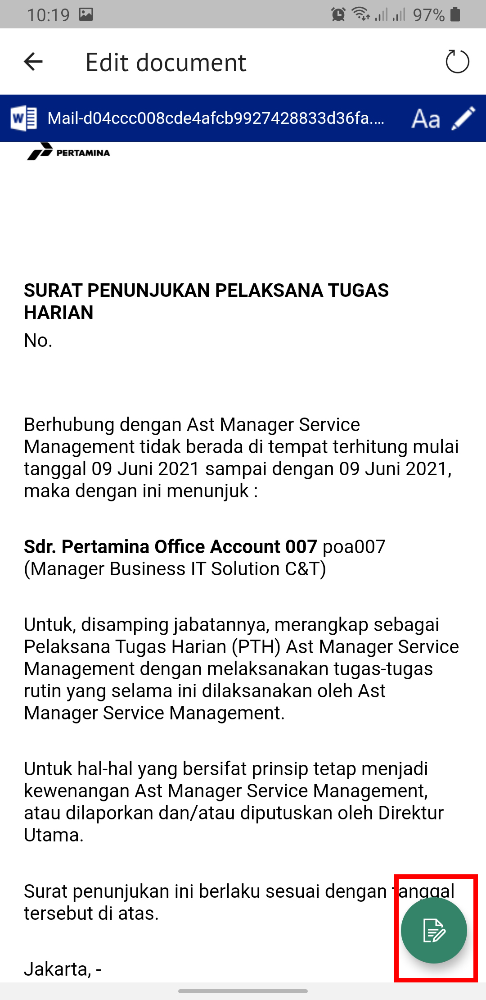 

2. Lakukan perubahan pada isi surat. lalu sistem akan menampilkan pop up P-Office Editing Document pilih **Yes**

3. Isi surat akan otomatis tersimpan. Jika surat akan disimpan sebagai draft, maka klik **back** kemudian sistem akan menampilkan pop up konfirmasi, lalu pilih **yes**. 

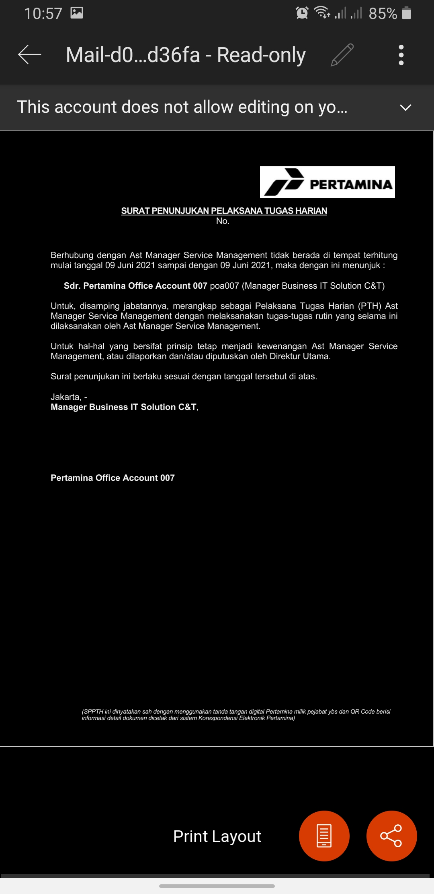 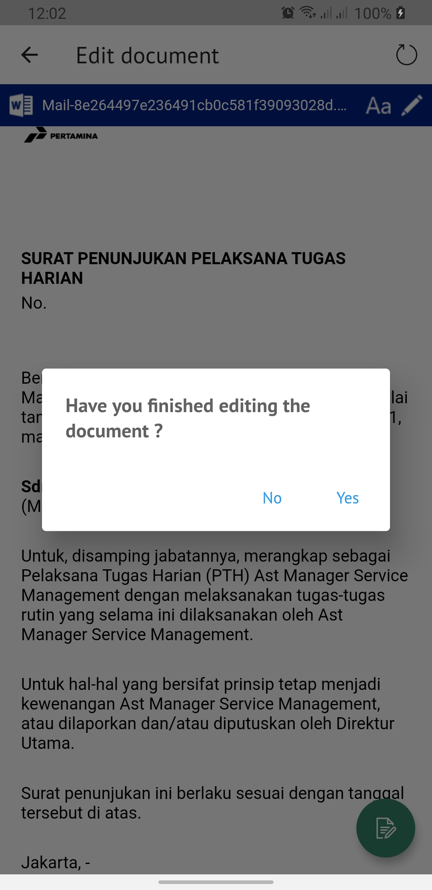

4. Surat yang sudah selesai diubah maka akan tersimpan di menu “**Draft**".
   
##### **Kirim / Setujui SPPTH**

Langkah – langkah untuk mengirim SPPTH adalah sebagai berikut:

1. Pada tampilan detail SPPTH, klik **Send Document** untuk mengirim SPPTH ke atasan pejabat

2. Sistem menyimpan perubahan dan SPPTH akan tersimpan di menu “**Sent Item**”

