**Role yang sesuai**

- *Approver User*
- *Reviewer User*
- Sekretaris

*User* dapat melakukan *drafting* SPPTH pada aplikasi E-Corr. *Drafting* SPPTH dilakukan jika *user* akan meneruskan dan melakukan perubahan pada SPPTH yang sudah disimpan pada menu **Draft.**

## **E-Corr Versi Web**

Langkah - langkah untuk melakukan drafting SPPTH via Web adalah sebagai berikut :

1. Klik menu **Draft** dan pilih Sub menu **Direct**

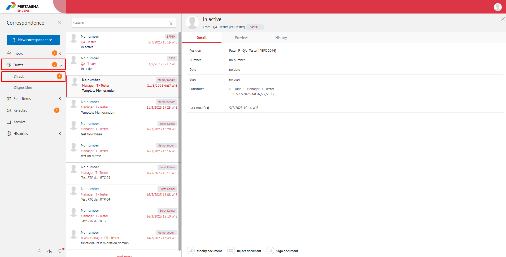

2. Pilih SPPTH yang akan diubah. Pilih tab **Detail** kemudian klik **Modify Document**

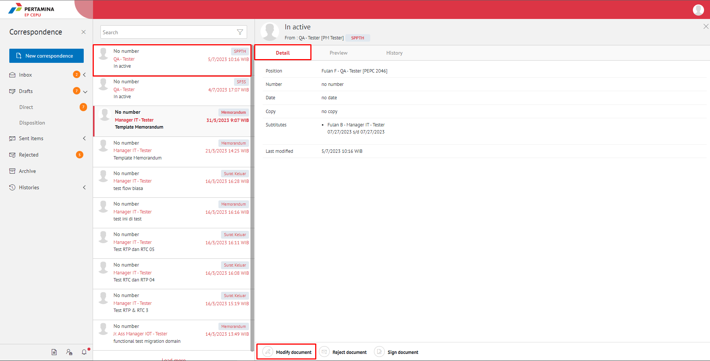

3. Sistem akan menampilkan *form* **Edit Correspondence**

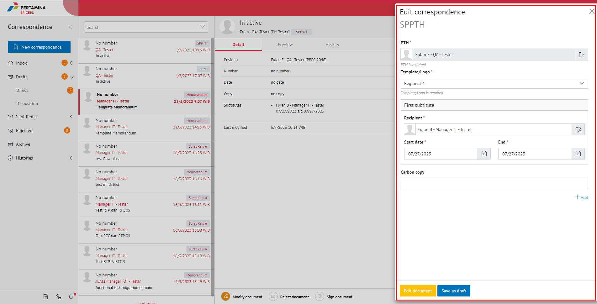

4. Lakukan perubahan pada *form*. Klik **Save as Draft** untuk menyimpan perubahan pada *form* SPPTH. Surat akan tersimpan di menu "**Draft - Direct**"

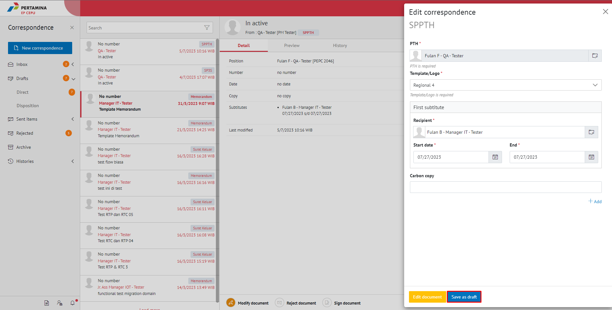

5. Klik **Edit Document** untuk mengubah isi SPPTH

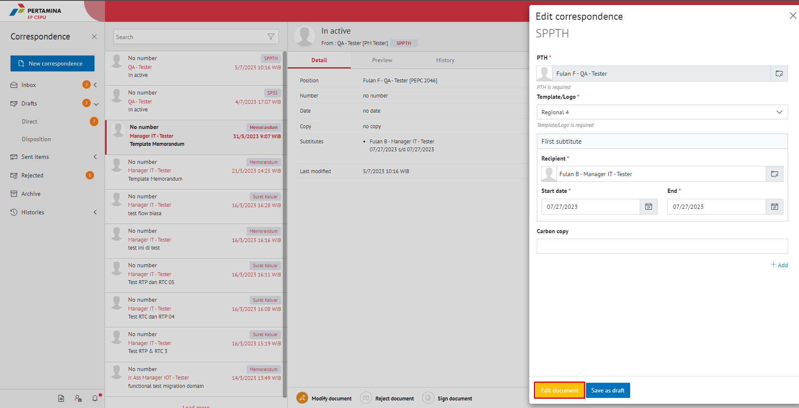

6. Sistem menampilkan pop up konfirmasi untuk melakukan *editing* terhadap isi surat. Pilih **Edit in Word app** untuk mengedit di aplikasi word desktop atau **Edit Online** untuk mengedit menggunakan aplikasi word secara _online_.

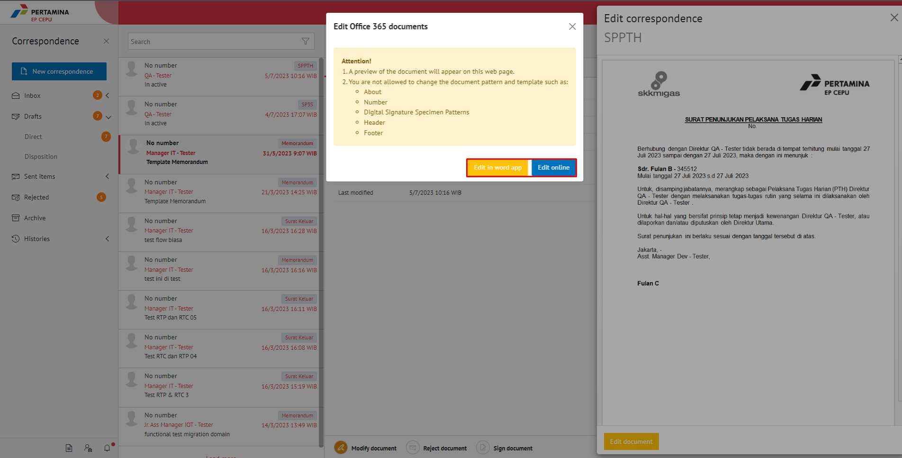

#### **[Edit] Word Desktop**

Langkah - langkah untuk mengubah isi SPPTH melalui Word Desktop adalah sebagai berikut

1. Klik **Edit in Word app** untuk mengubah melalui aplikasi Microsoft Word

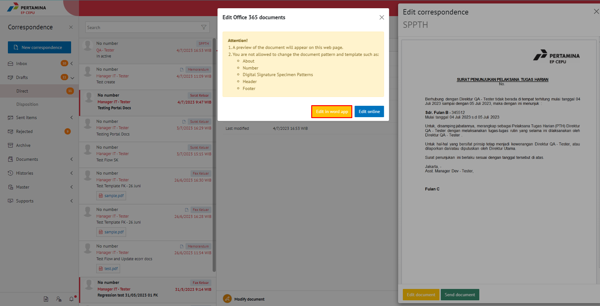

2. Lakukan perubahan pada isi surat. Klik **Close** pada aplikasi dan isi surat akan otomatis tersimpan

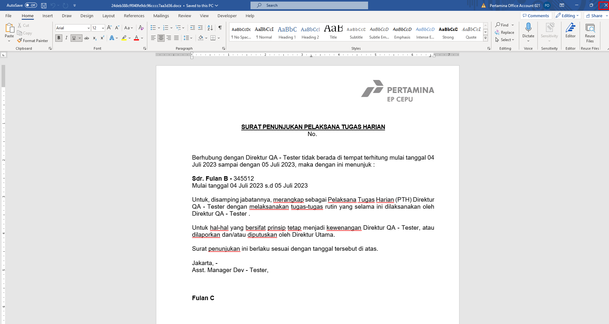

#### **[Edit] Ubah Online**

Langkah - langkah untuk mengubah isi SPPTH secara online adalah sebagai berikut.

1. Klik **Edit Online** untuk mengubah isi surat secara online

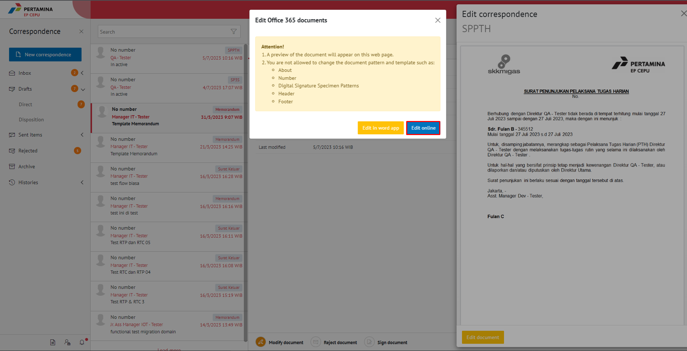

2. Lakukan perubahan pada isi surat. Klik **Close** pada aplikasi

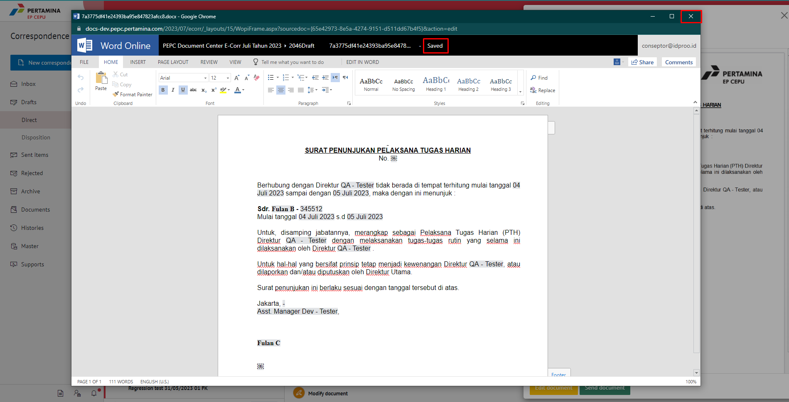

3. Isi surat akan otomatis tersimpan. Jika surat akan disimpan sebagai draft, maka klik **Yes**

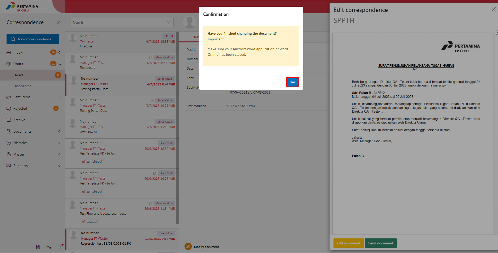

4. Surat yang sudah selesai diubah maka akan tersimpan di menu "**Draft - Direct**".

#### **Kirim / Setujui SPPTH**

Langkah - langkah untuk mengirim SPPTH adalah sebagai berikut.

1. Pada tampilan *preview* SPPTH, klik **Send Document** untuk mengirim SPPTH ke atasan pejabat

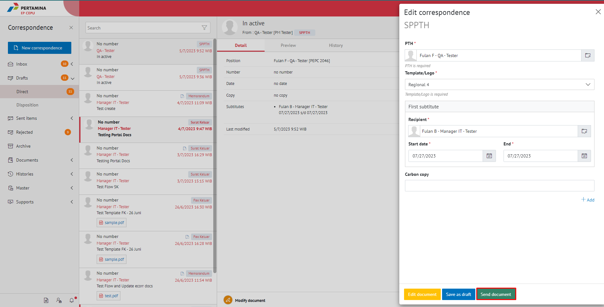

2. Sistem menyimpan perubahan dan SPPTH akan tersimpan di menu "**Sent Item**"

