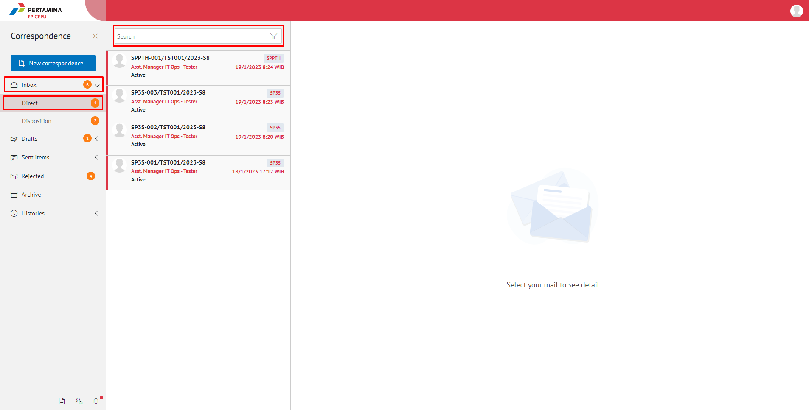
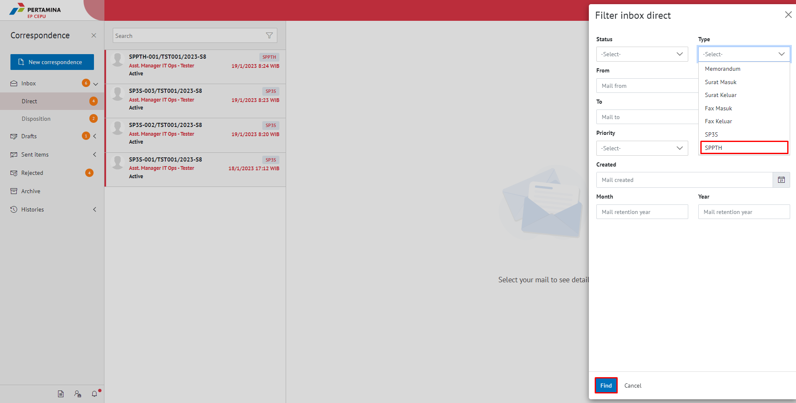
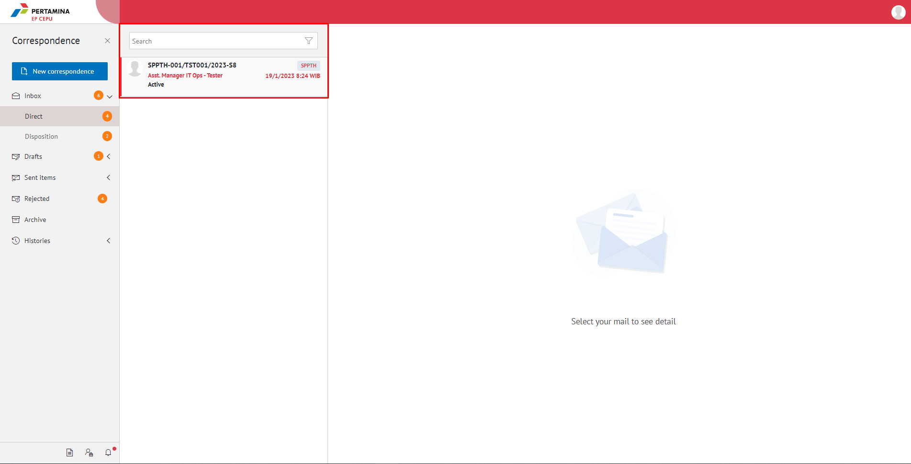
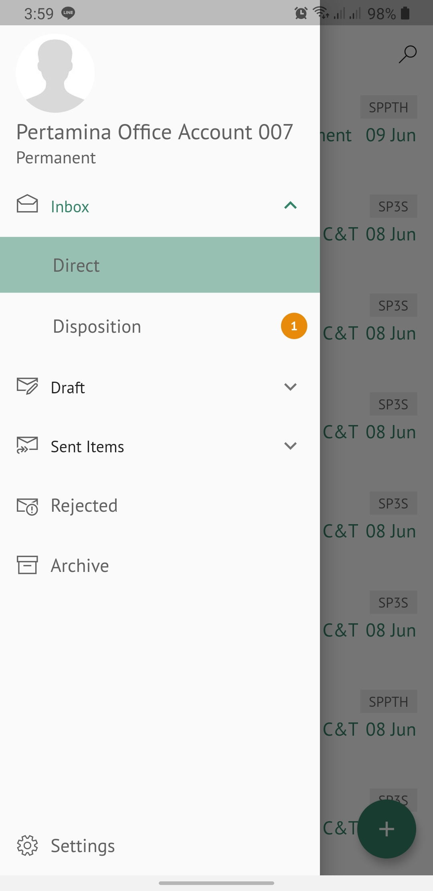
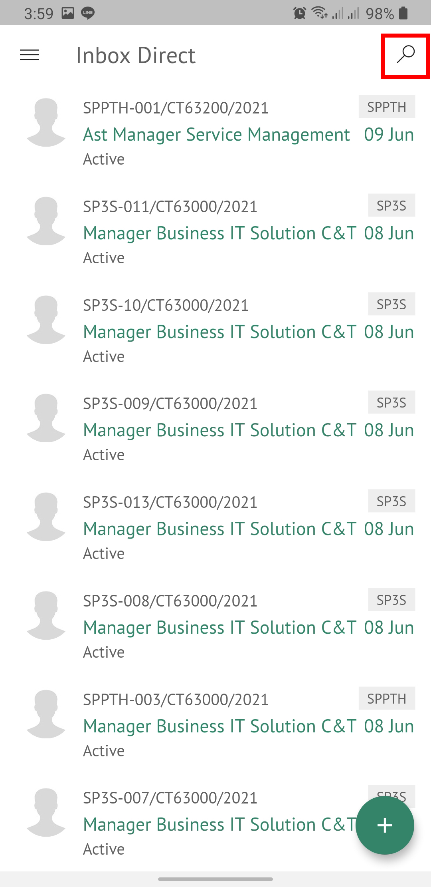
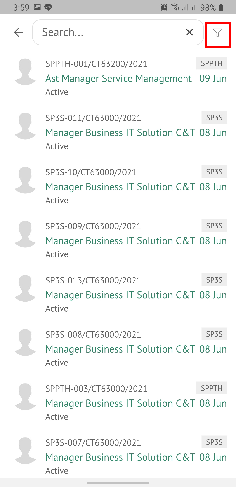
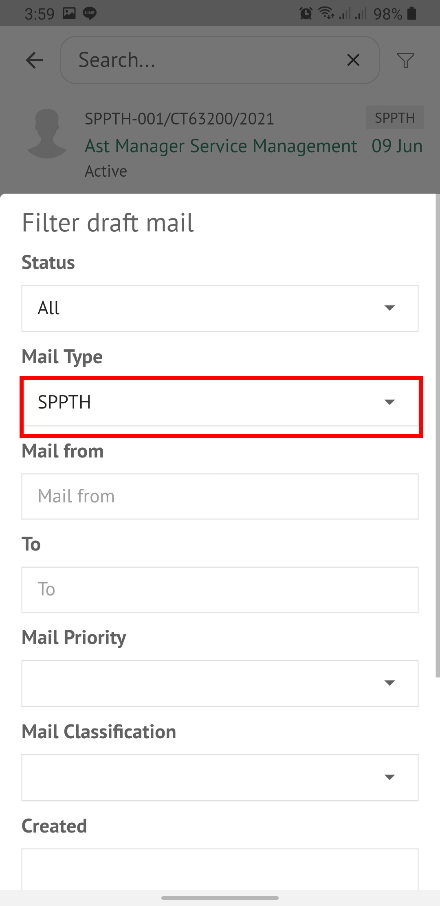
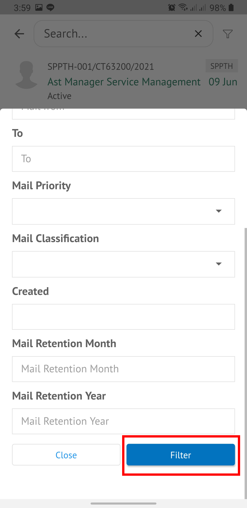
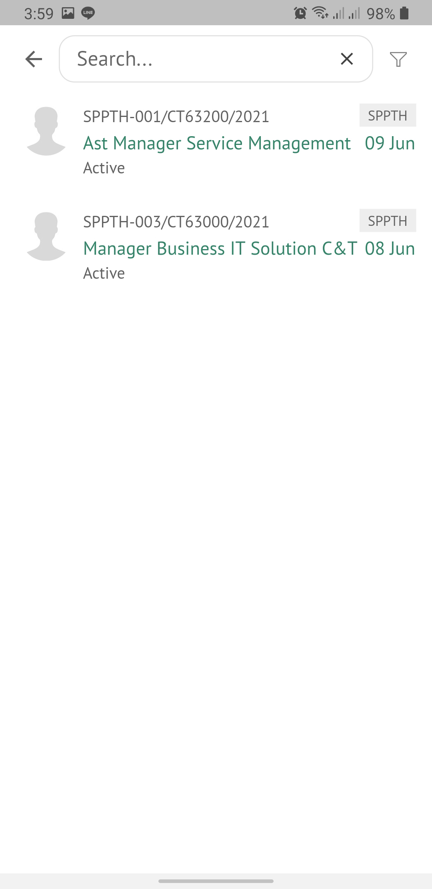

**Role yang sesuai**

- *Approver User*
- *Reviewer User*
- Sekretaris

*User* dapat melihat daftar SPPTH pada pada menu **Inbox, Draft atau Sent Item** pada masing - masing akun. 

## **E-Corr Versi Web**

Langkah - langkah untuk melihat daftar SPPTH via Web adalah sebagai berikut

1. Klik menu **Inbox - Direct** dan pilih _icon_ **filter**.

2. Pilih field **Type** pilih opsi surat jenis **SPPTH** dan klik **find**.

3. Semua surat dengan label **SPPTH** akan muncul pada menu inbox.

## **E-Corr Versi Mobile (Android & iOS)**

Langkah - langkah untuk lihat daftar SPPTH via Android dan iOS adalah sebagai berikut :

1. Klik menu **Inbox / Draft / Sent Item**.
   
 

2. Klik _icon_ **Search**, lalu klik _icon_ **filter**.
   
 

3. Pilih form type dengan **SPPTH** dan klik **filter**.
   
  

4. Semua surat dengan label **SPPTH** akan muncul pada menu inbox.

