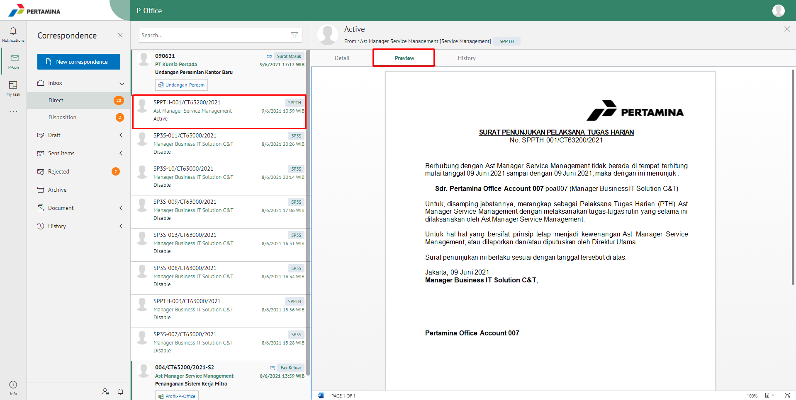
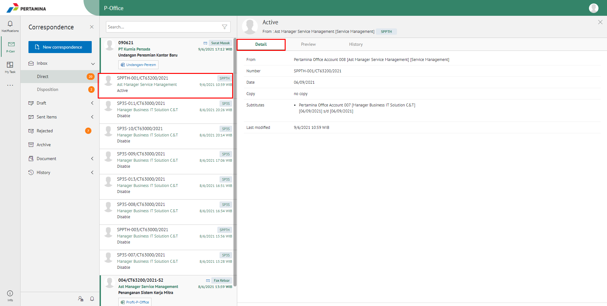
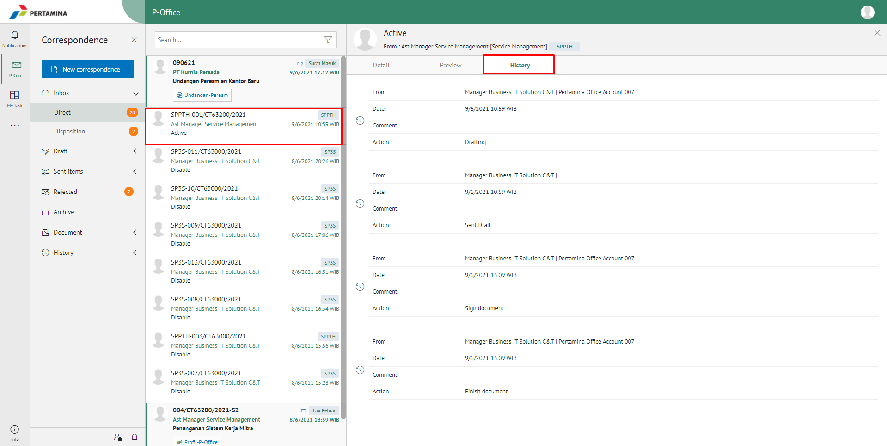
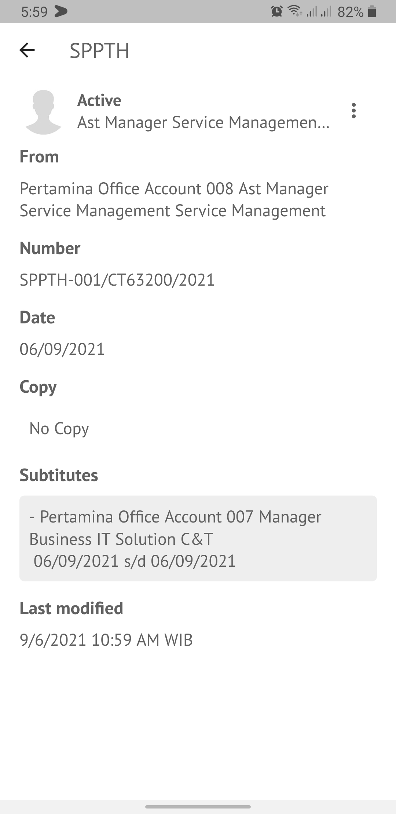
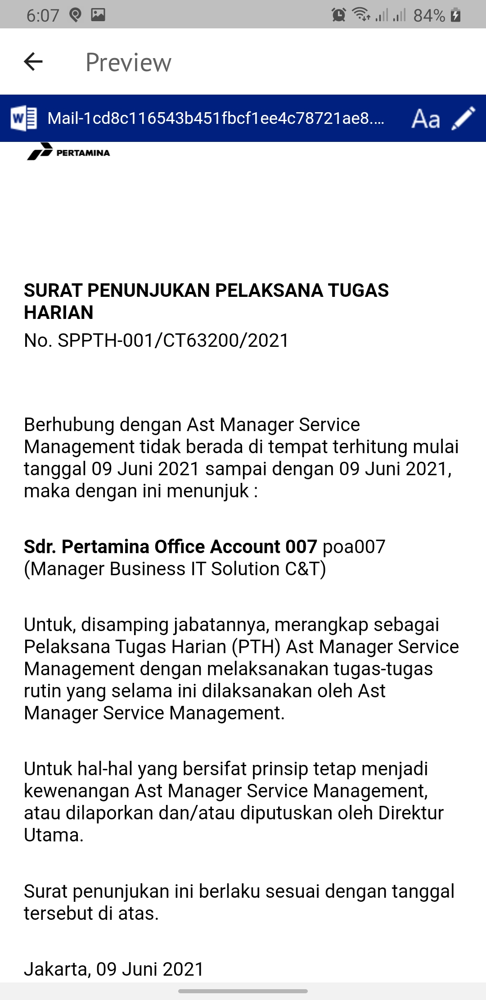
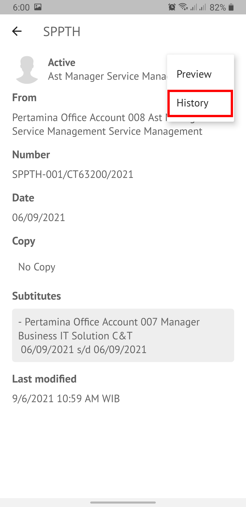

**Role yang sesuai**

- *Approver User*
- *Reviewer User*
- Sekretaris

*User* dapat melihat informasi lengkap SPPTH termasuk *preview* SPPTH, detail SPPTH dan *history* SPPTH.

## **E-Corr Versi Web**

Langkah - langkah untuk melihat informasi SPPTH via Web adalah sebagai berikut :

1. Klik menu **Inbox/Draft/Sent Item**. Pilih salah satu SPPTH yang akan dilihat informasinya

#### **Preview SPPTH**

Pada tab **Preview**, ditampilkan *preview* SPPTH yang sudah dibuat. *Preview* SPPTH disesuaikan dengan template berdasarkan jenis surat.

#### **Detail SPPTH**

Pada tab Detail, terdapat informasi nomor SPPTH, jabatan PTH, Pejabat pengganti pertama, jangka waktu serta pejabat pengganti kedua (jika ada), jangka waktu pejabat pengganti kedua (jika ada)

#### **History SPPTH**

Pada tab **History**, ditampilkan riwayat SPPTH yang terdapat informasi jabatan, tanggal, tindakan dan komentar

## **E-Corr Versi Mobile (Android dan iOS)**

Langkah - langkah untuk melihat informasi SPPTH via Android dan iOS adalah sebagai berikut :

1. Klik menu **Inbox/Draft/Sent Item** dan pilih salah satu satu surat berlabel **SPPTH** yang akan dilihat informasinya.

 

#### **Detail SPPTH**

Pada tab Detail SPPTH, terdapat informasi nomor SPPTH, jabatan PTH, Pejabat pengganti pertama, jangka waktu serta pejabat pengganti kedua (jika ada), jangka waktu pejabat pengganti kedua (jika ada)

#### **Preview SPPTH**

Pada tab **Preview**, ditampilkan _preview_ SPPTH yang sudah dibuat. _Preview_ SPPTH disesuaikan dengan template berdasarkan jenis surat.

 

#### **History SPPTH**

Pada tab **History**, ditampilkan riwayat SPPTH yang terdapat informasi jabatan, tanggal, tindakan dan komentar

 

