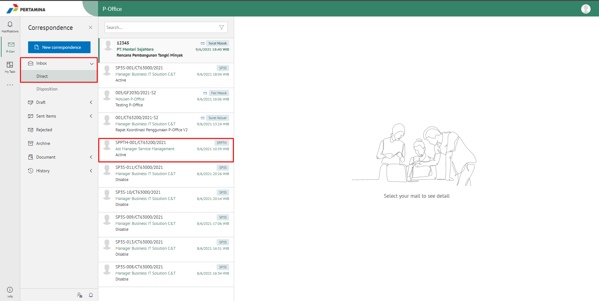
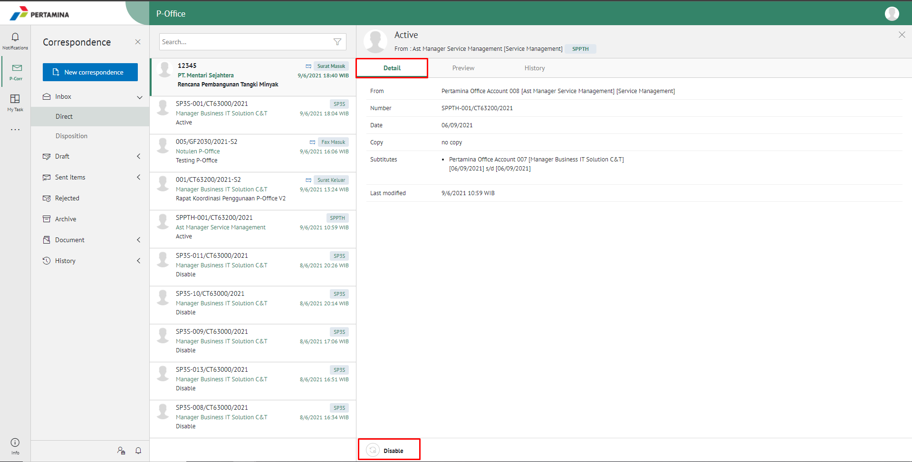
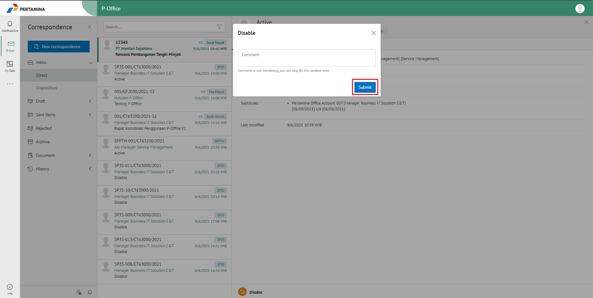
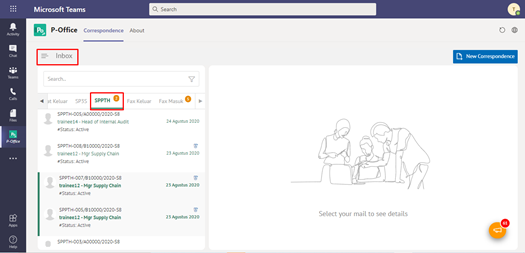
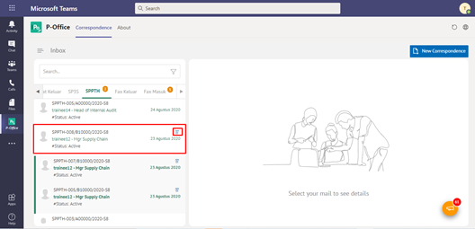
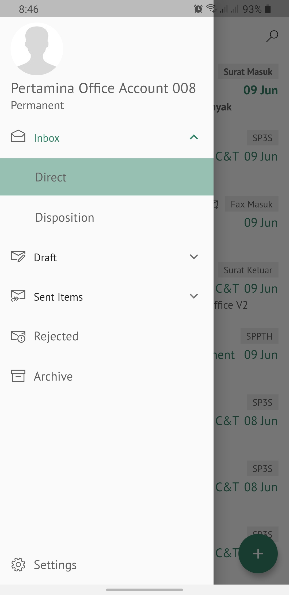
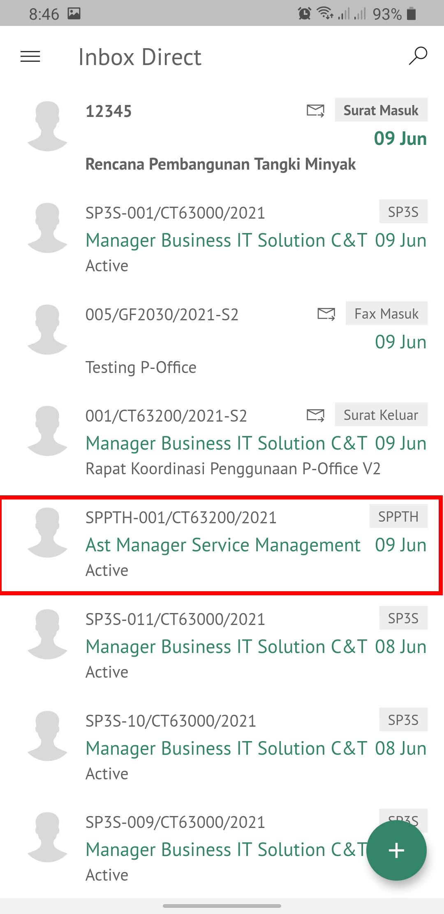
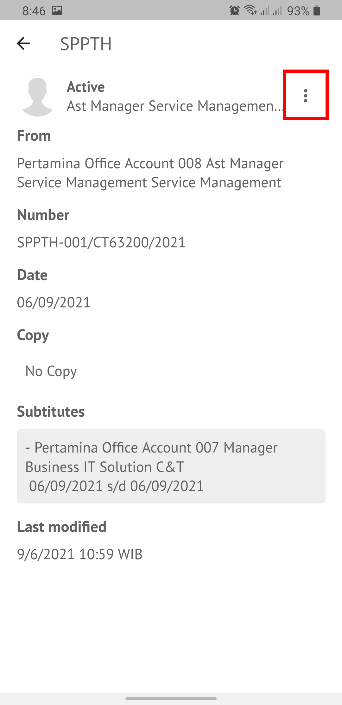
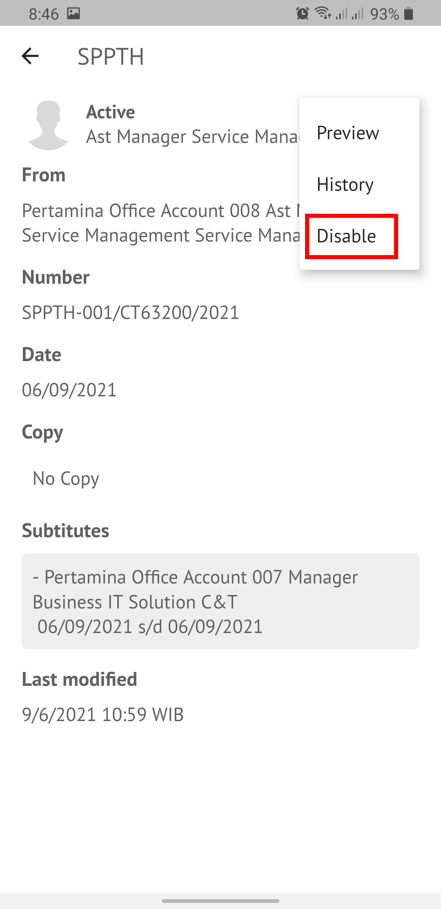

**Role yang sesuai**

- *Approver User* (Pejabat Pth)
- *Reviewer User* (Pejabat Pth)

SPPTH yang masih berlaku akan non-aktif secara otomatis apabila sudah habis masa jabatan pejabat yang sedang di PTH-kan.  Namun, apabila pejabat definitif kembali bekerja sebelum masa PTH nya habis, maka pejabat tersebut harus menon-aktifkan SPPTH yang berlaku dengan cara sebagai berikut:

## **P-Office Versi Web**

Langkah - langkah untuk menonaktifkan SPPTH via Web adalah sebagai berikut :

1. Klik menu **Inbox** dan pilih surat dengan label **SPPTH** yang akan dinon-aktifkan.

2. Pada tab **detail** pilih _icon_ **Disable**. Kemudian Pilih **Submit**. Berikan komentar jika perlu.

 

3. SPPTH yang sudah tidak aktif akan tersimpan di menu "**Sent Item**" *approver*. Untuk pejabat PTH dan pejabat yang meninggalkan tempat, surat akan tersimpan di menu "**Inbox**".

## **P-Office Versi Teams**

Langkah - langkah untuk menonaktifkan SPPTH via Teams adalah sebagai berikut :

1.	Klik menu **Inbox** dan pilih tab **SPPTH**

 
2.	Pilih SPPTH yang akan dinon-aktifkan kemudian pilih icon **Disable**.

3.	SPPTH yang sudah tidak aktif akan tersimpan di menu **“Sent Item – SPPTH”** approver. Untuk pejabat PTH dan pejabat yang meninggalkan tempat, surat akan tersimpan di menu **“Inbox – SPPTH”**

## **P-Office Versi Mobile (Android & iOS)**

Langkah - langkah untuk menonaktifkan SPPTH via Android dan iOS adalah sebagai berikut :

1. Klik menu **Inbox** dan pilih surat yang berlabel **SPPTH** yang akan dinon-aktifkan.

 

2. Pilih _icon_ **Option** kemudian pilih **Disable**.

 

3. SPPTH yang sudah tidak aktif akan tersimpan di menu “**Sent Item**" _approver_. Untuk pejabat PTH dan pejabat yang meninggalkan tempat, surat akan tersimpan di menu “**Inbox**”.
